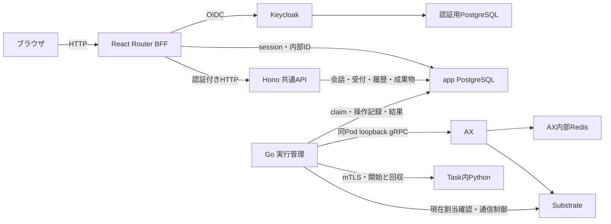

# ローカルWebの境界と非同期実行

2026-10-06、共通APIの受付・所有者確認・会話管理をHono/TypeScriptへ移し、会話・実行履歴・小さな成果物をapp PostgreSQLへ保存する構成へ切り替えた。PythonはTask内部で動く。対象はbase `0b6b4c8` からの `codex/portable-api-postgres` の変更とローカル実環境。Cloudflare等への公開は未実施。

API/business layer、SQL、native adapter、配備設定に対応する図である。DBの設置先は接続設定で決め、Kubernetes内に固定しない。採用理由と外部操作の制約は[移行の決定](../decisions/systems/ax/portable-api-postgres.md)。

## 責務と起動

`web/app/` はReact Router Framework ModeのSSR/BFF、`web/api/` はHonoの共通API。ブラウザはWebにだけ接続する。`scripts/run.ts` はWeb/APIを別Nodeプロセスで起動し、`127.0.0.1:3100/3101` を既定にする。W1では単一プロセス案と比較し、API単独障害の表示と実行管理の分離を優先した。

起動管理は準備確認と自身の子の終了だけを行う。稼働後のAPI停止でWebを巻き込んで停止せず、APIの再起動・要求の自動再送もしない。準備確認は公開 `/login` 応答の署名Cookieを起動時の鍵で検証し、ポートを使用中の別サービスの200を成功と誤認しない。起動途中の失敗とWebの終了は子全体を回収する。API・共通処理・設定の変更は全体を再起動する。

## セッションと通信の境界

WebはHost、送信時のOrigin、署名した匿名CSRF Cookie、CSRFを検証する。匿名Cookieはポート別名でHttpOnly・SameSite=Strict、期限30分、起動ごとの鍵変更でも失効する。認証Cookieは別の不透明IDでHttpOnly・SameSite=Laxとし、OIDCの戻りを受けられるようにする。sessionと暗号化tokenはapp DB、暗号鍵は永続した非公開ファイルに保存するため、有効な認証sessionは再起動後も保持する。ローカルHTTPなのでSecureは付けない。同じPCの敵対プロセスの隔離や本番公開は対象外。本人の記録へのアクセスを制限する[認証設計](../decisions/systems/ax/auth-foundation.md)を参照する。

Referrer-Policyはsame-origin。no-referrerではJavaScriptなしの通常フォームPOSTがOrigin:nullとなり、React Router 8の要求元検証で拒否されたため。フォーム構造とサイズを検証したら、セッション検証より前に表示用入力を保存し、期限切れ・再起動後の拒否でも入力を保持する。API呼出しは検証成功後に限定する。

API全経路で固定Host・起動時Bearerを確認し、Origin付き要求を拒否する。status以外ではX-AX-Access-TokenのJWTとDB上の有効な利用者対応も確認する。確定した内部UUIDをDB関数へ渡し、ブラウザからownerを受け取らない。秘密値や内部接続先をブラウザへ渡さない。実行APIは要求64 KiB・応答512 KiB、DBのquery待ち時間に上限を設け、BFFは本文まで8秒。redirectと自動再試行は禁止。旧接続確認は16 KiB・3秒、trim後1〜200 UTF-16コード単位を維持する。

React DOM 19.2.8はtextareaのhydrationで非空の既定値をvalueへ代入する。読み込み完了前の入力を失わないよう、初回stateで既存DOMの値を取得してdefaultValueへ渡す。SSRでは既定値かaction入力を使い、カウンターもSSRと同じ値で初期化してeffectでDOM値へ同期する。JavaScript取得を保留した実ブラウザ試験で保持を確認した。

## PostgreSQLと実行管理

受付・会話・実行・成果物の正本はapp DBのax_*領域。ownerと受付キー、入力のfingerprint、会話の親・順序をtransactionで保存する。同じ利用者の同じキー・内容は既存ID、内容の変更は409。旧ownerなしの記録は通常Webへ公開せず全体guardへ含める。GETはAXを操作しない。

常駐Go controllerはHTTPから独立してDBの受付を処理する。外部操作ごとに一度だけintentを保存し、結果・manifest・成果物bytes・usageと通信遮断・実Actor停止を確認して終了する。claimの期限切れやHTTP再送で実行を自動再開しない。API・controllerのDB権限は分離され、通常APIからclaim・import・管理者復旧を呼べない。

復旧要求はDBへ記録する。開始した可能性のある実行は、旧controllerと残存RPCの停止を証明する管理者処理が必要。復旧は回収・遮断・停止のみでstart/resumeを送らない。状態不明は全体枠を保留する。旧Python bridge/CLIはretirement markerで通常操作を拒否し、移行後の二重writerを避ける。

APIのNode entryはpg Pool、Workers entryは要求ごとのpg Clientを使う。DB接続断は503として終了し、再接続や受付の自動再送はしない。workerdでAPIと実PostgreSQLの契約を確認したが、クラウド配備やBFFのWorkers移植は未実施。起動・移行・復旧手順は `web/README.md` と `execution/README.md`。

## 今回の確認

既存15件の原bytes・hash・owner・順序・費用を移行し、旧ファイルを保全した。APIのNode/workerd共通契約、認証・所有者分離、DB障害、実AX offlineの回収・遮断・停止を確認した。実KeycloakのログインからWeb→API→PostgreSQL→controller→AXを通すofflineも成功し、同一キー再送は同じIDだった。追加モデル呼出は0。詳細は `.space/tasks/ax-portable-api/verification.md`。

## 操作と入力

受付キーはフォームURLのdraftに保持する。再読込やセッション更新で消さず、別の作業は「新しい実行」で新規キーにする。通常フォームのCRLFとJavaScriptのLFが別内容にならないよう、BFFで指示・テキストの改行をLFにそろえる。単発作業の一覧更新は同じdraftを送る通常GETフォームでactionを `/tasks` とする。同一queryにfragmentだけを付けたactionではページ内遷移となり、GETが起きなかった。

既定offlineは実AX内で入力を成果物に保存し、モデルを使わない。modelの明示選択と外部送信・料金への同意がある場合だけ、設定済みAntigravity/Geminiを選ぶ。指示2048バイト・入力4096バイト、成果物1件64 KiBまで。成果物はサイズ・SHA256・UTF-8を再確認して表示・取得する。未知usage、cleanup未完、有料失敗のguardと[費用ルール](../rules/ax-model-spending.md)を維持する。

## 以前の構成と確認の経緯

W1は境界5件・ブラウザ8件で模擬往復を確認した。W2〜W4の最終確認はPython85件、Node12件、ブラウザ12件、型検査、buildが成功。ブラウザ試験の実行バックエンドはfixtureである。

実ブラウザからAX offlineを2件実行し、期待成果物・使用量0・通信遮断・Task停止を確認した。同じキーの再送で実行が増えず、完了後のWeb/API再起動でも結果を再表示できた。実行途中の実AX/API停止は停止前に完了したため未確認。worker寿命・強制終了時の排他は隔離した子プロセス試験で確認した。今回の有料API送信は0件で、Webからの有料モデル全経路は実機未検証。

デザインはプロジェクト内の[参照スキル](project-design-skill.md)が保存したDADSの基本・フォーム・通知に基づく。320px・キーボード・axeは確認したが完全適合の証明ではない。根拠は `.space/tasks/ax-web-runs/{design,verification,review}.md`、利用手順は `web/README.md`。

## チャット導入時の構成と確認

2026-10-06、ルート画面をチャットへ変更し、単発作業を/tasksへ移動した。会話の順序・本文・返答を既存receipt/request/成果物から復元し、成功ペアのrole付き履歴を各往復の有限Taskへ渡す。設計理由、再送と文脈の不変条件、制限は[会話の設計](../decisions/systems/ax/chat-turns.md)へまとめる。

APIはGET /v1/conversations、GET /v1/conversations/:id、POST /v1/conversations/:id/turns。会話応答のみ1MiBへ拡張し、旧runの512KiBを維持する。会話IDはURL、送信keyはIDと末尾runから復元する。503の原送信はGET再取得後もstateに保持し、同じ内容だけ再送可能にする。Enter改行、Ctrl/⌘+Enter送信、IME変換中は送信しない。現在の返答は完成後に表示する。

チャット導入時は実AX2往復で再読込後の文脈参照を確認し、モデル使用量と終了処理も確定した。会話履歴の長さは有限である。同日の認証追加後は本人の会話だけを表示・継続する。本番配置は未実施。

## 認証を接続した時点の確認

2026-10-06、Keycloakのパスワード・パスキー、BFF session、API JWT、Python所有権を接続した。Python113件、Keycloak初期化4件、Node29件、ブラウザ24件、型とbuildが成功した。実Keycloakと2利用者の実AX offline、旧データ不変、DB隔離復元、再起動後のsessionも確認した。課金モデル送信は0件。物理認証器のパスキーは未確認。詳細は `.space/tasks/ax-auth/verification.md`。

通常配信は `web/server/serve.ts` のHonoで行い、callback URLに含まれるcodeをアクセスログへ出さない。認証のテスト設定は `.state/auth-test/app.json` に分離し、初回Keycloak初期化が試験専用ファイルを秘密情報の欠損と誤認しないようにした。試験DBもapp_auth_testだけを許可する。
