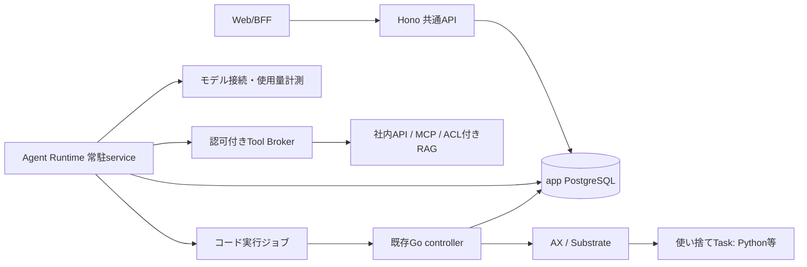

# 候補B：信頼側Runtimeが会話を進め、AXにはコード実行を渡す

2026-10-07、基準 `a682948be9daddc37555067fd98475eb3938b427`。共通条件は `../task.md` のD1–D5。独立候補Bのみを作成し、他候補は参照していない。設計案であり、以下の新機能・隔離は未実装。

## 利用例と構造（D1）

「所属部署で閲覧できる売上資料を調べ、Pythonで集計し、社内案件の更新案を作る。更新前に確認してほしい」とWebから依頼する。資料検索→コード実行→変更案の提示→本人の承認→社内API更新→出典付き回答を、同じ会話で確認する。途中の追加質問に答えたり、停止後に確認済みの続きから再開できる。

この全工程は現行の2 tool上限を超えるため、最初の実装では検索と回答、またはPython集計と回答など小さい経路に分ける。利用例を理由に上限や2,000円条件を自動変更しない。



- **共通API**：本人確認、Workspaceと会話owner、受付・入力・承認・停止要求・表示。短いDB transactionだけを行い、agent loop、モデル送信、PythonやAX操作を実行しない。
- **Agent Runtime**：DBに保存したstepをclaimして、モデル判断と型付きtool要求を進める常駐プロセス。会話のためにTaskを常駐させない。モデルの出力は信頼しない。
- **モデル接続／Tool Broker**：型、許可された接続先・操作、現在の本人権限、予算、送信権を検査する。最初はRuntimeの管理されたモジュールでもよいが、SDKから迂回して外部へ送れない構造を検証する。通信先指定をモデルに任せない。
- **Go controller／AX**：コード実行要求を有限のTaskへ変換し、起動・回収・通信遮断・実停止を管理する。任意コードの正当性まで判定せず、生成物は不信なデータとして返す。
- **言語／SDK**：構造からTSを必須にしない。Python常駐Runtimeなら現Antigravity 0.1.20のadapterと計測実装を段階利用できる。TSなら既存Python SDK移植の代わりにprovider adapterが必要。APIはいずれもTSのまま。後述のstep制御をSDKで実現できるかを比較し、実装前に選ぶ。

## スキル、subagent、Pythonの境界（D1・D4）

- スキルはWorkspace内で許可された版付きmanifest（説明、入力、必要tool、上限）として固定する。runにはversion/hashを保存する。説明文や取得文書は認可を増やせず、スキルのスクリプトも信頼側へimportせずTaskで実行する。
- subagentはSDKの無制限な内蔵forkではなく、`parent_id`付きの子状態。依頼者・Workspaceは不変、tools/scopes/budgetは親の部分集合。必要な文脈だけ渡す。最初は深さ1・子1・直列とし、親が中断／失効すれば子も次の操作を開始しない。
- Pythonは選択された入力と版固定の実行イメージだけを受け取る。DB資格情報、モデル鍵、接続先OAuth token、ホストmount、kubeconfig、他人の作業領域を渡さない。依存の任意ダウンロードは初期対象外。
- 現runnerのadapter-state、usage receipt、モデル鍵と任意コードを同じ信頼境界に置かない。モデル料金は信頼側の送信記録・provider usageで測り、sandboxの申告を採用しない。
- コードのstdout、ファイル、終了コードは内容の正しさの証明ではない。信頼できる実行基盤の観測と、回収側の件数・bytes・hash・path検査を使う。コードが編集できるresult.jsonや自己申告だけで終了を確定しない。
- **開始条件**：任意コードから制御RPC／metadata／社内ネットワーク／モデル接続へ迂回できないことを実証する。現行のgVisorと確認済みHTTP/HTTPS egressだけを「全通信隔離」とみなさない。制御・計測の侵害を防げなければPython機能のリリースを止める。

## 保存とAPI骨組み（D2）

app PGが正本。SDKの生メモリや会話プロセスの生存、Taskのローカルファイルを再開条件にしない。

```text
AgentRun {id, owner_user_id, workspace_id, conversation_id, engine_version,
          state, revision, parent_id?, skill_versions, grant_id, budget_id}
Step {id, run_id, kind:model|tool|sandbox|question, input_hash,
      state:prepared|sending|confirmed|unknown, operation_id, result_ref, usage}
Grant {id, initiator, session_id, workspace_id, connector_scopes, expires_at, revoked_at}
Approval {id, run_id, operation_id, payload_hash, target_version, expires_at, decided_by}
Event {run_id, seq, kind, safe_summary, artifact_refs}
POST /v1/agent-runs {key, conversation_id, parent_revision, text, skill_ids}
GET  /v1/agent-runs/:id/events?after=seq
POST /v1/agent-runs/:id/inputs {key, question_id, expected_revision, text}
POST /v1/agent-runs/:id/approvals/:id {key, decision, payload_hash}
POST /v1/agent-runs/:id/stop {key}
POST /v1/agent-runs/:id/continue {key, expected_revision}
```

- ownerとWorkspaceは認証済みAPIから確定し、bodyやモデルが指定した本人を信用しない。keyはowner・操作・payloadに束縛し、更新はrevisionで競合を検出する。
- Runtimeのprovider adapterは `nextStep(context, allowedTools, remainingBudget)`、toolは `invoke(operationId, grantRef, typedArgs)`、sandboxは `dispatch(executionRunId, codeRef, inputRefs, limits)`。秘密値はこれらの引数へ含めない。
- 会話・step・確認済みtool結果・質問・承認・usage・出典・成果物を保存し、APIはseq順の有限pollで途中表示する。HTTP切断でジョブは消えない。UIへは処理状況と出典を返し、内部思考や秘密の生ログは保存・表示の対象にしない。
- SDK sessionの持続は不要。確認済みの履歴から文脈を再構成する。SDK固有session dumpを使う場合も、正本ではなく版固定・検証可能な補助情報に限定する。tool前後の停止と独立usageを観測できないSDKは、そのままloopの正本には採用しない。
- 長い文脈は出典参照＋許可された要約を使い、権限を再確認して必要な部分だけ読む。現在の入力2048B／履歴4096B／32turnはv1契約として保持し、新版の上限は別途固定する。黙って切り捨てない。
- 小さいUTF-8結果は現行の1件64KiB・byteaを維持。大きい／複数の成果物が必要になった段階で、PGにowner・hash・サイズ・ACLラベル、object storageに非公開の本体を置く。参照の発行時も本人と現在の権限を確認する。

## 停止、再開、二重実行（D2）

- 状態は `queued → running → waiting_input / waiting_approval / completed` と、`stopping → stopped`、`blocked_unknown`、`failed`を分ける。停止要求の受理を実停止と表示しない。
- モデル／toolを送る前にintentを一度だけ保存する。応答不明のモデル要求は新しい要求で置き換えず、usage不明のまま保留する。副作用の再送権をlease期限切れだけで再発行しない。
- brokerを別プロセスにするなら世代と一回限りの送信権を入口で検証する。ただし既送信RPCは世代更新で消えない。旧Runtime／送信経路の停止、in-flightの確定がない限り別Runtimeへ引き継がない。既存controllerのretirement証明の制約を維持する。
- `continue`は確認済みstepの次から進む新しい世代。旧start、モデル要求、社内更新を再送する操作ではない。`blocked_unknown`を利用者の「続ける」だけで解除しない。現行runのrecoverは再開なしのまま残す。
- 人への質問・承認待ちへ入る前に、稼働中のTaskを回収・停止し、全usageと送信結果を確定する。未確定なら待ち状態ではなく保留。停止後も利用者の操作権と別の限定された権限で回収・通信遮断を完了する。
- AgentRun（会話上の依頼）とExecutionRun（1実行1Task）を区別する。初期は全体で実際に進むモデル／tool／sandbox操作を1つに制限する。親が実行枠を保持したまま子が別枠を待つ構造を作らず、子待ちの親は計算を行わない。未知usage／未停止があれば全体を保留する。
- 親と子の予算を同じ台帳で集計する。初期上限3 model / 2 tool / 512 output / 6000 input、90秒の実処理予算を親子で共有し、質問待ちの時間だけを除外する案。各sandboxも有限timeoutを持つ。新しいstepやcontinueで予算をリセットせず、既存の累積費用・有料失敗ガードも維持する。上限変更は独立した判断が必要。

## 本人性、委任、社内API/MCP/RAG（D3・D4）

- `initiator = 内部users UUID` と `actor = Runtime/connectorのservice identity` を別に記録する。外部アカウントとの紐付けは接続時に検証し、メール文字列やモデルの申告で同一人物とみなさない。
- 許可は「有効な本人・現在のWorkspace所属」∩「接続先の本人ACL／scope」∩「Workspace接続方針」∩「今回の委任範囲」。Groupと業務ロールは方針の入力であり、自動的な接続先権限ではない。owner/adminにも他人のprivate会話や資格情報を渡さない。
- 接続ごとのOAuth同意または対応するtoken exchangeをbrokerが担当する。交換元のトークンを社内APIやMCPへそのまま渡さず、resource/audienceを限定した接続先用tokenを用意する。本人委任も対象ACLの検証もできない接続先を、広いservice accountで透過的に代替しない。
- refresh tokenと鍵はbroker専用の暗号化保管へ置き、DBには参照だけを記録する。sandbox、モデル入力、成果物、イベントには渡さない。MCP endpointとtool schemaは許可リスト・版固定・サイズ制限を持ち、tool名やdescriptionだけでread-only／更新を判定しない。stdio MCPが必要なら別の管理されたconnector実行環境へ隔離する。
- 委任は対話実行のsessionに結び付け、有効期限と取消を持つ案。ログアウト、本人停止、所属／接続方針変更、接続先の失効を次のモデル送信・tool・dispatch・データ再利用前に確認する。期限切れは再認証待ち。更新承認は権限を増やすものではない。
- 交換tokenの失効は自動連動すると仮定しない。broker側のgrant失効を必ず確認し、接続先の取消／短命token／利用可能な失効確認を組み合わせる。既に相手へ届いた更新やモデル送信の即時撤回は保証しない。
- RAGはWorkspace分離と文書ACLを検索段階で適用し、返却chunk・タイトル・引用も現在の本人ACLで確認する。ACL版をcache keyに含め、削除／失効時に無効化する。共有embeddingを使う場合も無認可な検索結果をモデルへ渡さない。
- 取得文書とその派生要約に出典・ACLラベルを残す。権限を失った資料を古い会話cacheから再送しない。新しいRAG由来の保存結果も表示時に必要な出典権限を再確認する。外部へ既に表示・送信した内容を回収できるという保証はしない。
- 初期の外部更新は常に具体的な差分を本人へ提示し、operation ID・payload hash・対象versionに結び付いた期限付き承認を必要とする。承認後も最新権限と対象versionを再確認し、変更済みなら新しい承認を求める。
- 接続先がidempotency keyと結果照会を提供する場合にだけ、その契約で結果を確定する。更新の応答喪失を一般的なHTTP retryで再送しない。照合できなければ `blocked_unknown` とし、管理者の実結果確認へ渡す。監査は依頼者／実行主体／委任／承認／送信内容hash／接続先／結果／usageを関連付け、機密本文は別のアクセス制御下に置く。

MCP HTTP認可のaudience限定とtoken passthrough禁止は[公式2025-11-25仕様](https://modelcontextprotocol.io/specification/2025-11-25/basic/authorization)に沿う。subject/actorを分ける交換と、交換だけでは失効連動を保証しない点は[RFC 8693 §2.1](https://www.rfc-editor.org/rfc/rfc8693#section-2.1)による。各社内サービスがこの方式を提供するかは未確認。

## 理由、負担、段階導入（D5）

**理由**：Web/APIと長時間処理を分け、任意コードから鍵・usage・認可を遠ざけられる。社内API／RAGと会話はTaskの再起動に依存せず、モデル差替えや承認待ちを明示的な状態で扱える。PythonをAPIへ戻す必要もない。

**負担**：現在Task内で一体のagent loopを分けるため、step台帳・broker・認可cache・停止経路を追加する。SDKの透過的なsession再開より実装量が増える。常駐Runtime／brokerの侵害は大きな影響を持つため、service資格情報・DB role・通信先を分離する。Taskを計算ごとに作る待ち時間とファイル受渡しも増える。

1. **境界試作**：模擬provider/toolでstep保存・一度だけ送信・旧worker失効・親子予算を実証する。Python SDK再利用とTS provider adapterを小さく比較し、制御できる方を選ぶ。有料呼出し不要。
2. **読み取り経路**：新版AgentRunを既存会話と接続し、途中表示・質問・停止・確認済み再開、版付きスキル、1つの社内read APIまたはACL付きRAGまで通す。既存v1のrun/会話・NULL Workspace履歴は変更しない。
3. **コードと子処理**：鍵なしTask、信頼側の計測・回収、通信とRPC隔離を検証後、Pythonと直列subagentを追加する。既存controllerの1ExecutionRun=1Taskと停止証拠を再利用する。
4. **更新経路**：1つの接続先について、権限委任、差分承認、idempotency、応答不明時の照合を実証してから更新を有効にする。接続先を増やす際も同じ条件を個別確認する。
5. **切替**：新版にengine_versionを固定し、共通の費用／全体実行guardへ全writerを統合してから受付を開く。旧jobを新Runtimeが再解釈・再開始しない。戻す場合は新規受付を閉じ、未確定処理と原本を保持し、処理中に旧writerへ戻さない。

検証ゲートは、HTTP切断／Runtime再起動後の継続、二重送信、モデルusage不明、更新ACK喪失、旧workerの遅延送信、承認後の対象更新、本人／Workspace／Group／接続ACL失効、子の権限増加拒否、RAG cache漏出、Pythonからの秘密／制御RPC／ネットワーク脱出、停止未確認時の全体hold。成功・失敗・未確認を分ける。

未決はSDKのstep制御能力、Runtime言語、最初の社内接続先と本人委任方式、全通信隔離の実証方法、長文／複数成果物の具体上限、待機中grantの期限・ログアウト時の製品方針。後二者も既定を暗黙に緩めず実装計画で固定する。定期実行は範囲外。

## 現状根拠

- `ax-local/task_runtime/adapters/antigravity.py:64–91, 95–130`：write_outputのみ、subagents無効、SDK予算とmeter照合。移設する信頼側機能の根拠。
- `ax-local/task_runtime/runner.py:83–110`：一度だけ開始とguest側status。`web/shared/chat-contracts.ts:4–23`：32turn／2048B／4096Bと現行入力。
- `web/api/chat-service.ts:5–20`：共通APIのDB repository境界。`execution/controller/controller.go:68–127, 214–308`：lease・intent・未知失敗・通信遮断・実停止の保存。
- `ax-local/README.md:3,57–61`：gVisor、確認済み通信範囲、ActorTemplate envの鍵と基盤隔離の制約。
- OKF path検索は `execution/`、`ax-local/task_runtime/`、`web/api/chat-service.ts`。親が確認済みのルール・原則・auth/workspace境界を再利用し、`portable-api-postgres`本文を再照合した。

この単位では設計ファイル以外を変更せず、コード実行試験、DB・環境操作、モデル呼出し、PR操作は行っていない。候補比較と独立レビューは親へ渡す。
