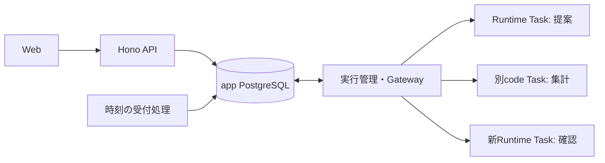

# 候補A：定義・ファイル・実行状態をapp PostgreSQLで管理する

2026-10-07。基点 `ede929ea87af8173af128e7b8706c11d1a9b16f6`。独立候補であり未採用・未実装。他候補は参照していない。
共通入力は `../task.md` と親からの確定回答。最初はCSV/Excel集計、定義は本人用/Workspace共有、定期実行は作成者本人の権限・本人限定結果・ログアウト後も継続、所属/権限喪失で停止。製品subagentは作らない。
選択基準は利用者が保存先やTask間コピーを意識しないこと、版と実行受付の整合、本人境界、停止後の重複防止、小規模運用の負担。

## 利用例から決める構造

1. 本人用の「月次売上集計」エージェントを作り、プロンプトと「売上集計」スキルの公開版を選ぶ。共有する場合は明示してWorkspace向けに発行する。
2. CSV又は `.xlsx` をアップロードし、金額列・集計軸・シート等を確認して実行する。例：部門別売上合計と件数を `summary.xlsx` にする。
3. Runtime Taskが利用者の確認した列・シート名等を読み、型付き集計操作又は短いPythonを提案する。Excel解析と生成コードは別のcode Taskだけで動く。
4. code Taskの出力・終了・停止を回収後、新しいRuntime区間が集計結果を確認し、本人だけが結果ファイルを取得する。画面再読込やログアウトでファイルを失わない。
5. 同じ公開版・入力セットを指定した定期実行を作成する。日時ごとの結果は作成者だけに表示し、共有スキル利用者やWorkspace adminへ公開しない。



Runtime同士やcode Taskへ直接権限を渡さず、各段階はPGの操作台帳を介して逐次進める。code TaskはSDK、モデル鍵、DB資格情報、Gateway権限を持たない。Taskは実行場所、PGは保存と業務状態の正本とする。

## 保存・所有・版の骨組み

| 概念 | 保存内容と不変条件 |
| --- | --- |
| `definitions` | `id, kind(skill/agent), owner_user_id, scope(private/workspace), workspace_id?, state`。privateは本人、workspaceはその所属者が利用可能。共有定義から私有履歴への参照は禁止 |
| `definition_versions` | 不変の版ID、親版、本文、設定、作成者、発行時刻、manifest hash。エージェント版はプロンプト、許可toolの要求、順序付きskill版ID、runtime profileを固定 |
| `bundle_files` | 版ID、相対名、media type、`bytea`、長さ、SHA-256。本文・参照資料・scriptを一transactionで発行し、実行中は版の内容を更新しない |
| `work_files` | `id, owner_user_id, workspace_id, root_id?, role(input/output), name, bytea, size, sha256`。本人用データ。共有定義とは別の認可経路で読む |
| `workbench_roots` | 既存rootに1対1で付ける新protocolの構成。定義版の閉包、入力ID/hash、実行profile、grant参照を受付時に固定。本人/Workspace・状態・revision・累積予算を二重管理しない |
| `workbench_steps` | `(root_id, ordinal)`、型(runtime/code)、一意なrun/Actor、要求hash、claim世代、intent、確定結果/出力ID、cleanup証拠。root内の実行中段階は高々1 |
| `schedules / occurrences` | 作成者、Workspace、固定定義/入力版、時刻規則・timezone・revision、grant。`UNIQUE(schedule_id, scheduled_at)` と発生時のschedule revisionを保持 |

候補の初期上限はbundle合計1MiB/32ファイル、入力・出力各合計8MiB/8ファイル、展開後32MiB。実測後に確定し、API・PG CHECK・転送・Taskで同じ版付きprofileを使う。既存65,536 byte成果物の上限を黙って変更しない。
PGには大きな単一base64 JSONを置かず、binaryとmanifestを分ける。全入力と受付、又は成果物全体と段階完了を同じtransactionで確定できるサイズに制限する。超過は明示拒否し部分成功にしない。
転送は固定操作 `stage_chunk/commit_input/read_output_chunk` 等で32KiB程度に分割し、PG上は未確定のstagingを他者・実行から読めない状態にする。offset・hash一致の再投入のみ許可し、最後のmanifest検証まで開始しない。GCは未参照かつ実行中でないstagingだけを消す。
archiveの任意展開は初期に提供しない。名前正規化、絶対path/親参照/symlink/hardlinkの拒否、件数・展開量の制限を境界に集める。参照資料やscriptは未信頼入力であり、共有・発行によって信頼済みtoolには変わらない。

公開版の更新は新しい版。起動中rootとscheduleは自動で最新版へ変わらない。版のwithdraw/archiveは新規利用を止め、履歴に参照されたbytesは保持する。権利削除は次操作の利用権確認で停止する。
private→共有は本文と依存版を明示確認して新しい共有版として発行する。私有skillを参照したまま共有agentを発行できない。編集はCAS revision、所有・共有scopeの変更を実行履歴へ遡及させない。
個人用定義をWorkspace横断の本人ライブラリにするのは本候補の案であり未決。Workspaceごとに限定する回答ならprivateにもworkspace_idを必須にし、受付時の利用範囲を狭める。実行データはどちらでも本人＋実行Workspaceに固定する。
共有版の発行/編集権限は未決。候補では作者がdraftを編集し、Workspace adminが共有発行/撤回を承認する。誰でも共有発行可能にする場合は別の明示方針が必要。

## Runtimeと別code Taskを結ぶ契約

```ts
start({workspaceId, agentVersionId, inputIds, instruction, key})
  -> {rootId, state, replayed}
Proposal = Ask{text} | Compute{inputRefs, pythonSourceOrPlan, outputNames}
         | Finish{artifactRefs, summary} | Unsupported{reason}
settleStep({rootId, ordinal, runId, resultHash, outputManifest, stopEvidence})
  -> {nextStepId?: string, state}
```

Runtimeは固定SDK 0.1.20の一回提案を再利用し、tools自動実行とsubagentを引き続き無効にする。PGから固定された会話・版・確定操作結果を構成し直し、SDK SQLiteや未確定tool-callを復元しない。
基本の安全指示はイメージ内、利用者のagent prompt/skill本文は版付きデータとしてロードする。要求されたtoolと実行grant/profileの積集合だけをGatewayが許可する。プロンプトやskillに権限・予算を変更する力を与えない。
列・型・少量サンプルと集計結果だけをモデルへ渡す候補とし、元のExcel全体を自動で送らない。モデル利用同意にはこのデータ送信範囲を含める。入力中の命令はデータとして扱い、Gatewayの外向き通信先を変更できない。
`Compute`確定時にcode bytes・入力hash・固定Python image digestをPGへ保存する。Runtimeを停止確認してからcode Taskを起動し、両者のworkspace volumeを共有しない。Python標準csvと固定版openpyxl等をイメージへ同梱し、pip・任意URL・オンデマンド導入は初期対象外。
code Taskは新規Actorで実行し、終了コードと出力bytesを信頼側が観測する。codeが書くreceipt/stdoutを費用・権限・停止・成功の証拠にしない。出力は常に未信頼としてサイズ・形式・hashを検査し、必要な安全な要約だけを次Runtimeへ渡す。
code成果物のPG保存と次段階の受付は、前段のdeny・Actor停止・worker未割当の証拠が揃ってから同一transactionで行う。次の段階は新run_idだが同じrootの予算を消費する。段階の切替は製品subagentではない。
既存global slot 1は維持する。前段が未停止なら次段をclaimしない。人待ち時はcheckpoint・既知usage・全段階停止を確定してslotを解放し、本人回答のCAS受付と次段作成を原子的に行う。
操作台帳の新protocol対応時には、v5の費用合計・未確定予約・旧有料adapterを含む判定を共用する。workbench用に独立した「残額」を作らない。新段階を既存queryの対象外にして送信できる抜け道を実PGで検証する。
AX Create/Resume/Start前にintentを保存し、ACK不明なら同操作を自動再送しない。保存済み成果物/返信の同hash再読込は可能だが、期限切れclaimの自動takeoverや未知な実行の再開始はしない。recoverは照合・回収・遮断・停止だけを維持する。

既存上限3 model/2 tool・input6000/output512・active90秒で収まる最初の流れは「必要項目を先にフォームで確認→Compute→Finish」。Askもtoolを消費し、Ask→Compute→Finishや複数Computeは現行2 toolに収まらないため、上限で停止する。名前の変更で消費を除外しない。
反復修正や自由な長いPython生成には新しい明示profileが必要。候補はまず定型集計plan又は短いcodeを用い、固定出力512のまま無制限の作業能力を約束しない。費用枠・回数・実作業時間を広げる採用判断は親/利用者へ残す。

## code Task公開前の隔離条件

鍵なしAX patchをcode用image/領域にも適用し、default template fallback・自動モデル鍵注入を拒否する。atespace名やKubernetes namespaceだけを隔離と見なさない。
codeからRuntime/他Actorのファイル、runner制御領域、SDK保存領域、ProcessService/control API、worker/host socket、クラウドmetadataに届かない構成を作る。code実行UIDと信頼側collectorを分け、readonly入力・限定output・capability削除・資源制限を要求する。
固定上流のSecurityContextはcapabilityだけでUID/PID上限の実装を保証しない。image内launcher又は実行基盤側で成立する方法を試作し、同guestの制御RPCをcodeが呼べるなら公開を止める。既存runnerへ任意Pythonを足すだけでは成立しない。
通信はHTTP/HTTPS denyだけでなく、DNS・任意TCP/UDP・IPv4/IPv6・link-local・loopback制御口・UNIX socketを実Actorで検査する。codeは外部通信不要。APIやモデルへ送る操作はRuntime/Gatewayだけに残す。
CPU/memoryに加えwall time・子プロセス数・disk/output量を制限し、fork/メモリ/圧縮展開/大量出力/終了しない子プロセスでもcontrollerから停止できることを確認する。必要な隔離が固定上流で実現できなければ、この単位は未達として基盤修正の範囲を再設計する。

## ログインと独立した定期実行

`ScheduleGrant`をセッション由来の既存RunGrantと区別する。本人が認証済みで明示的に有効化し、作成者UUID・Workspace・固定agent/skill/input版・tool・期限・最大発生回数・概算金額枠・一回上限をDBへ保存する。生token/refresh tokenを保存又はTaskへ渡さない。
時刻受付はAPIリクエストやWebプロセスと別寿命の小さいworker。DB時刻と行lockでdueを取り、occurrence・root・予算予約・次due更新を一transactionで確定する。複数worker・再起動でも同じ予定日時は同じrootを返す。
初期時刻UIは毎日/毎週＋IANA timezone等に限定する案。DST重複時の同一予定は一度、存在しない時刻はskip、停止中の取りこぼしは一括追走せず最新一件だけを記録して扱う。これらは選択可能な候補方針で、cron全構文は不要。
同一scheduleの前回が稼働/人待ち/unknownなら次回は`skipped_overlap`と記録し、別rootを増殖させない。人待ちは既存24時間等の期限を持ち、期限切れを終結してから次回へ進む。未知usageや未停止は全体holdのまま。
ログアウトはsession grantだけを取り消すよう現行のowner全root取消を分岐させる。scheduleの停止/削除はgrantを恒久失効させ、現在のrunも新効果を止める。所属削除・ユーザー停止・実行権喪失・依存共有定義の利用不可は両grant種別を停止する。再加入で古いgrantを復活させない。
発生受付、AX開始側intent、モデルcount/生成直前、code開始、保護ファイルの再利用ごとに現在の権限・grant・残枠を確認する。失効後も既送信の精算とcleanupは専用権限で続ける。確認と外部送信の間の瞬間的競合をゼロと断言しない。
共有agentの作者/adminは他人のscheduleを代理実行する権限を得ない。結果・入力・ログ・成果物は作成者本人限定。版の更新、入力差替え、費用枠拡大は新schedule revisionと明示再許可が必要。
定期実行の入力方式は未決。本候補では最小案として固定保存済みセットを提示する。毎月の新しいExcelを使うなら「本人の指定フォルダ/入力セットの最新確定版」等を別に定義し、発生受付transactionでその時点のfile ID/hashへ固定する必要がある。外部連携や無条件の最新版取得を決定済みとはしない。
無人の金額枠・許可期間・回数は未決。候補例は7日/最大7回/一回と期間合計の概算枠の二重制限。決まるまでは定期実行をdisabled又は無課金fixtureでのみ検証する。2,000円・0.01 USD概算停止guardを暗黙に増やさず、有料Gatewayも自動開放しない。

## 既存からの移行と検証単位

v1-v5 SQL/checksumと既存要求bytes/hash/所有者は変更しない。v6以降に定義/files/grants/workbench構成/stepsを追加し、既存rootのprofileに応じて制約・予算関数を拡張して、新protocolだけで可変段階を受け付ける。既存二段階interactive rootは従来の読取・回収経路を保ち、進行中rootを途中で新protocolへ変換しない。
旧fixed `brief-v1` はsystem管理の初期公開版としてdigest付き登録できるが、既存rootのskill値/履歴は書換えない。旧65KiB artifactを保持し、新binaryファイルのAPIとDB認可を追加する。owner無しlegacyを公開しない。
API/exec/scheduler各DB roleを分け、必要な関数のみgrantする。schedulerは全テーブル読取や任意ownerの受付を持たず、due scheduleを処理する関数だけを呼ぶ。PG停止時のfile fallbackを作らない。
受付を閉じ未解決runを確認、backupとhash照合、追加migration、互換controller/API配置、新受付を順次開く。新データ受付後に旧binaryへ安易に戻さず、disable/forward修正を基本にする。

1. **ファイルと定義版**：本人アップロード→不変版付き手動集計→binary downloadを専用PG schemaで確認。原子的rollback、同key/別本文競合、跨Workspace拒否、共有定義からprivate漏洩なし、更新/削除後の固定版を検証。
2. **code隔離の成立**：実Actorで秘密・他Actor・制御RPC・全通信・ファイル改ざん・資源攻撃を試験。通過前は生成codeをUIへ公開しない。固定Python/image/依存digestを記録する。
3. **逐次Runtime→code→Runtime**：模擬providerで実AXを使い、金額合計・件数を独立した期待値と照合しExcelを再読込。各境界のcrash/ACK loss/停止/期限で重複効果ゼロ、全Task実停止と本人限定downloadを確認。資源・段階起動時間も計測。
4. **登録運用と定期実行**：発行権限の確定後UI登録→版指定→同一実行、schedule多重tick/DST/重複/ログアウト後継続/退会後停止/再加入不復活を検証。無人費用承認後だけ親が最少の有料実経路試験を行う。

## 利点・負担・未決

PGのtransactionで定義依存・入力・受付・成果物を結べるため、object storeとDB間の確定漏れを初期構成から除ける。バックアップ、所有権、版再現性を一つの保存境界で扱える。Task-local diskは交換可能な作業領域になる。
一方でbinaryがDB/WAL/backupを増やし、API/workerメモリと転送時間を圧迫する。サイズ/保存量上限・retention・実測が必要。大容量Excelや長期大量履歴には適さず、将来object storeへ移すならmanifest/IDを保ち保存実装を変更する別移行が必要。
Excelは初期 `.xlsx` の値集計に限定する候補。マクロ・外部リンク・数式実行・暗号化ファイルは扱わず、数式のキャッシュ値やCSVの文字コード/型/式注入の扱いを明示する。誤って文字列を数値へ変換して成功させない。
残る採用判断は個人用定義のWorkspace範囲、共有発行/編集権限、定期実行の最新入力、ファイル/保存量とretention、無人費用・期間・回数、既存2 toolで不足する対話/反復の扱い。実Actor隔離と固定上流の資源/制御RPC境界は実験前の未確認である。

## 今回確認した根拠

- `ax-local/versions.json:2`：AX `ac233282…`、Substrate `944abe…`、SDK 0.1.20固定。既存の実モデル成功・再停止はOKF `decisions/systems/ax/agent-runtime` を再利用し、新code隔離の証明にはしない。
- `web/data/schema-v4.sql:2,14,19,187,206`：root3/2、二段階・mailbox1/2固定、session fingerprint/期限、logoutのowner全root取消、所属確認。定期実行を単なる有効期限延長で実装できない根拠。
- `web/data/schema-v5.sql:157,183,210`：Reserve→AuthorizeGeneration→Settleと費用正本。`web/server/data-migrate.ts:5`：v1-v5 checksum検証。`web/data/schema.sql:50`：本人runに属する65KiB binary成果物。
- `ax-local/task_runtime/protocol.py:9`、`interactive_protocol.py:49,60`：入力4KiB・成果物65KiB、固定proposalとphase。`adapters/interactive.py:197,218`：固定skill/一SDK呼出・toolsなし・予算・mailbox確定後の出力。
- `execution/controller/controller.go:155`、`native/guest.go:10`、`native/direct_guest.go:55`：一runのintentとcleanup、固定runner RPC、Actor/worker宛先確認と小さいgRPC枠。既存Stageに大容量/任意shell転送はない。
- 固定AX `internal/workspace/setup.go:263`：skillsはディレクトリ作成のみ。`ax-local/patches/credential-free-atespace.patch:24,38`：env/workspace/fallbackとtemplate照合の現在の制約。新code image/資源設定にも意図した厳密照合が必要。
- 固定Substrate `pkg/proto/ateapipb/ateapi.proto:365,759,794,991,1974`：worker selector、cpu/memoryのみ、capability設定、workerはatespace外。`ax-local/README.md:57`：既存通信実証はHTTP/HTTPSに限定。
- OKFはrule/principle全descriptionと対象3パスをCLI検索。既読費用/PR/本人境界に加え、原則のデータ先行・業務状態の型・冪等・境界・検証単位を本文照合した。今回は設計文書だけを作成し、稼働操作・モデル送信・本体変更・OKF更新を行っていない。
