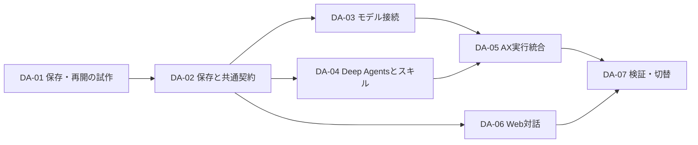

# Deep Agents移行のタスク分解

## 今回の到達点

承認済みの構成を、7つの移行作業と4つの後続候補へ分ける。当初は計画の作成までだったが、その後、登録スキルのファイル保存を先行実装する依頼を受けた。Deep Agents本体の移行単位は未実施のまま、保存・搬送をSS-01〜SS-04として進める。移行作業の最新状態は `orch/` 台帳を正本とする。

基点は `498abb96d7405c78985a35a32f15262e75f15ba8`。採用した構成と根拠は [task.md](task.md)、現行仕様は [agent-runtime](../../babel/decisions/systems/ax/agent-runtime.md) を参照する。

2026-10-08の追加依頼で、登録スキルの本文・資料をファイルストレージへ保存する設計を具体化した。[保存設計](skill-storage-design.md)をDA-01/02/04/05/06/07へ反映する。ローカルの推奨先はkind外のアプリ用Docker RustFS。既存のsnapshot用RustFSとは別にし、入力・成果物のPG保存はこの移行で変更しない。

## 保存・搬送の先行単位

SS-01は専用Dockerストレージ、SS-02はAPIとPGの管理情報、SS-03はGoからAX Taskへの搬送、SS-04は配備・既存データ保持・画面からの確認を担当する。成果はDA-01/02/04/05/06/07で再利用するが、既存Antigravity Runtimeとの接続完了をDeep Agentsへの移行完了とは数えない。担当・終了条件・確認結果は台帳と [検証記録](verification.md) にまとめる。

## 維持する条件

- 共通APIのホストにはPythonを要求しない。Deep AgentsはAXの推論用Task内で実行する。
- 会話・入力ファイル・実行結果は本人限定。スキルは本人用／Workspace共有を選べるが、共有定義から他人のデータを読めない。
- 会話、依頼、Task、モデル要求、コード実行、checkpointを別々に識別し、相互の対応を保存する。再開は同じ依頼の状態を新Taskへ渡す操作とする。
- 推論用TaskにDB接続情報やモデル・外部システムの秘密情報を渡さない。内部窓口への資格は短命・依頼限定とし、失効と実行世代を検証する。
- 生成コード用Taskは推論用Taskと分離し、既存のファイル範囲・ネットワーク・資源・停止・回収の制約を維持する。
- 一つの依頼を進める有効な実行主体は一つ。更新、モデル送信、外部操作、結果受領で実行世代を確認し、古いTaskからの要求を拒否する。
- 標準エージェント一つを使い、サブエージェントは無効にする。スキルの選択・登録で実行権限を増やさない。
- モデル要求は要約等の内部呼出しも含めてGo Gatewayを通す。未知の使用量や結果不明の操作を自動再送しない。
- 実行開始時にruntime image・framework・標準prompt・skill公開版を固定し、再開可能な依頼が残る間は対応する版を保持する。
- 登録スキルの新しい原本は非公開のS3互換ストレージ、PGは権限・公開版・保存参照を持つ。認可した版だけをTaskへファイルで渡し、Taskにストレージ資格情報を渡さない。
- 通常利用のAI接続は維持する。計画作成や個別試験の終了を理由にサービス全体の受付を閉じない。

費用は [AXモデル費用ルール](../../babel/rules/ax-model-spending.md) に従う。総額2,000円、現行Workbenchの1依頼0.01 USD・既存累計0.05 USD、モデル6回・道具8回（Python3回）・300秒・入力6000／出力512・API再試行0回を移行の初期制約とし、旧経路の別profileも保持する。Deep Agentsの既定要約などが収まらない場合は、その機能の設定を見直すか人間へ変更を提案し、独断で上限を広げない。新しい提供元の有料検証枠はDA-03/07の前に確認する。

## 全体の順序

| ID | 作業の結果 | 先に必要な成果 | 主な担当範囲 | 完了の目安 |
| --- | --- | --- | --- | --- |
| DA-01 | AX内でDeep Agentsの保存・終了・再開が成立する小さな試作 | 承認済み構成 | 固定SDK試作・専用AX検証 | 新Taskで続きが進み、旧Taskは停止し、実行が重複しない |
| DA-02 | 会話・依頼・checkpoint・操作記録の保存契約 | DA-01の成立条件と固定版 | 共通型・PostgreSQL・保存窓口 | 本人だけが保存・復元でき、古い実行世代を拒否する |
| DA-03 | 複数モデルへ接続できる費用管理付きGateway | DA-02の要求・利用量契約 | Go Gateway・Pythonモデル接続部 | 二種類のprovider形式でツールと使用量を扱え、制限を迂回できない |
| DA-04 | 標準Deep Agentsと既存スキルを接続 | DA-02の保存・版・認可契約 | Python runtime・skill読込・固定image | 自動読込、明示指定、参考資料、回答待ちが既存権限で動く |
| DA-05 | AX Taskの起動・保存・停止・再開と隔離コード実行を統合 | DA-03とDA-04の接続可能な実装 | Go controller/native・AX結合 | Runtime→code→新Runtimeが動き、停止・再起動でも重複しない |
| DA-06 | Webから会話を続け、進捗・回答・成果物を確認できる | DA-02の会話・イベント契約 | TypeScript API/BFF/UI | 再読込・途中回答・停止・次の依頼が同じ本人用会話で扱える |
| DA-07 | 実経路の確認、既存履歴を保つ切替、引渡し | DA-05とDA-06の統合 | 統括・独立レビュー・配備 | 実Web→AX→成果物を検証し、移行・復旧手順と証拠がそろう |

DA-03・04・06はDA-02の契約が独立レビューを経て受け入れられた後、別ファイルと専用fixtureで進められる。DA-06の画面・API局所確認は先行できるが、AXを含む合格はDA-05との統合後に判定する。Task起動・配備・稼働DB・課金操作は統括が順に実施する。

## DA-01：保存・終了・再開を先に確かめる

利用例は「スキルの資料を読む→作業を外部へ依頼する→終了→別Taskで結果を受け取る→回答する」。ネットワークなしの固定モデルfixtureで始め、専用の実AX環境でも確認する。人間の回答待ちからの再開も同じ試作で扱う。

- 所有：新設する `.space/tasks/ax-deep-agents/spike/` の試作、試作専用image・fixture。製品コード、稼働DB、既存受付は変更対象にしない。
- 成果：使用するDeep Agents/LangGraph等の固定版、状態形式と保存タイミング、Pythonのcheckpointer／model／tool接続の骨組み、AXでの引継ぎ結果。骨組みの実装範囲は試作内に限定する。
- 検証：実際のSDKを使い、サブエージェントなし・外部モデル送信なしで、スキル本文と資源の読込、checkpointと未完了操作の保存、新Taskでの復元を確認する。保存前後の中断、同じ結果の再配送、期限切れも試す。
- 完了条件 C01：別Taskの回答が保存前の作業と一致し、全Taskの実停止・通信遮断・回収を確認できる。曖昧な外部結果は再送せず停止する。固定版・接続契約案・未確認点を独立レビューし、後続で実装可能と判断する。
- 証拠：版・入力hash・状態／操作ID・出力・AX停止状態・送信0回を試作報告に記録する。証拠は未取得。
- 追加の保存設計：実ファイルのmetadata→本文→補助資料を読めることと、新Taskへ同じ版を再配置できること、readonly境界の成立条件を確認する。製品のストレージ配備はDA-02に置く。

失敗した場合は先に原因と構造を見直す。GoとPythonの二重の行動選択ループや、TaskへのDB／モデル鍵の配布で回避しない。

## DA-02：保存モデルと共通契約

- 所有：`web/data/` の次の追加migration（番号は着手時に確認）、会話／依頼／状態／操作の型・repository、認可処理、Goの永続化接続部分。SQLと共有型の変更窓口はこの担当一人に集める。
- 成果：Conversation→Run→Taskの関連、Runごとのcheckpoint thread、checkpointとpending writes、外部作業の要求／結果記録、実行世代・排他、版manifest、本人限定の保存・読出し契約。同じ会話への同時送信の順序と、新Runへ渡す履歴範囲も定める。
- Go内部窓口には認可済みの状態取得・保存、資源読込、作業要求の登録を実装する。Python側の接続コードはDA-04が所有する。共有契約と保存処理の責任をDA-05へ重複させない。
- 会話・表示用イベント・課金の正本と、SDKの復元用checkpointを区別する。Taskが送った任意のuser/workspace/thread IDをそのまま信用しない。
- 完了条件 C02：専用PostgreSQLで正常保存・復元、二重要求の同一結果、古い世代の拒否、別ユーザー・別Workspaceの拒否、所属失効時の停止を確認する。checkpointと作業要求が片方だけ確定する場合の復旧を検証する。
- 移行：現行v9の履歴・固定版・受付済み再送を保持する追加migrationとし、既存Runを新frameworkへ途中変換しない。保存上限、checkpoint保持・削除、旧image保持、秘密情報を記録しない形式を定める。
- 証拠：追加schemaへの移行結果、旧データ照合、権限・並行・復旧試験、内部API契約の独立レビュー。いずれも未取得。
- ファイル保存の所有を追加：アプリ用RustFSのDocker配備定義（予定先 `ax-local/object-storage/`）、S3接続契約、TypeScriptの原本保存処理、Goの原本取得、manifest・容量予約・公開参照・旧版対応の保存モデル。APIルートはDA-06、Task内の読取はDA-04、搬送はDA-05へ契約を渡す。
- C02には原本保存→hash検証→PG公開確定の途中失敗・同時編集・同じ要求の再送、他Workspace拒否、資格情報の権限制限、旧JSONを変更せず移行参照を追加できることも含める。保存先を変えて既存の容量・モデル費用・実行権限を広げない。

## DA-03：モデル接続と費用管理

- 所有：`execution/gateway/`、対応するモデル利用量の保存接続、Pythonのモデル接続専用module。DA-04のagent構築・skill処理は変更しない。共通SQL変更はDA-02担当へ依頼する。
- 成果：モデル名・ツール定義・tool call ID・結果・終了理由・利用量を扱う契約。現在の固定JSON actionの代わりに、Deep Agentsのモデル呼出しに必要な情報を仲介する。
- まずGeminiの既存機能を新契約で保持し、第二のproviderは人間が選んだ接続先を追加する。提供元ごとの機能差、価格profile、事前見積りと使用量の差を明示する。API互換と料金互換を同一視しない。
- 完了条件 C03：模擬HTTPサーバーで二種類のprovider形式を確認する。正常・失敗・timeout・使用量不明・キャンセル・予算超過・古い世代・再配送で費用予約と精算が整合する。要約を含むSDKの全呼出しがこの経路を通り、自動リトライ／fallbackが迂回しない。
- 第二providerが未選定でも、共通化・Gemini回帰・provider fixtureまでは進められる。第二provider対応とDA-07の有料検証は、選定と資格情報の準備を着手条件にする。
- 証拠：wire fixture、モデル接続契約、費用台帳との照合、Goの局所・race試験、独立レビュー。実課金試験はDA-07へ集約し、ここでは実施しない。

## DA-04：標準エージェントとスキル

- 所有：`ax-local/task_runtime/` のDeep Agents adapter・graph・checkpointer接続・skill backend、組み込みcatalogと対応試験、runtime用Dockerfile・依存固定。モデル接続専用moduleはDA-03担当と分ける。
- 成果：標準エージェントの推論・道具選択をDeep Agentsへ集約する。Goには同じ判断ループを追加しない。PGが指すファイル原本の固定公開版と組み込みskillを、Task内の認可済み読み取り専用ファイルとして公開する。独自の遠隔検索backendやFUSEを前提にしない。
- 現在の自動選択と `/` の明示指定を保つ。概要→本文→必要な資料の順に読み込み、同名skillや候補上限の扱いを定める。旧checkpointのcatalog cacheと異なる版が混ざらないようにする。
- 完了条件 C04：実SDK＋固定モデルで、一般相談、CSV集計依頼、明示skill、自動skill、参照ファイル、質問／回答、失効したskill、壊れたcheckpointを確認する。無関係なskillの全本文を最初から送らず、公開版とhashが一致する。
- 固定版の公式仕様に従い既定・追加のサブエージェントを無効化する。任意shellやコードの直接実行、Taskからの外部接続を有効にしない。コード処理はDA-05へ引き渡す専用toolにする。
- 証拠：固定image内の実SDK試験、読み込んだskill ID／版／hash、提示されたtool集合、サブエージェントと余分な送信がない記録。課金を伴う評価はDA-07に集約する。

## DA-05：AX実行と復旧

- 所有：`execution/controller/` の実行ライフサイクル、`execution/native/` のTask搬送・停止・回収、必要な範囲の `ax-local/code_runtime/` とAX結合fixture。DA-02の保存実装・DA-03のprovider接続は各担当へ変更依頼する。
- 成果：受付→実行枠取得→状態復元→保存→Task実停止→待機／別Task→新Task再開を実装する。長い待機中に推論Taskを残さず、旧世代の要求を無効にする。作業結果が先に届いても取りこぼさない。
- 完了条件 C05：模擬モデルと実AXで、Runtime→隔離Python→新Runtimeの正しい集計結果、途中回答、停止、controller再起動、Task異常終了、同じ通知の再配送、資源超過を確認する。Task間で秘密情報や許可外ファイルを共有しない。
- スキル原本の取得後はTaskへの搬送・hash照合・readonly化・回収を担当する。新Taskとsnapshot復元のどちらも現在の認可と固定manifestを照合する。AX snapshotを登録スキルの原本にせず、既存profileのsnapshot制約を未検証のまま解除しない。
- 複数利用者：同一Runの二重claimを拒否し、別Runは全体・Workspace・利用者の実行枠に従う。上限値は既存設定を維持し、変更が必要なら測定結果から提案する。
- 証拠：DB状態だけでなくAX/Actorの停止・通信遮断・worker解放・同一世代cleanupを独立に照合する。副作用結果が不明なケースは成功扱いせず、照会／確認待ちへ遷移した記録を残す。

## DA-06：Webで対話を続ける

- 所有：`web/api/` の対話・依頼API、Web BFF、`web/app/routes/` とskill composer、対応するAPI・ブラウザ試験。schema・共通型はDA-02担当が所有する。
- 成果：会話に次の依頼を追加し、前の文脈を使える。処理中・回答待ち・停止・失敗・完了を既存画面で理解でき、成果物を本人が取得できる。ページ再読込後も保存済み状態から表示する。
- 受付IDと実行IDを保ち、送信応答が不明なときの再確認で依頼を増やさない。既存履歴とURL、標準エージェント、skillの一覧・登録・明示指定を保持する。別の大幅なUI再設計は含めない。
- スキルの登録・下書き確認・公開・公開版閲覧をDA-02のファイル保存契約へ接続し、同じ要求の照会と保存途中の表示を確認する。画面からobject keyや資格情報を直接扱わせず、公開対象のファイルと共有範囲を確認できる形を保つ。
- 完了条件 C06：専用DB・既存の認証経路を用い、質問→回答→成果物→次の依頼、再読込、二重送信、停止、別ユーザー拒否をブラウザから確認する。画面上の完了だけで成果物の正しさを判定しない。
- 証拠：API契約試験、Webの型検査・build、Playwright、実AX統合前後を区別した画面と出力の照合記録。

## DA-07：統合確認と切替

- 所有：統括が統合・専用検証環境・配備を担当し、作成者とは別の担当が境界と差分をレビューする。修正は各所有担当へ戻す。
- 無課金で、実Web→API→PostgreSQL→Go→AX→Deep Agents→隔離Python→本人の成果物を通す。合成CSV/Excelの期待値は独立に計算して比較する。所属失効・他人の結果・二重送信・中断・不明usageも含める。
- 許可された有料試験は二社の低価格モデルで同じ代表依頼を最少回数だけ実施する。第二提供元・具体モデル・使用可能な鍵・費用枠を確認し、既存累計と不明usageを引き継ぐ。失敗時に同条件の自動再送はしない。
- 移行前に新規受付の切替方法、旧Runの完了／再開経路、schema互換、バックアップの復元、旧runtime image保持、戻せる範囲を確認する。進行中の旧RunをDeep Agentsで復元しない。
- 完了条件 C07：上記の実経路と既存v1/v2/v9回帰、認可・費用・停止・移行を対象版で確認し、独立レビューの必須指摘を解消する。新規依頼の切替後も本人の履歴と通常利用のAI受付を保持する。
- 証拠：固定image digest、schema版、実入力／成果物hash、使用量、Task停止観測、レビュー、切替・復旧結果。将来作成する証拠名は実在する証拠として参照しない。
- スキル保存の統合検証：実Webで登録・公開した本文と参考資料を標準機能で読み、新Taskでも同版を利用する。他人の拒否・所属失効・原本欠損・hash不一致・原本保持・PGとファイル一式の復元を専用環境で確認する。kind再構築の試験は稼働利用者の環境を破壊せず、専用環境で行う。

## 検証経路と実施権限

基点で確認した既存経路は、Webの `test`・`typecheck`・`build`・`test:e2e`、`execution/` の `go test -race ./...`・`go vet ./...`・`go build ./cmd/...`、Pythonの `unittest`、実SDKを固定image内で動かすネットワークなし試験、専用schemaを使う `execution/cmd/workbench-probe/` である。新runtimeのprobeはDA-01/05で拡張し、既存probeだけで新方式を検証済みにしない。

この計画作成では製品試験・実配備・有料送信を実行していない。実装時の権限は会話の既存承認を引き継ぎ、追加購入・費用拡大・外部サービスへの書込み・定期実行の有効化を計画承認から推定しない。通常の可逆的な実装作業に確認を重ねない。

## 担当と引渡し

台帳のowner/recorderは当初、統括担当が保持する。これはコード実装開始の割当ではない。着手時に担当を確定し、全担当へ「共有コードベースであり、他者の変更を戻さない」ことと所有範囲を渡す。

SQL、共通型、保存契約はDA-02に集約する。DA-03のPythonモデル接続とDA-04のagent構築を別moduleへ分け、同じadapterを同時編集しない。DA-05はcontrollerの制御、DA-02は永続化接続を所有し、同じファイルへ変更が必要なら一方の引渡し後に順番に扱う。DA-06のAPIも同じ方法で共通型の変更を受け取る。

統括が各unitの成果・証拠を照合して受け入れ、依存先の契約版を固定する。後続担当は「先行担当が完了と言った」だけでなく、受け入れ済みの版とfixtureを使う。DA-01、DA-02の認可・保存境界、DA-03の費用、DA-05の停止復旧、DA-07の統合・移行に独立レビューを設ける。未解決の必須指摘を後続の成功で上書きしない。

PRはunitごとに作らない。今回の計画だけのPRも作らない。最初はDA-01で試作を受け入れ、DA-02〜07を新runtimeへの利用経路としてまとめる。差分が大きくなり分割する場合は、既存動作を保った保存・接続の追加と、新runtime切替のように、単独で検証・復旧できる境界で分ける。分割数は固定しない。

## 人間確認と後続の具体化

今すぐの計画作成とDA-01の無課金試作を妨げる未回答はない。以下は対象の実装・有効化前に確認する。既に答えられた権限・共有方針は聞き直さない。

| 確認事項 | 必要になる時点 | 回答まで進められる範囲 |
| --- | --- | --- |
| 第二のモデル提供元・具体モデル・利用可能な資格情報と有料検証枠 | DA-03の第二provider実装／DA-07の有料検証 | 共通契約、既存Gemini、模擬provider、無課金AX統合 |
| 連携する社内システム／MCP、許可する操作、認証の受け口 | EX-01 | 連携契約・本人限定の模擬接続 |
| 定期実行の頻度・timezone、入力ファイルとskill版を固定するか最新にするか、1回／期間の費用枠 | EX-02 | 起動経路の再利用設計。無人実行や有料scheduleは有効化しない |
| GitHubの対象repository、push／PRの許可、必要な作業環境 | EX-03 | 読取り中心の環境試作 |
| 本番のスキル保存提供元・地域・容量・保持期間・バックアップ先と復旧目標 | 本番配備・自動削除の有効化前 | kind外Docker RustFSを用いるローカル構成と契約の実装・専用環境検証 |
| 本人用入力・成果物の保存先、容量・保持期間・削除方針 | EX-04 | 現行PG保存の継続、スキルと別の領域へ拡張する契約の整理 |

## 移行後の候補

これらはDA-07後の製品拡張で、直近7単位の完了条件には含めない。利用先の確認後に独立した台帳unitと所有範囲を登録する。将来機能のためだけの常駐サービスや汎用基盤を先に追加しない。

| ID | 作るもの | 依存・確認事項 | 受け入れる結果 |
| --- | --- | --- | --- |
| EX-01 | MCP・社内API・RAGの接続 | DA-07と接続先の認証・操作仕様 | 本人の権限で検索／操作でき、他人の認証セッション・RAG文書が混ざらない。資格情報は信頼する接続窓口で扱う |
| EX-02 | 画面から登録する定期実行 | DA-07、版・入力・時刻・費用の確認。外部連携を使う予定だけEX-01にも依存 | ログアウト後も作成者の権限で動き、結果は本人限定。所属・権限喪失で停止し、重複起動を防ぐ |
| EX-03 | GitHub作業と要求に応じた実行環境 | DA-07、GitHub資格情報と許可操作。認証委任部分はEX-01を再利用 | 許可repositoryで取得・変更・検証・成果差分を作る。push／PRは認められた範囲で実施する。全言語の事前導入を前提にしない |
| EX-04 | 大きい入力・成果物の保存移行 | DA-07、本人用領域・容量・保持の確認。スキル用のS3接続を再利用 | 本人限定の入力／成果物をスキルとは別の保存領域に置き、PGの所有者・hash・参照と一致する。旧ファイルを読み続けられる |

最初に着手する単位はDA-01。試作の受け入れ時にDA-02以降の範囲と依存を見直し、実装上の未知を解消してから製品コードへ反映する。
