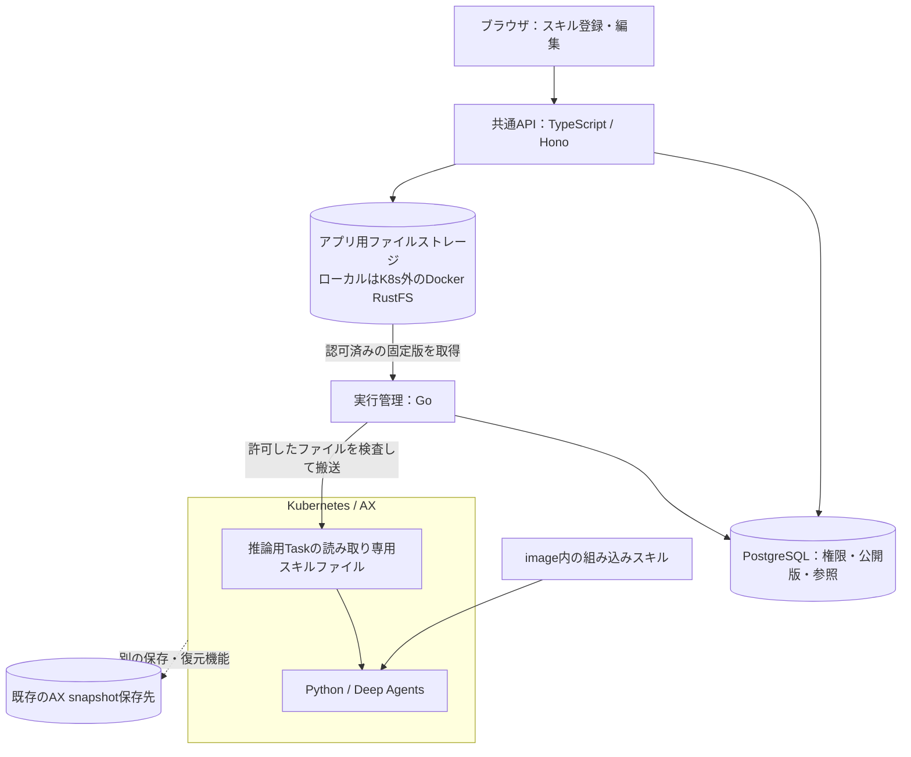

# 登録スキルのファイル保存

2026-10-08。利用者は、画面で登録したスキルをファイルとして保存する方向を了承し、その保存場所と接続方法の設計を依頼した。本書は実装前の設計案。ローカルの推奨配置を具体化するが、コンテナ・bucket・資格情報はまだ作成していない。製品コードの基点は `498abb96d7405c78985a35a32f15262e75f15ba8`。

## 推奨する配置

登録スキルの原本はS3互換オブジェクトストレージへ置く。ローカルでは、現在のPCのDocker上にアプリ用RustFSを一つ立て、Kubernetes / kindから独立した永続volumeを割り当てる。将来は、到達可能な外部のS3互換サービスへ保存先を替えられる構成とする。

| 対象 | 保存する内容 | ローカルの場所・扱い |
| --- | --- | --- |
| アプリ用RustFS | 登録スキルの本文・参考資料・スクリプト・テンプレート | 新設するDockerコンテナ。専用volume `ax-app-objects-data` を `/data` に割り当てる案 |
| `app-skills` bucket | 下書きの保存版と公開版が参照するファイル原本 | アプリ用RustFS内の非公開領域。名前は本設計の提案値 |
| app PostgreSQL | 名前・概要・所有者・Workspace・共有範囲・下書き参照・公開版・hash・使用中の参照 | 既存の外部接続可能なPostgreSQL。新方式の本文は保存しない |
| AX推論用Task | そのRunが利用できる固定版の実行用コピー | Task内の専用スキルディレクトリ。消失しても原本から再取得できる |
| runtime image | 組み込みスキルと標準prompt | Gitで管理し、image digestと同時に固定する |
| AX snapshot用RustFS | AXが保持する作業環境のsnapshot | 既存のkind内PVC。アプリ用RustFSから分離し、今回移設しない |

Docker Desktopではnamed volumeの実データはDockerが管理する仮想環境内に置かれ、そのディスクは現在のPCにある。リポジトリ内のファイルでも、コンテナの書込み層でもない。通常のコンテナ再作成・kind再構築から原本を分離できるが、volume削除・Dockerデータ消去・PC故障へのバックアップにはならない。

新しいRustFSのimageは実装時に検証した版とdigestへ固定する。既存snapshot用のbeta版をアプリ保存の検証済み版とみなさない。HTTP接続先・bucket・region・path-style・TLS・資格情報を配備設定にし、ホストとcontrollerからの接続を別々に確認する。ポート番号は既存サービスとの競合を調べて決める。管理画面はローカルに限定し、保存APIは信頼するAPI/controllerだけが到達できる経路にする。

## 保存と実行の流れ

画面は従来どおり名前・説明・本文・補助ファイルを登録する。APIが保存時に標準の `SKILL.md` と補助ファイルへ整え、そのbytesを原本にする。実行のたびにDB本文から作り直さない。APIの一覧・検索はPGの名前・概要・公開参照から返すため、一覧表示でbucket全体を走査しない。

実行管理が、本人・現在のWorkspace・共有範囲・公開状態を確認して版を固定する。原本から取得したファイルのサイズとSHA-256を照合し、Taskへ既存の制御された搬送経路を拡張して渡す。Pythonからオブジェクトストレージへ直接接続させず、APIキー・bucket全体の読出し権限を渡さない。

Deep AgentsにはTask内の限定したフォルダをスキルの読込元として指定する。初期の小さい容量では、選ばれた候補catalogに含まれる認可済みファイルを実行前に配置する案とする。ファイル配置とモデルへの全文投入は別で、モデルには標準の段階読込により概要から提示する。固定SDKでの候補数・容量・名前衝突・配置時間はDA-01/04で確認する。同名スキルを暗黙に上書きせず、定義IDと公開版を追える一意の実行用名称へ対応付ける。既存の `/` による明示指定を保持する。

ストレージ上のS3 URLをDeep Agentsのローカルパスへそのまま渡す方式ではない。初期版でFUSEや汎用の遠隔filesystem backendを追加せず、ローカルにある実ファイルを標準機能で読ませる。通常PodのPVC mountがそのままAX Taskにも使えるとは仮定しない。Task内の読込経路はスキルの書込みを提供せず、許可外のパス・秘密・他Runのファイルを見せない。

保存経路の先行実装ではファイルを0444、ディレクトリを0700にする。ファイルを読むたびにサイズ・SHA-256・通常ファイル・hardlinkなし・symlink非追跡を照合する。ディレクトリ0555は実AX終了時のdurable-dir削除を妨げたため採用しない。同UIDのプロセスは所有ファイルのmodeを変更できるので、mode単独を隔離保証にしない。現在の推論用Taskは登録scriptを実行せず、生成コードは別Taskへ隔離する。Deep Agentsでファイル操作を導入する際も、スキルの書込みを許可しないbackendと検証を維持する。

## ファイルと版の管理

オブジェクトキーは `workspaces/<workspace-id>/skills/<skill-id>/revisions/<revision-id>/SKILL.md` のように、サーバー発行IDで構成する。補助資料は同じrevision配下の `references/`、`scripts/`、`assets/` に置く。メールアドレスや任意の表示名はキーへ埋め込まない。

revisionごとにmanifestを持ち、相対パス・サイズ・media type・各SHA-256・形式版を記録する。PGの参照は保存先の論理ID、manifestのキーとhash、総bytesを持つ。bucketやendpointは管理設定から解決し、ユーザーが任意URLを指定するAPIを作らない。manifestとファイルは確定後に上書きしない。オブジェクトストレージ固有のversioningやETagを、アプリの公開版番号・SHA-256の代わりにしない。

公開版は、完全に保存された一つのrevisionを参照する。編集は新revisionを作り、PGの下書き参照だけを切り替える。公開では確認した下書きrevisionを固定し、公開済みのファイルを変更しない。実行は公開版IDとmanifest hashをRunへ保存し、再開時も同じ版を使う。標準promptはimageに同梱し、今回ユーザー編集可能なagent prompt管理を再導入しない。

### 保存途中と再送

1. APIは本人の編集権限、期待する下書きrevision、要求キー、申告サイズを確認し、PGに容量予約と保存要求IDを作る。
2. APIはその要求専用の不変revisionキーへファイルを保存する。相対パス、重複、総容量、SHA-256を検査する。絶対パス・親への遡り・symlink・hardlinkを認めず、初期版は任意archiveの展開機能を持たない。
3. 全ファイルとmanifestの保存を確認してから、PGのtransactionで現在の権限・期待revisionを再確認し、下書き参照または公開版参照を確定する。この時点を画面上の保存成功とする。
4. 応答が失われたら、同じ要求キーの状態を照会する。同じ内容の再送は同じ結果へ収束させ、別内容の同じキーは拒否する。保存要求IDごとの処理権と世代を管理し、並行writerが同じキーを異なるbytesで更新できないようにする。

PGとストレージの二つを同時に確定するtransactionはない。ファイルだけ保存された状態は非公開のまま照合対象として残す。PG確定後の応答喪失は既存結果を返す。公開済み参照のファイルが欠損・不一致なら、その版の利用を止める。他版や旧DB本文へ黙ってfallbackしない。オブジェクトへの再送は不変キー・同じ内容を照合できる場合に限り、結果不明のモデル呼出しや業務更新の再送許可にしない。

初期のsemanticな制限は既存schema-v7を維持する。本文16KiB、補助テキスト16件まで・各32KiB、定義payload合計128KiB、公開版100件、定義保存の全体枠128MiB。生成するfrontmatter/manifestの上乗せ、未完了保存、旧版・移行コピー・バックアップの実bytesも別途容量へ計上し、初期配備時に物理枠を設定する。容量不足は保存を拒否し、使用中の版を自動削除して空きを作らない。バイナリ添付や上限拡大は別の要件とする。

## 権限とデータの分離

本人用も共有用もWorkspaceに属する。共有スキルは全メンバーが登録でき、作成者と現在のadminが編集する。本人用の内容は他のメンバーへ公開しない。画面の閲覧・編集・公開、Run開始・再開・保護データ利用・モデル送信・効果実行時に現在の権限を検査する。

bucketは非公開とし、ブラウザへ永続URLやS3資格情報を渡さない。APIが検証済みIDから読出し・編集を仲介する。APIはアプリbucketの読書き用、Go controllerは実行用の読取り用に資格を分ける。削除・バックアップ用の権限は別にする。固定RustFS版で必要な制限が実際に効くことを、資格情報の拒否試験で確認する。

Taskへのコピー後に権限が失われても、既に読んだ内容を消せるとは保証しない。以後のモデル送信・保護データ利用・副作用を拒否し、該当Runを停止、Taskを回収する。共有解除・利用停止はRunの固定catalogも再評価する。snapshotやcheckpointから復元する場合も同じ検査を通す。

スキルの公開は、その内容を共有範囲へ渡す操作である。会話・ユーザーの作業ファイル・生成結果を自動でスキルへ添付しない。`scripts/` の保存・読込は任意実行やネットワークアクセスの許可ではなく、実行は既存の隔離コードTaskと許可済みの道具に限る。

## 保持・バックアップ・移設

初期の利用停止は論理的な非公開化とし、使用中の版を直ちに物理削除しない。下書き・公開版・再開可能Run・監査上必要な参照・バックアップから参照されるrevisionを保持する。具体的な保存日数や自動GCは本番の保持方針を決めてから有効化する。それまでは容量上限で新規保存を止める。未完了保存の回収も、期限だけでなくwriter停止と参照不存在を確認する。

バックアップはPGだけで完結しない。整合したPG読取り時点と、その時点から参照される不変manifest・ファイルの一覧を一組にし、コピー中は対象の削除を抑止する。別の保存先へコピーし、復元試験で全参照とhashを照合する。バックアップ済み参照の保持と削除抑止を解除する時点も管理する。named volumeやAX snapshotだけをアプリのバックアップと呼ばない。

将来はAmazon S3、外部ホスティングのS3互換ストレージ、または自己運用の外部RustFS等へ移せる。HTTPのPUT/GET/HEADを中心に実装し、IAM・条件付き書込み・削除・TLS等を移設先の契約試験で確かめる。S3互換を全機能・全SDKの完全互換とは扱わない。Cloudflare R2も互換差の確認後の候補であり、利用先を今決定しない。Azure Blob等の別APIは将来別adapterが必要で、接続先変更だけで対応すると約束しない。

移設では旧保存先を残し、参照中の全ファイルをhash照合してコピーした後、PGが参照する保存先を切り替える。新保存先へ書込みが始まった後は、旧保存先へ自動で戻さない。戻す場合も新しい参照とファイルを照合・同期する。

## 比較した案と選定理由

担当 `/root/skill_storage_filesystem` が共有filesystem案、`/root/skill_storage_objects` がS3互換案を、それぞれ他案を読まずに具体化した。判断基準は、利用者の登録操作を変えないこと、APIの移植性、AX隔離、版と公開の整合、ローカルでの運用と将来の移設である。

| 案 | 成立させる構成 | 利点 | 今回の判断 |
| --- | --- | --- | --- |
| A：共有filesystem / NFS | 信頼するGo側にmountし、HonoからHTTPSで保存依頼。Taskには限定したファイルを配信 | ディレクトリのまま扱え、既存NFSがある組織に向く | APIへmountを要求せず成立するが、Go側の保存窓口とmount可能な配置が必要。AX Taskの直接mountも未確認のため初期案には選ばない |
| B：S3互換ストレージ | HonoがHTTPで保存、Goが取得しTaskへファイルを搬送 | APIホストへfilesystemを要求せず、ローカルと外部サービスで保存境界を保てる | 推奨。オブジェクトからTaskへのコピーとPGとの整合管理は残る |
| Bの配置：既存snapshot RustFSに別bucket | 現行kind内のRustFSを共用 | コンテナ追加が不要 | kind/PVCの寿命・AX容量・資格情報に結び付くため初期の原本保存には選ばない |
| Bの配置：アプリ専用Docker RustFS | kind外の独立volume・bucket・資格情報 | AXの再構築とスキル原本を分離できる | ローカルの推奨配置。一サービスとバックアップ運用が増える |

先の「PostgreSQLから毎回ファイルを生成する」案は既存実装の再利用が利点だった。本書は利用者のファイル保存方針に合わせ、新方式の本文の正本をストレージへ移す。PGとの二重保存を恒久仕様にしない。

## 既存データと実装計画への反映

現行の下書き・公開本文はPGにあり、公開版は更新・削除禁止triggerを持つ。既存行の本文を消して参照だけへ書き換えるmigrationは行わない。新しい保存参照を追加し、旧公開版ID→移行済みmanifestの対応を検証する。旧payload hashと新しいファイルbytesのhashは別物として保持し、意味・名前・本文・各補助ファイルの一致も検査する。

旧Runは固定した旧descriptor/hash・旧runtimeで完了させる。新Runが使う移行済み版は一つの原本を明示して読み、障害時に二つの保存先から都合よく混ぜない。新しい編集・公開はファイル保存経路へ切り替える。旧JSONは互換・復旧用として保持し、削除を今回に含めない。旧ファイルUUID、会話・入力・成果物の本人限定PG保存は今回移さない。

| 作業 | 追加する範囲・完了条件 |
| --- | --- |
| DA-01 | 実SDK＋固定モデルで、ファイルのmetadata→本文→補助資料の読込と、新Taskへの同版再配置を試す。AX搬送とreadonly境界の成立条件を確認 |
| DA-02 | 保存参照・revision・容量予約・公開確定・冪等性・移行対応を追加。アプリ用Docker RustFSの配備定義とS3接続契約、TSのストレージ処理、Goの原本取得を所有 |
| DA-04 | Deep Agentsに認可済みファイルだけを見せる接続、同名衝突、catalog上限・明示指定・使用版記録を実装 |
| DA-05 | Taskへのファイル搬送・封印・回収を統合。原本資格情報を渡さず、新Task再開・失効時停止・snapshot復元時の再検査を確認 |
| DA-06 | 登録・編集・公開・一覧を新保存契約へ接続。未完了保存や再送を画面で正しく扱う |
| DA-07 | 実Web登録→公開→自動選択→補助資料→回答、新Task再開、他ユーザー拒否、原本欠損、kind再構築後の原本保持、PG＋ファイルの復元を検証 |

大きな入力・成果物を移すEX-04は引き続き後続機能。今回先に導入する保存接続を再利用できるが、本人用データを共有スキルbucketへ入れない。新たなPRはこの設計だけでは作らず、意味のある実装単位にまとめる。

## 確認済みの根拠と残件

- 現行スキル保存・上限・不変版：[schema-v7.sql](../../../web/data/schema-v7.sql)、[現在のruntime判断](../../babel/decisions/systems/ax/agent-runtime.md)。
- AX既存snapshot保存：固定Substrate `944abe3278b895ccbf5d45555a49dd0f2f6ceae7` の `manifests/ate-install/kind/rustfs.yaml` はPVC `rustfs-data`、1Gi、`/data`、固定beta image。履歴は[ローカル基盤](../../babel/knowledge/ax-local-kind-environment.md)。今回のシェルではkubectlのcurrent-contextが未設定のため稼働状態を新たに実測していない。
- [RustFS公式Docker構成](https://docs.rustfs.com/en/installation/container/docker)：単一コンテナ・永続volumeの構成根拠。現在のAX用imageの機能保証ではない。
- [Deep Agents Skills](https://docs.langchain.com/oss/python/deepagents/skills)、[Backends](https://docs.langchain.com/oss/python/deepagents/backends)：ファイルからの段階読込と限定したbackendの根拠。Web APIホストのfilesystemをエージェントへ公開しない。
- [AX固定版Task API](https://github.com/google/ax/blob/ac2332829f22360ff97b0ba34d94dd0dd782f17e/pkg/apis/v1alpha1/ax.proto)、[Kubernetes NFS](https://kubernetes.io/docs/concepts/storage/volumes/#nfs)：通常PodとTaskを区別する根拠。
- [R2のS3互換表](https://developers.cloudflare.com/r2/api/s3/api/)：S3互換であっても差があることの例。

残る実測は、固定RustFS版の権限制御と永続化、APIのNode/workerd両経路、Goからの取得、実AXへの搬送・readonly・新Task再開、既存データ移行・復元。本番の提供元・保存地域・容量・保持期間・バックアップ先と復旧目標は本番利用前に人間確認する。ローカル設計の作成を妨げる未回答はない。今回モデル呼出し・デプロイ・既存データ変更は行わない。
