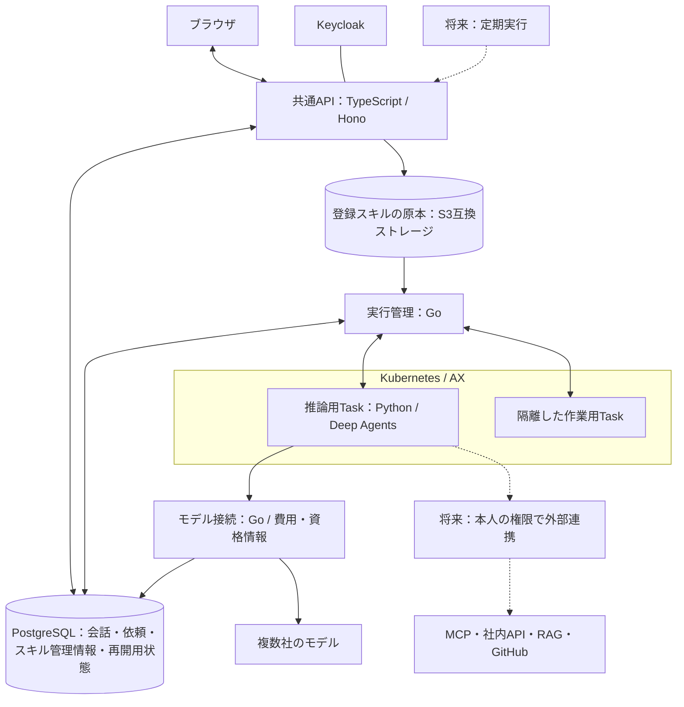

# Deep Agentsへの移行

2026-10-08、利用者はPython版Deep Agentsの採用と、AX内の短命Task・外部の管理基盤を組み合わせる構成を了承し、タスク分解を依頼した。計画作成後、利用者が登録スキルのファイル保存設計を承認し、実装を依頼した。現在は保存・公開・Taskへの搬送を先行して実装する。Deep Agents本体とモデル提供元の変更は後続であり、この作業で移行全体を完了とは扱わない。

基点は `498abb96d7405c78985a35a32f15262e75f15ba8`。現行の自動スキル読込・標準エージェント・隔離Pythonは維持する機能であり、Deep Agentsへの移行完了を意味しない。

## 作業の入口

- [作業単位・依存関係・完了条件](plan.md)
- [登録スキルの保存場所・公開・実行・復元の設計](skill-storage-design.md)
- 進捗の正本：このディレクトリの `orch/state.json`。更新は `.agents/skills/orch/scripts/task.ts` から行い、生成ファイルを直接編集しない。
- 台帳の親は `DA-ROOT`、移行作業は `DA-01`〜`DA-07`。後続機能 `EX-01`〜`EX-04` は計画内の候補であり、まだ実行担当へ割り当てない。
- 計画と台帳の記録責任者は統括担当。コード担当・独立レビュー担当は、実装開始時に所有範囲を確認して割り当てる。

今回の計画作成と、台帳が追う移行作業の完了を分ける。実装の最新状態は台帳を参照し、この文書へ重複記録しない。

## 承認された構成と追加の保存設計

Deep AgentsをAX Task内のPythonで実行し、会話・認可・秘密情報・費用・実行状態の正本は管理側に置く。共通APIはTypeScript/Hono、AXの起動・停止・復旧はGoを継続する。生成コードは推論用Taskとは別の隔離Taskで実行する。利用者は標準エージェント一つを使い、製品のサブエージェントは有効にしない。

会話は複数の依頼を持ち、一つの依頼は複数の短命Taskを使う。Task内では予算の範囲で複数のモデル・ツール操作を進め、回答待ちや別Taskでの作業待ちになる前に状態を保存して終了する。再開は同じ依頼の保存状態を新Taskに読み込む。LangGraphの状態保存とAXの停止・復旧をつなぐ部分は未実装・未検証。

点線は後続機能。登録スキルの保存先は、2026-10-08の追加依頼に基づく設計案として移行範囲へ含めた。本文と資料をファイルで保存する方向は利用者と合意し、ローカルはkind外のDocker RustFSを推奨する。保存経路は先行実装し、ローカル配備・実動作は後掲の検証記録で確認した。Deep Agents本体の配備は後続である。入力・成果物の大容量ストレージ移行は引き続き後続である。図の箱は論理的な責務であり、一箱につき一つの常駐サービスを追加する指示ではない。

## 選定の根拠と再利用範囲

前段でDeep Agents案とPydanticAI案を別担当が比較し、第三の担当も独立に比較した。スキル本文・補助資料の段階読込と文脈管理の再利用を優先し、Deep Agentsを推奨した。PydanticAIは短命Taskへの引継ぎを明示しやすいが、今回の要件では資源取得等を組み立てる範囲が増える。利用者がDeep Agentsを採用したため、今回ライブラリ選定をやり直さず、AXとの接続可能性をDA-01で確かめる。

- [現在のランタイムの設計・制約](../../babel/decisions/systems/ax/agent-runtime.md)
- [現行の自動スキル読込の契約](../ax-agent-workbench/automatic-skills-contract.md)
- [Deep Agents Skills](https://docs.langchain.com/oss/python/deepagents/skills)
- [Deep Agents Models](https://docs.langchain.com/oss/python/deepagents/models)
- [LangGraph Checkpointers](https://docs.langchain.com/oss/python/langgraph/checkpointers)
- [LangGraph Interrupts](https://docs.langchain.com/oss/python/langgraph/interrupts)

公式機能の確認と実AX統合の成功は別である。将来の接続先、第二のモデル提供元、定期実行の入力・版選択等は、[計画の確認事項](plan.md#人間確認と後続の具体化)で扱う。

## 計画作成の確認（2026-10-08）

別担当 `/root/compare_runtime_candidates` が2文書と費用ルールを読み、依存・所有・認可・費用・隔離・移行・承認範囲について重大な指摘なしと報告した。台帳とOKFの書込みはその独立レビューの対象外であり、統括が別途確認した。

台帳revision 17で親1件・子7件はすべてpending、条件判定は未取得。先行成果の受け入れを必要とする依存が登録され、実作業の最初の候補はDA-01である。`doctor` の問題は0件。2文書のローカル参照・コードフェンスと差分の空白検査は正常。OKFには採用済み・未実装の方針を追記し、旧実装の記録を保持した。strict/drift検証はエラー・警告0件。

この確認は計画と記録の検証であり、製品コード、実AX、新providerの実動作を確認したものではない。

## 登録スキルの保存設計の追加（2026-10-08）

利用者のファイル保存方針と保存場所の設計依頼を受け、[保存設計](skill-storage-design.md)を追加した。共有filesystem案とS3互換案を別担当が独立に具体化し、APIの移植性・AXの隔離・原本の寿命を基準に比較した。ローカルはkind外のアプリ専用Docker RustFSを推奨する。具体的な配備・移行は未実施。

`/root/review_skill_storage_a` と `/root/review_skill_storage_b` が、候補作成には参加せず、相互の指摘を見ずに保存設計・task・planの3文書を確認した。両担当とも必須修正なし。保存・公開の部分失敗、現在の認可、固定版のTask搬送、旧JSONを保持する移行、PGと原本の復元を確認範囲とした。同じモデルによる独立レビューであり、モデルを変えた検証ではない。台帳とOKFの書込みは親が別途照合した。

台帳revision 24で、保存・搬送・移行・復元をDA-01/02/04/05/06/07と親の担当範囲・完了条件へ反映した。全8unitはpending、実装条件の合格記録はまだない。doctorの問題は0件。OKFのagent-runtimeを更新し、旧構成・旧実測の記録を保持した。strict/driftはエラー・警告0件。文書のローカル参照・コードフェンスと差分の空白検査を確認した。

今回の確認は設計と保存記録の整合まで。固定RustFS、APIの両実行環境、実AXの搬送・readonly・再開、既存データ移行・バックアップ復元は後続の完了条件であり、実動作を確認済みとは扱わない。モデル送信・配備・既存データ変更・設計だけのPR作成は行っていない。

## 登録スキルの保存・搬送の先行実装（2026-10-08）

利用者の「それ対応お願い」に基づき、保存設計の実装を開始した。SS-01（専用ストレージ）、SS-02（管理APIとDB）、SS-03（AX搬送とRuntime）、SS-04（統合・移行・検証）をDA-ROOTの先行する子として追跡する。DA-01〜07のDeep Agents全体の完了条件は保持する。

既存のAntigravity Runtimeへ新しいファイル経路を接続し、後続のDeep Agentsも同じSKILL.mdと資料を利用できるようにする。旧版・旧descriptorを破壊せず、新規保存はファイル原本へ切り替える。既存本文は旧版の再開と段階的な移行のため保持する。入力・成果物の保存先は変更しない。

担当はストレージ基盤 implement_skill_storage_infra、TS保存 implement_skill_storage_data、SQL/Go/Python搬送 map_skill_storage_boundaries、設定・配備・統合・記録は統括。モデル課金なしで成立する境界試験を先行し、実行中のサービスと利用者データを保持する。実装・配備の結果は [検証記録](verification.md) に記録した。保存・搬送の先行実装は実AXの正常停止まで確認し、全体移行の残件は台帳に保持する。
