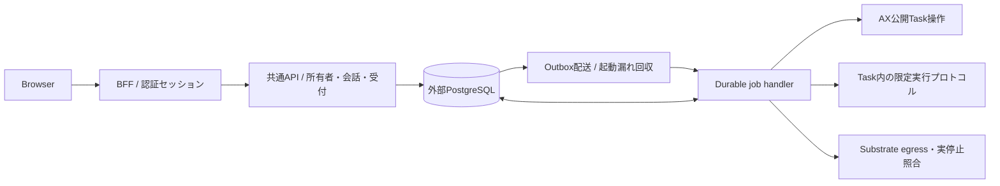

# 候補A：共通APIが外部DBの受付と実行ジョブを所有する

2026-10-06。設計候補、未採用・未実装。基準 main `b77da5a`、AX は `ac2332829f22360ff97b0ba34d94dd0dd782f17e` を確認。他候補を読まず独立に作成した。担当範囲のファイル以外、サービス、DB、秘密、モデルへ操作していない。

## 結論と成立条件

会話・所有権・受付・費用判定を共通APIのドメインへ移し、外部PostgreSQLを正本にする。HTTP受付と同じドメインコードを使う durable workflow/job handler が、HTTPリクエストと別の寿命でAX操作を進める。ホスト上のPython・shell・ローカルreceiptを実運用時の依存から外す。

ただし、固定AXに Fetch で呼べる一通りの実行APIはない。現行の公開RPCだけで成立する、と評価してはいけない。Fetch環境にも配置するには、AX側のHTTPトランスポート、Task内の限定的な実行プロトコル、Substrateへの制限付き接続を整備する必要がある。これはこの案の追加実装負担で、今回は試作しない。

## 現行ソースから確認した事実

1. `ax-local/.sources/ax/pkg/apis/v1alpha1/ax.proto:24` の公開面は native gRPC。Task Get/List/Create/Delete/Suspend/Resume/Watch、Workspace/Model管理を定義する。`internal/server/server.go:81` は HTTP/2＋`application/grpc` を gRPC server に渡し、通常HTTPは `/healthz` 以外404。REST/Connect/gRPC-Web対応はこの実装から確認できない。
2. `cmd/ax-server/main.go:113` はHTTP/1と平文HTTP/2を有効化している。`internal/server/server.go:69` に認証interceptorはなく、公開インターネットへそのまま露出する前提にできない。サービス認証・TLS・ネットワーク到達性は別途必要。
3. CLIは必須の業務エンジンではない。`cmd/ax/main.go:122,197,258` は接続先/トンネルの解決、manifest解析、typed gRPC呼出を担当する。これらはAPI adapterへ移せる。ただしCLIが隠していたクラスタ接続・資格情報・証明書の準備は消えない。
4. `CreateTask` は同名既存Taskをimmutableとして拒否し、初回はSuspendedで保存してからSubstrateをreconcileする（`internal/server/server.go:138`）。保存とreconcileは一つの原子操作ではない。`ResumeTask:305` はRunningへ変更して再びreconcileするため、応答消失時に安全な再送と決めつけない。
5. `ax ssh` はTaskのworker IPを読み、別の guest ProcessServiceへ直接、またはatenet-router経由でgRPC接続する（`cmd/ax/main.go:991,1032`、`internal/guest/client.go:94`）。Task start/status/collectはAXのTask RPCではなく、現在はそのguest上でPythonコマンドを動かしている。
6. `TaskStatus.usage` はprompt/completion tokenの2項目だけで、現在の成果物hash、exit、usage既知判定、推定費用、cleanup証拠を置換しない（`ax.proto:104,121`）。runner契約もコマンド終了状態をcontrol planeが現在回収しないと明記する（`docs/runner.md:43`）。
7. egress変更・readbackはAX protoに無く、現在の `ax-local/scripts/set-egress.go:64` がSubstrate Control APIを使う。さらにAX `internal/controller/reconciler.go:194` はSuspendActorのエラーをWarnにしてTask.phaseをSuspendedにする。AXのphaseだけでは実停止を証明できない。
8. AX serverがRedis StoreとLockerを持ち、APIを通じてstore更新とreconcileを組み合わせる点は `cmd/ax-server/main.go:83,108` で確認した。Redis直接書込みではこの実行経路を通らず、直接読取でも会話所有者・受付・成果物の不足は埋まらない。製品データの正本には採用しない。Redisの内部構造・永続性の詳細は別担当の調査範囲。

## 代表的な使い方

- 利用者が `POST /v1/conversations/:id/turns` に既存の key、parent_run_id、text、allow_model を送る。認証済み内部UUIDをAPIが確定し、所有者・親head・上限・全体guardを検査する。DB確定後 `202 {conversation_id,run_id,replayed:false}`。UIやブラウザが消えてもジョブは残る。
- 応答を受け取れず同じkeyと本文を再送すると、同じ所有者の受付を返す。本文違いは409。他人の会話・run・成果物・復旧とownerなし既存データは404。
- GETはDBに確定済みの会話・実行・成果物だけを読む。AX開始やworkflow再作成をGETの副作用にしない。受付後の監視は短いGETの反復で足り、WatchTaskストリームへの依存は不要。
- `POST /v1/runs/:id/recover` は照合・回収・通信deny・停止を依頼する。モデル実行の再開始、Resumeのやり直し、別runへの振替をしない。

## 責務と正本



共通APIのドメインが会話の順序・所有権、run受付、結果確定、費用・失敗レビューを所有する。job handlerは同じドメインに属する別entry pointであり、独立した会話台帳を作らない。外部キュー/workflowは配送・再開時刻だけを所有し、完了判定の正本にしない。

PostgreSQLには既存のusers/identities/sessions/login_flowsを保ち、実行用schemaを追加する。接続driver・秘密・CAは環境adapterから注入し、起動時の `fs`、固定Macパス、`pg.Pool`だけに依存する構成をやめる。外部ホスト型PostgreSQLも同じtransaction契約を要求する。

現在は成果物64KiB上限なので、request、会話本文、結果、成果物bytes/hashもDBへ保存できる。結果確定と成果物公開を同一transactionにし、最初からobject storageとの二重commitを増やさない。容量要件が変われば、その時点で別の保存契約を設計する。

AX/SubstrateはTask・Actorの実状態、Task内runnerは開始marker・実測結果を所有する。DB内の観測値はそれらを照合した証拠であり、実状態を代替しない。Task内Pythonエージェントとdurable workspaceは維持できる。外部の業務正本をTask内ファイルへ戻さない。

## 接続と短い契約骨組み

```ts
type Owner = ValidatedInternalUuid;
acceptTurn(owner: Owner, input: ChatInput): Promise<AcceptedRun>;
getConversation(owner: Owner, id: Uuid): Promise<ConversationView>;
recoverRun(owner: Owner, id: RunId): Promise<RecoveryAccepted>;
advanceRun(runId: RunId, deliveryId: string): Promise<Checkpoint>;
interface ExecutionPort {
  createSuspended(task: BoundTask): Promise<TaskObservation>;
  observeTask(ref: TaskRef): Promise<TaskObservation>;
  resumeOnce(ref: TaskRef): Promise<TaskObservation>;
  stageOnce(ref: TaskRef, request: BoundRequest): Promise<StageProof>;
  startOnce(ref: TaskRef, runId: RunId): Promise<StartProof>;
  readResult(ref: TaskRef): Promise<ExecutionEvidence>;
  denyAndConfirm(ref: TaskRef): Promise<EgressProof>;
  suspendAndConfirm(ref: TaskRef): Promise<ActorStopProof>;
}
```

ExecutionPortは任意shellを受け付けず、固定image・atespace・run名・入力schemaに制限する。`create/observe/resume/suspend` の一部は現AX RPCを直接利用できる。`stage/start/result` はTask内 `task_runtime/runner.py:75,83,91,123` の現在の検証・排他を限定HTTP endpointへ移す追加実装。egressと停止証明はSubstrateの公開Control APIを使い、AXのphaseだけで済ませない。

Fetch配置を選ぶ場合、AX/Substrate境界に認証付きHTTPS/JSONの変換面を追加する。この変換面はTask操作と証拠のtransportだけを扱い、受付・会話・費用DBや独自jobを所有しない。Go/Nodeのnative gRPC接続可能なjob配置なら変換は不要だが、同じコードをそのままWorkersへ置けるとはしない。

WorkersのネイティブgRPC互換はこの調査で未確認。Cloudflareの [gRPCプロキシ対応](https://developers.cloudflare.com/network/grpc-connections/) はWorkersのFetch client適合の証明ではなく、同資料にはAccess/Tunnelの制約もある。TLS終端やサービス認証を含む小さな互換試験が必要。HTTP変換の追加可否も採用判断の条件にする。

## DBの最小骨格

```text
conversations(id, owner_user_id, head_run_id, version)
runs(id, owner_user_id, conversation_id?, sequence?, parent_run_id?,
     request, request_hash, execution_fingerprint, image_digest,
     phase, resolved, result, artifact_bytes, artifact_hash, cleanup, usage, estimated_usd)
admissions(owner_user_id, key, payload_hash, run_id) UNIQUE(owner_user_id,key)
run_commands(run_id, operation, command_id, dispatch_state, evidence) UNIQUE(run_id,operation)
outbox(event_id, run_id, kind, delivery_state) UNIQUE(run_id,kind)
execution_guard(singleton_id, active_run_id, generation)
failure_reviews(run_id, note, reviewed_at)
```

新規Web所有者はactiveな内部UUID必須。conversationとrunのownerは複合FK等で一致を要求し、ownerの異なる連鎖を表現できないようにする。旧ownerなし・不整合記録はimport区分を付けて保持し、Webでは常に拒否する。メールでownerを推定しない。

受付transactionでは同key照合を先行し、global guard行→会話headの順でlockし、同keyを再照合する。親head、32turn/入力容量、全runの未解決・未知usage・失敗fingerprint・試用費用制限を確認する。run、会話head、admission、active_run_id、outboxを一括commitする。別利用者の同keyは分離するが、費用fingerprintと排他は分離しない。

既存のpayload hash・実行fingerprintはPythonのJSON表現を含む契約として扱う。TypeScriptの通常 `JSON.stringify` へ置換して同じ依頼が別hashになる状態を作らず、改行・Unicode・key順・区切りを含む旧golden vectorで同値を要求する。移行済みの失敗依頼も新APIで再検出する。

## 受付とAX開始の非原子的境界

1. **DB受付**：run_idと不変request/hash/image、ownerを外部操作より先に確定する。commit前の失敗は受付なし、commit後の応答消失は同key照合で同じrunを返す。
2. **起動配送**：outbox配送が `run_id` を固定IDにworkflow/jobを起こす。DB保存後、キュー通知前に落ちても未配送outboxを再取得する。重複deliveryはDB checkpointへ戻り、外部操作を無条件に再送しない。
3. **AX作成**：`run_commands` のcompare-and-setでCreate送信権を1回だけ確保し、送信前にdispatchingをcommitする。GetTaskで同名と不変specを照合する。同名・別specは停止。送信済みか不明なままTaskが見つからなくても、Redis復旧や遅延RPCを否定できないので自動再Createしない。
4. **起動と入力**：Resume、stage、egress allowも意図を先に記録する。Task ready/actor同一性、request hashとstage証拠を検査後だけ開始へ進む。HTTP timeoutやworkflow retryからResumeを繰り返さない。
5. **モデル開始**：DBのstart dispatchingを先にcommitし、一度だけstartを送る。Task側のexclusive start/attempted markerも維持する。応答消失・job消失なら `start_unknown` とし、観測・回収だけへ進む。開始成功を再送で確かめない。通信前に落ちた場合もdispatchingだけでは未開始と断定しない。
6. **結果と停止**：run/request同一性、artifact bytes/hash/UTF-8、usage/費用を検査し、egress denyのreadbackとSubstrate実Actor停止を確認する。すべての条件が揃ったtransactionで結果・assistant返信・resolved・global slot解放を確定する。不明usageは結果を勝手に0へ補完しない。
7. **復旧**：一度も外部送信権を取っていない受付は、jobとのCASで取消し `not_started` にできる。それ以外はinspect/collect/deny/suspendだけ。AXやTaskが消失、停止証明不足、未知usageなら手動照合待ちとしてglobal slotを保持し、新規開始を拒否する。

global slotは業務上の予約であり、worker leaseの期限だけでは解放しない。leaseは観測・配送担当を交代させるために使う。停止中の旧workerが再び書込み・送信できる状態で「未開始」へ戻さない。現在AX RPCには世代fenceが無いため、dispatching後の旧worker/RPCの停止を証明できないケースでは、自動引継ぎでの追加mutationやslot解放を保留する。自動復旧範囲を広げるには受信側のoperation ID/fence契約追加が必要。

[Cloudflare Workflowsの公式規則](https://developers.cloudflare.com/workflows/build/rules-of-workflows/)もstep再実行を前提にする。workflow自体のdurabilityを外部APIのexactly-once保証に読み替えず、実行開始に汎用retryを付けない。jobのイベントにはrun_idだけを渡し、本文・token・状態の正本をworkflowログへ複製しない。

## 保持する条件と受け入れる負担

- ユーザー上限2,000円、現在の0.01 USD試用停止、最安固定モデル、回数/トークン/時間上限、自動モデル再試行なしを維持する。限度の値と過去費用を移行時に初期化しない（現 `task_cli.py:295`）。
- 不透明BFFセッション、JWT検証→issuer＋subject→内部UUID、DB障害時拒否は維持。Webへ任意AX名、service credential、owner指定を公開しない。
- 利点：APIプロセスのローカル状態がなくなり、所有権・再送・会話headをDB transactionで統一できる。ブラウザ・HTTP・jobプロセスの終了を分離でき、状態確認はDBだけで返せる。
- 負担：既存Python guard/receiptロジックの移植、DB移行、durable job/outbox運用、AX/guest/Substrateの通信adapter・認証、未知状態の運用が増える。既存AX公開面だけに限定した場合、この案は実行完了まで成立しない。
- 単にCLIをHTTPで包んでローカルreceiptを残す構造はこの候補に含めない。DBと受付の所有を共通APIへ移すことがAの構造上の違い。

## 移行と検証ゲート

1. API/ジョブの起動から `child_process`、Python、shell、ローカルfsを除く最小adapter試験を設計する。外部DB transactionと認証、AX unary操作、guest read、egress/実停止の通信経路をそれぞれ確認してから配置先を決める。試作は次工程。
2. SQL schemaと既存receiptのread-only importerを作る計画とする。run ID、owner、会話順序、request/result/artifact hash、既知費用、failure reviewを保持し、件数と内容を照合する。owner不明・mixed ownerは自動修復しない。
3. 旧CLI受付を停止し、global flockと全実行resolved/停止を確認して最終importする。旧CLIと新APIの二つの書込み系を並走させない。CLI互換を残すなら同じ新受付ドメインへ接続させ、ownerなし管理経路も同じglobal guardを使う。旧形式inspect/バックアップは残す。
4. 新規書込み前なら旧系へ戻せる。新DBで受付後に旧ファイルへ自動rollbackしない。まず全実行停止と未解決照合を行い、復元/逆移行の計画を別途作る。
5. gate：owner別同key/本文違い、全8経路の他人・legacy非公開、mixed owner拒否、active UUID、disabled user、旧費用集計と全体排他、32turn/本文上限を旧試験と突き合わせる。
6. gate：DB commit前後、outbox配信前後、Create/Resume/startの送信前後と応答消失、result保存前後、deny/suspend失敗で強制終了を注入する。同runでモデル開始が増えず、unknownが次を止めることをFake AX/guestで先に確認する。
7. gate：ブラウザ切断/API再起動/workflow重複起動/旧worker遅延/Redis再初期化でも、DBとAX開始の曖昧さを自動再実行で解消しないことを確認する。実AXの最初の確認はofflineで行い、有料試験は別の明示した条件に従う。

## 残る判断

Fetch用の通信面をAX側へ追加する範囲、job実行基盤、サービス認証とクラスタ到達経路、Substrate readbackで実停止を確定する具体フィールド、受信側fence導入の可否、import後のCLI運用が未確定。これらはコードの配置換えだけでは決まらず、採用後の設計・試作gateへ渡す。

OKFは親の確認済み `knowledge/ax-web-foundation`、`decisions/systems/ax/{single-task-cli,auth-foundation,chat-turns}`、`rules/ax-model-spending` と既存path検索を再利用。現在のローカル設計の理由を否定せず、新たな配置・保存要件に対する候補として比較する。OKFの確定decisionは更新していない。
