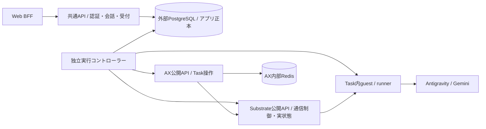

# 候補B: アプリDBを正本にし、独立コントローラーがAXを実行する

基準: main `b77da5a`、AX `ac2332829f22360ff97b0ba34d94dd0dd782f17e`。設計候補であり未実装。他候補の設計本文は参照していない。設計・移行計画までを担当し、サービス変更・試験実行・モデル送信は行っていない。

## 利用例と選ぶ境界

利用者Aが「前の会話の続きを教えて」と送信すると、共通APIはowner、親turn、再送キー、全体guardをDBトランザクションで確認し、runと永続ジョブを確定して `202 {run_id,replayed:false}` を返す。HTTP接続がその直後に切れてもコントローラーが処理する。同じowner/key/bodyの再送は同じrunを返し、実行を追加しない。

APIは会話・所有権・受付・閲覧を直接管理する。AXに近い常駐コントローラーはDBから確定済みジョブを取得し、AX/guest/Substrateの公式プロトコルで実行・回収・停止する。Python HTTPラップを恒久サービスとして設けず、APIから子プロセス・shell・共有ファイルを取り除く。Task内のPython runnerとAntigravityは維持する。

初期コントローラーはGoを第一候補とする。固定AX/SubstrateがGoとnative gRPCを使うため、クライアント・型・認証の再利用範囲を確認しやすい。TS/Nodeでも実現候補だが、guest双方向通信・gRPC資格情報の対応を別途実証する必要がある。APIのHono/TypeScriptは維持できる。



APIはAX/Redisへ接続しない。コントローラーのジョブ用接続はDB内部権限とし、利用者APIへ任意のTask操作やexecを公開しない。既存BFFセッション・issuer/sub→内部UUIDの認証境界を保持する。

## 正本とデータ契約

| 所有者・保存先 | 正本にするもの | 読み書きの責務 |
| --- | --- | --- |
| アプリPostgreSQL | 会話・owner・turn順序・受付キー・入力・実行判断・確定usage/費用・成果物hash・復旧履歴 | APIが受付/閲覧、コントローラーが許可された状態遷移/回収結果を記録 |
| AX内部Redis | AX Task/Workspace/ModelとAX側status | AXサーバーのみが通常writer。アプリのownerや費用の正本にしない |
| Substrate PG / RustFS | Actor等の実行基盤状態・スナップショット | Substrateが管理。アプリDBと役割・資格情報を分ける |
| Task内workspace | staged入力、開始marker、guest結果、回収前成果物 | runnerが生成。アプリは検証して回収するまで成功としない |

最小のアプリスキーマ骨組みは以下。既存認証users.idをそのまま参照する。

```text
conversations(id PK, owner_user_id NULLABLE, head_run_id, version)
runs(id PK, owner_user_id NULLABLE, conversation_id, sequence, parent_run_id,
     request_bytes, request_hash, execution_fingerprint, image_digest,
     phase, version, apply_attempted, resume_attempted, start_attempted,
     outcome, resolved, usage_json, estimated_usd, cleanup_json, receipt_evidence)
submissions(owner_user_id, key_hash, payload_hash, run_id, UNIQUE(owner_user_id,key_hash))
jobs(run_id UNIQUE, kind, state, controller_instance, generation, lease_until)
execution_slot(id='global', run_id, generation, hold_reason)
effects(run_id, operation, operation_id UNIQUE, intent_at, ack_at, observation_json)
artifacts(run_id, name, sha256, byte_length, content_bytea OR object_key, verified_at)
```

会話ownerは不変。`(conversation_id,sequence)`、parent/headの整合、runとのowner一致をDB制約とトランザクションで要求する。ownerなしは明示的legacy区分で保持し、一般APIは一覧件数制限前に除外し、詳細・再送・成果物・復旧も404とする。混在owner/壊れた親鎖は隔離して409。インポート時にNULL ownerへ既定ユーザーを当てない。

開始側のeffectには `(run_id,operation)` の一意制約も置き、別operation IDで同じCreate/Resume/startの送信許可を取り直せないようにする。反復可能な読取と、明示復旧でのdeny/停止は別の観測・復旧履歴として扱う。

受付トランザクションは、既存の同owner/keyを最初に照合し、なければglobal slotと会話headを固定順序でlockし、再度キーを照合する。変更bodyは409。同keyの競合INSERTはwinnerを読み直す。会話の現行32turn・入力/履歴上限、既知usage、費用・失敗fingerprint・失敗確認記録を確認してから、run/job/head/slotを同時commitする。

初期は現行同様、別の未解決runがあれば新しい受付を409にし、一般的な無制限ジョブqueueにはしない。同時実行1件と費用guardを全利用者・legacyにも適用する。execution_fingerprintにownerは加えない。全writerが同じDBの受付/遷移関数を使い、APIのSELECTだけに費用チェックを置かない。

API roleは受付用関数とowner付き読取、controller roleはclaim/結果報告/観測更新の関数に限定する。ownerや受付payloadをcontrollerから変更できないようにする。SQL関数・constraintをversion管理し、TS/Goへ同じguardの別実装を重複配置しない。

```ts
acceptTurn(owner: UserId, cid: UUID, key: UUID, parent: RunId | null, text: string): Promise<Accepted>
getConversation(owner: UserId, cid: UUID): Promise<ConversationView>
requestRecovery(owner: UserId, run: RunId): Promise<{ run_id: RunId }>
claimJob(controller: InstanceId): Promise<Claim | null> // 内部のみ
recordEffectIntent(claim: Claim, operation: Effect): Promise<OperationId>
recordObservation(claim: Claim, observation: VerifiedObservation): Promise<void>
finalizeRun(claim: Claim, result: VerifiedResult): Promise<void>
```

既存8操作のHTTP入出力とowner UUIDを維持する。状態の正本はDBなので、API再起動・HTTP切断・UI polling停止は実行寿命に影響しない。通知は補助で、DBのjob状態をpollすれば回復できる。実行をHTTPハンドラーの存続時間へ結び付けない。

## DBとAXの非原子的な境界

DBとAXをまたぐtransactionや「exactly once」を仮定しない。stable run IDをAX Task名に使い、image/commandとrequest hashを保存する。AX呼出しの前にoperation別intentをDBへcommitし、その後に1回だけ送る。intentのない副作用は禁止する。

| 切断・停止した境界 | 扱い |
| --- | --- |
| 受付commit前 | 同key再送で未受付か既受付かをDBで確定。commit応答不明でも別keyを生成しない |
| job未claim、effect intentなし | 再claim可能。復旧要求なら同じslot下でnot_startedへ終端化できる |
| Create intent後、応答不明 | GETで同名Task/specを観測する。存在だけでguest開始済みとはしない。NotFoundでも遅延したCreateが来ないとは証明できないため、新名作成や無条件Create再送をしない |
| Resume / stage / egress許可 / guest startのintent後、応答不明 | `needs_recovery` としglobal slotを保持。read-only観測で証拠を集め、start/resumeを自動再送しない |
| guest完了後、結果回収/DB保存の応答不明 | 同runのstatus/collectを読み直し、同hashの結果を冪等記録。モデル実行へ戻らない |
| cleanup応答不明 | deny/停止の実状態を確認し、確認できない項目はfalse/unknown。成功表示・slot解放をしない |

新規フローはCreate(Suspended)→Resume→通常Actor照合→stage→限定egress→start→status/collect→deny→停止確認→DB確定。guest側の `staged/start/attempted` 排他markerは残す。snapshot作成用のActorに開始合図を渡さない。

復旧は再開機能ではない。結果の観測・回収と通信拒否・停止だけを許す。`apply_attempted=false` かつ未送信を証明できる受付はnot_started、cleanup falseで終端化する。開始した可能性があるのにusageが不明なら、回収や停止に成功してもglobal guardを解除しない。

## leaseと古いcontrollerの扱い

DBのgeneration条件付きUPDATEは古いworkerのDB書込を拒否できるが、AXがgenerationを検証しないため、外部副作用を止めるfenceにはならない。lease確認直後にworkerが長時間停止し、交代後にResumeを送る競合を明示的に扱う。

初期Bでは**副作用のあるjobをlease期限だけで自動的に別writerへ渡さない**。controllerは単一writerで、effect intent以降のlease失効はslotを `controller_unknown` に固定する。後継はGET/statusなどの観測だけを行い、旧workerが生きている可能性のある間はcleanupも並行実行しない。DBが切れたcontrollerは新しいeffectを送信せず停止するが、この自己停止だけをfenceの保証にはしない。

明示復旧の前提は、旧controller世代の停止・資格情報/通信経路の遮断と、旧世代が送ったin-flight RPCの終結を確認できること。旧プロセスkillやtoken失効だけでは既にAXへ届いたRPCを取り消せない。証明できなければslotを保持し管理者判断を待つ。可用性を落としても、時間切れから新しい実行を推測して開始しない。

自動writer交代が必要になった場合は、AX/guest/egressの**副作用受理側**がrun/generation/operation IDを永続照合するfencing契約を先に追加する。単にHTTP gatewayの手前でDB leaseをチェックするだけではTOCTOUを解決しない。固定AXにその契約はなく、今回は実装済み機能として扱わない。

## AX Redisを共通APIが直接見る仮説

Redisを読むこと自体は可能で、Task JSONからname/atespace、image/command/env、phase、actor、workerIP、conditionsを得られる。Task/Workspace/Modelの索引もある。ただし、次の理由で通常の共通APIの依存先には選ばない。

- `store.go:59-97` のキー規約はAX内部実装。Task列挙はZSET→MGET、既定50件でowner絞込みはない。`UpdateTaskStatus:230-249` はTask全体のread-modify-writeで、外部writerとのCAS契約を持たない。
- `SaveTask:100-144` はSET、2索引更新、Pub/Sub publishをまとめる。コメントにはstreamとあるが実装に永続streamはない。`WatchTask:524-547` は購読であり、ジョブ受付・再送台帳や切断中イベントの再生機能ではない。
- 公開 `CreateTask:138-198` は入力検証、task単位lock、既存Taskの変更拒否、Suspended設定、reconcileを実行する。Resume/Suspend/Deleteも公開操作からreconcileする。Redis直書きはこの制御を経由せず、キーだけ更新すると索引/通知も壊し、削除ならActor cleanupも省く。
- `ObjectMeta` に内部user UUIDや会話ID/順序はない。`TaskStatus.usage` は存在するがprompt/completionの2項目だけ。固定ソースのTask/reconcile経路にusageを収集更新する実装は見つからず、guestの全呼出usage/概算/未知usage判定/成果物hash/cleanup証拠を置き換えない。
- Ready/RunningはActorとworkspace準備の状態で、利用者の処理成功ではない。Redisへの読取権限はTaskのenvや内部worker IPも読めるため、利用者API用の公開データ境界にはしない。
- 公開Get/Listも同じStoreを読む。運用者の診断で内部Redisを読む余地はあるが、利用者の会話一覧・課金判断はDB、実行基盤の観測はcontroller→AX公開APIへ統一する。

さらに固定 `reconciler.go:194-203` はSubstrate SuspendActor失敗をwarnに留め、Task phaseをSuspendedへ進める。従ってAXのSuspend応答/Redis phaseだけをcleanup成功の証拠にしない。Substrateの実状態確認を採用可否の検証ゲートとする。現行PythonはCLI成功をcleanup trueにするため、この差は移植時に曖昧なまま複製しない。

## 成果物: PG本文かobject storageか

現行64KiB以下のUTF-8成果物と会話返答は、初期BではPGの `bytea` に元のbytesを保存する案を選ぶ。hash・size・usage・cleanupと同じtransactionで公開でき、本文にNULがあっても元bytesを保全できる。会話表示は検証済みbytesをUTF-8へ戻す。履歴を含むrequestもcanonical JSONのUTF-8を `request_bytes bytea` に保存し、API/controllerでparseする。NULを含み得る本文をjsonbへcastせず、移行前後のcanonical hashを変えない。

大きな添付/大量成果物はprivate object storageへ分離する余地を残す。DBにはobject key/version/hash/sizeを保存し、immutable objectをupload・再読取検証してから参照をcommitする。uploadだけ成功したものは未公開orphanとして後で回収し、DB参照先missing/hash不一致は成功表示しない。owner確認後のBFF/API経由取得を基本にし、公開bucketや恒久URLにしない。

object方式はDB肥大を抑える一方、DBとobjectの非原子的保存、バックアップ整合、orphan清掃が増える。初期の小さい文章だけに必須導入する理由は薄い。bytesをJSON/text列へ無条件に流すとPostgreSQLで扱えないNULを失うため、保存型とエンコードを契約化する。

## 移行とrollback

1. 旧run/conversation/owner/sequence/parent、原request/receipt/result、artifact bytes/hash/size、全usage/概算/失敗確認記録、start/cleanup markerを移行manifestとして列挙する。今回の設計調査では `.state` 本文を読まない。
2. staging DBへのdry-run importで親鎖・owner・数・順序・hash・費用総計とguard判定を照合する。corrupt/mixed owner/unknown usageは修復して成功にせず隔離し、全体停止条件へ含める。内部UUIDを再発行せず、ownerなしを保持する。
3. 切替時はWeb/API受付、旧Python worker、管理CLI、直接AX操作を止め、flock・子プロセス・remote in-flightの残存を確認する。未解決実行は解決するか、その未解決slotをDBへ引き継ぐ。未開始acceptedを移行先で勝手に開始しない。
4. 最終freeze後の差分を取り込み、ID/順序/bytes/hash/usage/owner/guardの完全照合を行う。旧ファイルはread-onlyで保全し、新APIと新controllerを同じDB世代へ一括切替する。二重writer期間やDB→旧ファイルのbest-effort二重書込みを設けない。
5. 管理CLIは新DB/APIを使うadmin clientへ切替える。旧ownerなし記録のinspectは保全できるが、旧TaskCLIでの追加実行・復旧を許すとglobal guardが分断されるため禁止する。AX資格情報も新controllerへ限定する。
6. 新系が受付/副作用を一度も行っていなければ、全新writerを止め照合した上で旧系へ戻せる。1件でも新規commit/remote intentがあれば古いsnapshotへ単純rollbackしない。新系停止・全差分の逆移行・同じ不変条件の検証と残存副作用の解決が条件で、満たせなければ前進修正する。

## 実装へ渡す検証ゲートと未確定点

- Gate 1: APIのPython/shell/fs依存を消し、認証設定のfile読取・Node crypto・PG接続もruntime adapterへ分ける。Cloudflare等の採用先が決まったらDB transaction/暗号/JWKS/timeoutを実環境で確認する。今回「どのedgeでもそのまま動く」とは保証しない。
- Gate 2: Go controllerから固定AX gRPC・guest ProcessService・Substrate egress/実状態を、ローカルCLIなしでoffline taskへ接続する試作。AX公開Task APIだけではstage/start/collect/egressが揃わないため、必要な補助公開プロトコルと認証到達性を固定する。PythonのHTTP包み直しで埋めない。
- Gate 3: DB commit/各effect送信/ack保存の直前直後kill、HTTP lost ack、controller pause後lease失効、DB/AX outageを注入し、二重model startなし・old writerの未確認副作用中は新受付なしを検証する。副作用受理側fenceなしの自動writer交代は合格扱いしない。
- Gate 4: 2ownerの全8操作、同key同body/変更body、混在/ownerなし、50件前filter、未知usage・失敗fingerprint・累積費用・未解決slot、壊れたartifact・NUL・最大応答を確認する。
- Gate 5: snapshot/final delta移行、writer遮断、import失敗、切替前rollback、切替後逆移行拒否条件をモデルなしでリハーサルする。

利点はAPI実行環境からOS依存がなくなり、会話・所有権・受付が一つのアプリDBにまとまること。負担はファイル→DB移行、Pythonのguard/状態遷移の移植、独立controller運用、remote副作用の障害処理である。初期は自動HAより安全停止を選ぶ。

未確定は、副作用後の旧世代退役/in-flight終結を証明する運用方法、Substrate停止/egress確認の正式な証拠、guest RPCの資格情報とAPI形、配置先のDB接続adapter。これらを解決するまで有料経路を切り替えない。利用者の2,000円上限、現在の `.01 USD` 試用停止、呼出回数/時間/入力上限は緩和しない。

## 根拠・知識の引継ぎ

- AX固定版: `internal/store/store.go:29-48`、`internal/store/redis/store.go:59-249,524-547`、`internal/controller/reconciler.go:126-215,280-299`、`internal/server/server.go:138-198,257-350`、`pkg/apis/v1alpha1/ax.proto:54-124`（いずれも `ax-local/.sources/ax/` 配下）。
- 現行ローカル契約: `ax-local/task_cli.py:295-325,424-483,486-509,558-609`、`ax-local/task_runtime/runner.py:75-108`。guest marker/receipt・全体guard・復旧はこの仕様を基準にする。
- bundle `/Users/const/sori883/agent-workspace/.space/babel` の親確認済み `knowledge/ax-web-foundation`、`decisions/systems/ax/{single-task-cli,auth-foundation,chat-turns}`、`rules/ax-model-spending` を引き継いだ。追加for-path検索は上記AX store/reconcilerの3ファイルで、`rules/ax-model-spending` と既読 `knowledge/ax-local-kind-environment` が一致。OKFは変更していない。
- 採用後のdecision保存候補は「アプリデータ/受付を外部DBへ移し、AX内部Storeを非公開に保つ境界」と「lease期限だけでは副作用writerを交代させない条件」。今回は未採用候補のためタスク内だけに保存する。
