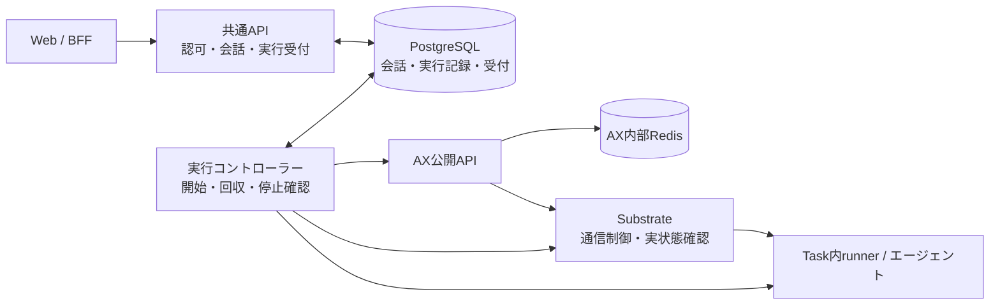

# 共通APIの配置先と保存先を切り離す設計案

2026-10-06。状態：提案・未実装。今回は責務・保存先・移行順序を整理する。利用者はCloudflare Workersを共通APIの移植性を測る基準として挙げており、配置先候補として指定したわけではない。本番の配置先・PostgreSQLサービス、クラウド公開、実データ移行は決定していない。対象の版と共通条件は[タスク記録](task.md)を参照する。

## 解決する問題

現在はHono共通APIが `web/api/run-service.ts` から `python3 ax-local/web_bridge.py` を起動する。Pythonが会話の所有者照合、記録の読み書き、AX CLIによる実行管理を担い、アプリの記録は `ax-local/.state/runs/` にある。認証情報とセッションは既に外部接続可能なPostgreSQLへ保存している。

この構成は既存CLIの排他・費用・記録をWebでも共用するために選んだが、APIとPython・CLI・永続ディスクを同じ環境に置く条件が残った。会話を読むだけでもPythonが必要になり、APIの複数配置やサーバーレス環境への移動を妨げる。

変更後は、利用者が「前のチャットを開く」と共通APIが認可してDBから返す。「次の質問を送る」とAPIがDBへ永続受付を記録して実行IDを返し、HTTP応答の終了とは独立した実行管理が処理する。APIの再起動後も同じ実行IDで状況を取得できる。

## 提案する構成

共通APIに会話・所有者・実行受付・履歴参照を集め、AX付近の実行コントローラーに開始から結果回収・停止確認までを任せる。APIからPythonを呼ぶ経路をなくす。実行コントローラーはPythonのHTTPラッパーではなく、DBの確定済みジョブとAX等の通信プロトコルを扱う処理として実装する案である。



コントローラーはDBからジョブを取得するため、共通APIからAXクラスタへ直接接続する必要はない。最初はDBの永続受付を使い、別のRedisやメッセージキューを追加しない。単純な処理の中継ではなく、処理中の状態と外部操作の証拠を管理する責務を持つ。

APIはHono/TypeScriptを維持する。コントローラーは固定AX/SubstrateのGo・native gRPCとの適合からGoを第一候補にし、後述P1で接続を実証して確定する。Task内のPythonエージェントは継続利用できる。APIの配置環境にPythonを要求しないことと、Task内で使う言語は別に決められる。

現在もHTTP受付の入口はHono/TypeScriptだが、その先の受付・会話の所有者照合・記録操作をPythonへ委譲している。提案では、その処理をTypeScriptの共通APIへ移す。重複受付・所有者の整合・費用・実行枠の強制条件はPostgreSQLにも置き、複数の呼び出し元で同じ規則を守る。Task内のPythonを残す点は、利用者が継続利用の意向を確認している。

共通APIの業務処理は標準のRequest/Responseを扱う層とデータアクセスの契約を中心にし、Nodeのサーバー起動口、Workersの起動口、設定・秘密・DB接続の注入を環境別の接続部分に閉じ込める。共通処理に子プロセス、永続ローカルファイル、Cloudflare固有サービスを必須にしない。Workers互換性を確認する際も、特定クラウドの専用機能への依存で移植性を失わないようにする。

## 独立候補の比較

[候補A](design-candidates/a.md)はAPIと同じドメインの永続ワークフローからAXへ接続する案、[候補B](design-candidates/b.md)はAX付近の独立コントローラーがDBのジョブを処理する案。両本文を読んだうえで、共通条件に照らしてBを提案の土台とした。

| 比較基準 | A：永続ワークフロー | B：AX付近の実行コントローラー |
| --- | --- | --- |
| APIのPython・ディスク依存 | なくせる | なくせる |
| 現在のAXとの接続 | Fetch配置ならHTTP変換面とguest/Substrate接続の追加が必要 | native gRPCを使う配置に寄せられる。guest/Substrate接続の試作は必要 |
| 障害と二重実行 | ワークフロー再試行と外部副作用を切り分ける必要がある | 初期は単一writerと安全停止に限定できる。自動交代には追加契約が必要 |
| 会話・所有者・費用 | DBトランザクションへ統一可能 | 同じ。複数言語間の強制条件はDBに集約する |
| 配置と運用 | ワークフロー製品と通信変換面の運用が増える | 常駐コントローラーの運用が増えるが、共通APIの配置と分離できる |
| 移行 | 全writerのDB切り替えが必要 | 同じ。現行実行基盤に近い場所から段階的に接続を確認しやすい |

Bを勧める理由は、配置先を固定せずAPIの独立性を得られ、既存のnativeプロトコルを共通APIへ持ち込まずに済むため。Aの永続受付・副作用の意図記録・小さい成果物をまずDBに収める考え方も統合する。初期Bにワークフロー製品、配送outbox、HTTP変換サービスを機械的に追加することはしない。

候補作成に参加していない担当の独立比較もBを推奨した。管理CLIの受付主体と再送キー、開始系操作の送信権の一意性を補足し、旧記録のハッシュ互換性を移行の検証に含めた。統合後のレビュー結果はtask.mdへ記録する。これは実装済み構成や利用者による採用済みの決定ではない。

## 配置先について確認したこと

以下のCloudflare資料は、制約のある実行環境でも共通APIが動くための条件を確認する根拠として使う。Workersで動作すれば全環境で無条件に動作するという保証ではなく、通常のNode環境でも同じ業務処理を確認する。特定ホスティングへの移行作業は今回の依頼に含まれない。

Cloudflare WorkersにもPython Workersはあるが、Pyodide上の実行である。現在のNodeから任意のPython子プロセスを起動する構成とは異なる。`node:child_process` は実働しないstubであり、Workersのファイルシステムもローカル台帳を永続保存する場所にはできない。[Python Workers](https://developers.cloudflare.com/workers/languages/python/how-python-workers-work/)・[Node互換性](https://developers.cloudflare.com/workers/runtime-apis/nodejs/)・[ファイルシステム](https://developers.cloudflare.com/workers/runtime-apis/nodejs/fs/)。

HTTP接続の継続中に処理できることと、応答後も必ず完遂することは別である。`waitUntil` による応答後の延長は最大30秒で、実行管理の永続性の代わりにならない。永続ワークフローは別の選択肢だが、今回は特定製品を前提としない。[Workers制限](https://developers.cloudflare.com/workers/platform/limits/)・[Workflows](https://developers.cloudflare.com/workflows/)。

既存PostgreSQLをWorkersから使う接続手段にはHyperdriveもある。DB製品の変更は必須ではない。ただし現在のlocalhost上のDB・認証サーバーへクラウドから接続できるわけではなく、接続経路とTLS、接続数・トランザクションの動作確認が必要になる。[Hyperdrive](https://developers.cloudflare.com/hyperdrive/)。

## データの責任を分ける

| 対象 | 提案する保存先・責任 | 移行上の条件 |
| --- | --- | --- |
| 本人確認・パスキー | 既存Keycloakと認証用DB | 今回の再設計で置き換えない |
| 内部利用者ID・ログインセッション | 既存app DB | IDと暗号化鍵の継続性を保つ |
| 会話・発言・返答・所有者・順序 | app DBの会話領域 | 内部利用者IDで認可。会話IDを保持する |
| 実行要求・状態・利用量・費用・停止確認 | app DBの実行領域 | 実行ID、重複防止キー、過去の費用も保持する |
| 永続受付・実行待ち | 同じDBのジョブ領域 | 受付とジョブ登録を同一トランザクションにする |
| 小さい入力・返答 | まずapp DB | 原文バイト列・ハッシュと表示用文字列を区別する |
| 大きな成果物・添付ファイル | 必要になった時点でオブジェクトストレージ | DBには参照・サイズ・ハッシュ・所有関係を保存する |
| AX Task等の内部状態 | AX所有のRedis | アプリの会話・実行台帳には流用しない |
| 実行環境のスナップショット | 既存Substrateの保存先 | アプリの会話保存とは別の責務として維持する |

既存app DBに領域を追加する案であり、認証・会話ごとにPostgreSQLサーバーを増やす必要はない。本番の配置はKubernetes内外のどちらにも固定しない。APIと実行管理には別のDB権限を与え、実行管理から利用者IDやセッションを書き換えられないようにする。

入力・成果物の原文は `bytea` 等で保存し、PostgreSQLのtext/JSONBへ無条件に入れない。NULなどを含む既存入力も保全し、検索・表示に使う検証済みの列と分ける。オブジェクト保存を追加する場合は、非公開の不変オブジェクトを保存・検証してからDB参照を確定する。参照確定前の孤立オブジェクトを後で回収し、欠損やハッシュ不一致を成功扱いしない。

AX Redisの直接参照は採用しない。固定版のRedisはAXのTask・Workspace・Modelを保持する内部実装であり、会話・認可・確定した利用量を満たさない。状態を書き込むだけでもAXの実行制御を正しく呼び出せない。API側の画面表示はapp DBの実行記録を参照し、実行管理がAXから観測した状態を反映する。

DBへ移してもAX Redis消失時にTaskを安全に作り直せるとは限らない。Taskが見つからないことだけで未実行と推定せず、既存の受付・外部操作の証拠に従って新規作成を保留する。

## 境界の骨組み

```ts
acceptTurn(actor: AuthenticatedUser, input: ChatInput): Promise<AcceptedRun>;
getConversation(actor: AuthenticatedUser, id: ConversationId): Promise<ConversationView>;
requestRecovery(actor: AuthenticatedPrincipal, id: RunId): Promise<RecoveryAccepted>;
claimJob(controller: ControllerIdentity): Promise<Claim | null>;
recordEffectIntent(claim: Claim, operation: Operation): Promise<OperationId>;
recordObservation(claim: Claim, evidence: VerifiedObservation): Promise<void>;
finalizeRun(claim: Claim, result: VerifiedResult): Promise<void>;
```

上3つは共通APIのユースケース、下4つは実行管理だけが使う内部契約。外部HTTPの入出力は既存のrun/chat契約を維持し、任意のAX名・shell・owner指定を公開しない。所有者・会話末尾・実行枠・費用の強制条件は、バージョン管理したDB制約/関数へ集約する。APIの事前検証だけに頼らず、TSとGoに別々の費用判定を複製しない。

主な保存単位は `conversations`、`runs`、`submissions`、`jobs`、`effects`、`execution_slot`、`artifacts`。会話とrunのowner一致、会話内の順序、`submissions(actor_id,key)`、`effects(run_id,operation)`、`jobs(run_id)` の一意性を要求する。これは最終DDLではなく、P2で外部操作の契約と合わせて具体化する。

## 残す実行上の条件

APIの受付トランザクションで、内部利用者ID、会話の現在の末尾、同一送信キーと内容の一致、全利用者に共通する費用上限と同時実行数を検査する。要求・会話の次の往復・実行・ジョブを一緒に確定してから202を返す。同じ利用者・キー・内容の再送は同じ実行IDを返し、内容違いと会話の末尾の競合は409にする。別の利用者のキーと混同しない。

最初は現在の同時実行1件を維持し、他の未解決実行があれば新しい受付を拒否する。無制限に実行待ちをためる機能は追加しない。会話の32往復・入力容量・失敗fingerprintと確認記録・費用上限の値も継承する。fingerprintにownerを加えて利用者ごとに上限を分断しない。

新しい受付の `actor_id` は必ず認証済みの主体を持ち、一般利用者と運用者/serviceの名前空間を区別する。所有者なしの旧記録と、認証なしの新規受付を混同しない。運用CLIの権限は別の内部経路で検証し、再送キーも非NULLの主体に結び付ける。nullable ownerとUNIQUEだけで運用CLIの重複受付を防ごうとしない。運用者の復旧も一般APIと同じglobal guardを使う。

外部の処理開始とDB更新は一つのトランザクションにはできない。開始前に操作IDと要求ハッシュを永続化し、開始応答を失ったときは状態を照合する。成否を判定できなければ要確認状態にし、再送や期限切れを理由に新しい実行を開始しない。

Create・Resume・guest start等の開始系操作は、`(run_id, operation)` ごとの一意な送信権をDBで確定してから送る。intentがあること自体を再送許可としない。通信前に落ちたか送信後に落ちたか区別できない場合も保留する。結果の読み直し・同一ハッシュの記録は、モデル開始の再送とは別の操作にする。

複数の実行管理プロセスにはDB上のclaimと世代番号を使う。ただし世代番号で古いプロセスのDB更新を拒否しても、AXへの外部操作は止まらない。期限切れだけで別プロセスが開始を引き継がず、旧プロセスの停止と外部操作の成否を照合する。安全な引き継ぎを実証できなければ自動引き継ぎを無効にする。

初期運用は副作用を送るコントローラーを1つに制限する。送信意図の記録後に世代が不明になった場合、旧プロセス・送信済みRPCの終結を証明するまで、後継は観測だけを行う。cleanupも古いResume等と競合し得るため並行して進めない。プロセス停止や資格情報失効だけで送信済みRPCまで消えたとはみなさず、不明なら実行枠を保持する。自動交代を広げる場合は操作受信側の世代・操作IDの照合契約を先に追加する。

完了には返答・成果物の検証、利用量の確定、外向き通信の遮断、実行環境の停止確認を要求する。AXがRunning/Readyであることを処理成功としない。固定版ではSubstrateの停止失敗後もAXのTask状態がSuspendedになり得るため、AXの状態表示だけで停止確認を代用しない。利用量不明・停止未確認は次のモデル実行を止める。

この停止確認は既存CLIの実装をそのまま翻訳して済ませない。現在のPythonにはCLIの終了成功からcleanup成功を記録する経路がある。移植時にはSubstrateの実状態の照合を加え、その確認方法をP1の成立条件とする。

所有者不明の旧記録は管理用の履歴として保持し、全体の費用制限には含めるがWebには公開しない。他人の記録は404、同一会話内の所有者矛盾は409。復旧は回収・通信遮断・停止の確認に限定し、モデルの再実行を行わない。

## 次工程で解消する未知

- AX操作API、Substrate、guestの入力転送・開始・結果回収をCLIなしでつなぐ接続方法と権限。
- 外部開始の応答喪失、実行管理のクラッシュ・交代時に二重開始を防ぐ観測可能な条件。
- 配置候補のDB接続、トランザクション、認証鍵・CA・サービス資格情報の注入方法。現在のローカル設定ファイルと同時起動時の一時トークンを本番の前提にしない。
- オブジェクト保存を先に必要とするデータ量かどうか。小さなチャットはまずDBに収められるが、サイズ上限と保持期間は実装時に具体化する。

これらは調査で確認できる事項なので、今の段階で利用者にクラウド製品や実装言語の選択を求めない。今回は案と検証順序までを提示し、実行可能性の試験は次の作業に分ける。

## ファイルからDBへの移行

移行ツールはまず書き込みなしで、request・receipt・成果物の対応、ID、所有者、会話順序、要求と成果物のハッシュ、既知・未知の利用量を検査する。欠損や矛盾は件数と対象IDを報告し、正常な会話として黙って補正しない。旧記録の原文も退避する。

試験用DBへの取り込みで件数・ID・内容・順序を照合する。同じ入力を再取り込みしても重複せず、同じIDで内容が変わっていれば止める。過去のownerなし記録、失敗・利用量不明の記録も費用と実行制限に影響するため移行対象とする。

旧PythonのJSON正規化・要求ハッシュ・失敗fingerprintを既知の入出力例で固定し、新しい実装と比較する。言語のJSON出力順・Unicode表現などの差で過去の再送・費用判断が変わらないことを確認する。移行された未開始受付を新コントローラーが勝手に開始しない。停止確認済みでも利用量不明なら、その実行枠と停止条件をDBへ引き継ぐ。

本切り替えではAPI、運用CLI、既存の切り離しworkerを含めた全書き込みと直接AX操作を停止し、実行中の処理を回収・停止確認してから最終バックアップと取り込みを行う。未確認の外部実行が残る場合は切り替えない。受付を止めた間に整合性と新経路を確認し、すべての書き込み口を同時にDBへ切り替える。旧ファイルへ書くCLIとDBへ書くAPIを併用しない。

通常のAX操作の資格情報・到達経路を新コントローラーへ限定し、旧CLIや旧接続経路による直接操作を拒否する。ローカルファイルへの書き込みだけを止めても、AXへの直接操作が残ればDBの費用・実行枠を迂回できる。具体的な接続制限をP1で確定し、P5で旧経路の拒否を検証する。将来の運用者の例外操作も明示した復旧手順へ集約する。この制限は新規操作の遮断であり、既に送信済みのRPCの終結確認を代替しない。

旧ファイルは読み取り専用の保管・監査用に残し、二重書き込みはしない。切り替え後に新しい受付や外部操作が一件もなければ、受付を閉じたまま旧構成へ戻せる。新規受付・実行後は旧ファイルが古いため、単に接続先を戻してはいけない。新記録を含む逆移行と全体の費用・重複防止の再照合、またはDBを使った修復が必要になる。

## 作業順序と確認する結果

実装担当は次の着手時に割り当てる。全体計画と進捗の正本はこのタスクのtask.mdで、親担当が更新する。各単位の検証記録は実施後に追加し、以下を取得済みの証拠とは扱わない。

| 単位 | 結果・変更範囲 | 着手条件・検証と引き渡し条件 |
| --- | --- | --- |
| P1 接続と失敗時動作の試作 | 実行制御の接続契約、CLIを使わない最小アダプターの試験。AX/Substrate/guestの操作と観測、通常操作を新コントローラーに限定する接続制限を決める | 最初に着手。模擬障害とモデルを使わない実AXで、入力転送・開始・結果回収・遮断・停止を確認。応答喪失と旧プロセス残存時に再開始しないこと。成立しなければ設計へ戻る |
| P2 DB保存と移行ツール | app DBの会話・実行・ジョブ・費用制御、データアクセスの契約、取り込みツール | P1で外部操作IDと状態遷移が定まった後。分離した試験DBでトランザクション失敗・重複送信・同時受付・ownerなし履歴・再取り込みを検証。現行受付の正本は変更しない |
| P3 APIと実行管理の置き換え | `web/api/` の会話/実行サービス、実行管理、運用CLIの接続を新DBへ統一 | P1/P2成立後、同じ不変条件を扱う一担当の管理下で統合。試験DBとoffline経路で2利用者の隔離、API/実行管理の再起動、結果検証、費用・停止不明時の拒否を確認。旧経路のまま稼働する環境と混ぜない |
| P4 APIの配置互換性 | サーバー起動口、設定・鍵・CAの注入、DB接続管理、BFF→APIの接続/認証設定 | P2の契約後はP3と別ファイルの範囲で並行可能。Workers互換の実行環境と通常のNode環境を基準に、Python/AX CLI/永続ディスクなしで認証・履歴取得・永続受付を確認。特定クラウド固有の機能を共通処理の必須条件にしない。import成功だけでは完了とせず、クラウド公開・ネットワーク到達性の検証は別途扱う |
| P5 本切り替え | 現行データの最終取り込み、全書き込み口の切り替え、運用手順と構成図の更新 | P3/P4の統合検証・独立レビュー後。バックアップ復元、全件照合、旧CLIの書き込みと旧経路の直接AX操作の拒否、チャット往復、再起動後の保持を確認。モデルを使わない検証を基本とし、有償モデルの確認は既存の承認・費用条件に従う |

P3ではAPIのDB読み出しだけを先に完成させても、現行Pythonがファイルへ書き続ける稼働経路には接続しない。試験用の取り込み済みデータで確認し、利用者向け経路の切り替えはP5に集約する。P4とP3の共有ファイルの変更は所有担当へ集約する。

P1の結果を得てから実装言語とPRの境界を確定する。移行と障害時の振る舞いを一度に見失わないよう、アダプター、DB、統合の順にレビューする。作業のまとまりは5単位だが、5本のPRを先に作るという意味ではない。

## 根拠と確認範囲

- 現行の呼び出し境界：`web/api/run-service.ts`、`web/api/app.ts`、`web/server/auth-config.ts`、`web/server/auth-store.ts`、`web/server/config.ts`。認証設定・CA・鍵のファイル読取と同時起動用のローカル設定も、配置互換性の対象に含めた。
- 既存方式の理由：[PR #7](https://github.com/sori883/agent-workspace/pull/7)、`.space/tasks/ax-web-runs/design.md`。別々の費用台帳・排他を避ける目的は今回も維持する。
- AX固定版の[操作API定義](https://github.com/google/ax/blob/ac2332829f22360ff97b0ba34d94dd0dd782f17e/pkg/apis/v1alpha1/ax.proto)、[サーバー](https://github.com/google/ax/blob/ac2332829f22360ff97b0ba34d94dd0dd782f17e/internal/server/server.go)、[Redis実装](https://github.com/google/ax/blob/ac2332829f22360ff97b0ba34d94dd0dd782f17e/internal/store/redis/store.go)、[実行制御](https://github.com/google/ax/blob/ac2332829f22360ff97b0ba34d94dd0dd782f17e/internal/controller/reconciler.go)。独立候補の各担当がローカルの同一commitのソースを読み、行番号を候補内に残した。
- AXの通常HTTPはhealthcheckのみで、操作はnative gRPC。guestへの入力転送・開始・結果回収とSubstrateの通信制御はAX Task APIだけでは完結しない。APIの単純な呼び替えでは足りないという判断の根拠にした。
- Cloudflare公式資料は2026-10-06に確認。Workers向けの試作・デプロイは未実施。接続可否・復旧保証・データ移行の成功を今回確認したとは扱わない。

今回の検証はソース・設計の整合と独立レビューまで。稼働コード、保存中の会話、DB、モデル呼び出しには変更を加えていない。
