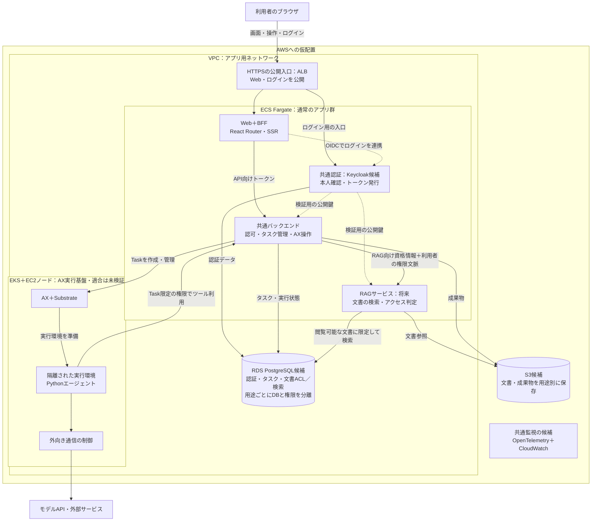

# AXのWeb入口とAWSへの仮配置

公開版は [docs/web-architecture.md](../../../docs/web-architecture.md)。PR #3でマージ済み（2026-10-06）。以後の設計・見積もりは公開版を更新し、この文書は当時のローカル作業記録として保持する。

2026-10-06。構成を理解するための将来案であり、AWSへの配置・動作確認・費用見積もりは行っていない。現在の実行環境はローカルのkindである。

同日、利用者の意向により概略設計フェーズを完了として区切った。サービスの責務と連携、React Routerの選定、認証・RAGと仮配置を整理した範囲の完了であり、詳細設計や実装・本番適合の完了ではない。次の作業は[ローカルWeb版の概算見積もり](estimate.md)までとし、実装には着手していない。

利用者はReact RouterのFramework ModeでSSRとBFFを実装する方針を選んだ。共通バックエンドにAX操作をまとめ、AX内のエージェントはPythonを維持する方向で整理する。2026-10-06、利用者はこの技術構成と配置の枠組みを、将来の見直しを前提とする当面の設計方針として了承した。Hono、Keycloak、AWS各サービス、RAGの製品・実装は仮置きを含み、製品・配置の最終確定や実装済みとは扱わない。

認証基盤はKeycloakに固定しない。利用者は将来の選択肢として、Amazon Cognitoの利用とMicrosoft Entra IDとの連携を挙げた。どの製品を認証の入口・トークン発行元にするか、連携・移行の方法は必要になった段階で決める。以下のKeycloakの配置と経路は現在の説明用の例として残す。

## 仮配置

Webと通常のAPIはECS Fargate、AX・Substrateの実行基盤はEKSのEC2ノード領域に配置する例。各ECSサービスは独立したコンテナとして配置できる。ECSとEKSは別のコンテナ実行基盤で、ECS側はEKSの外にある。

実線は操作・データの経路、点線は認証連携・署名鍵への信頼を表す。公開鍵は取得・キャッシュして検証するもので、全API要求がKeycloakへの問い合わせを経由するという意味ではない。監視への矢印は省略し、Web・API・認証・RAG・AXを横断してログ・メトリクス・トレースを収集する候補を示している。ネットワークの許可先や収集項目は未設計であり、図示だけで制御済みとは扱わない。

公開するのはWebとKeycloakのブラウザ向けログイン・OIDC入口。Keycloakの管理入口、共通バックエンド、RAG、AXの操作面は直接公開しない。ALBから各サービスへの通信経路と管理入口の制限を別途設定する。S3はVPC内のサーバーではなくAWSのストレージサービスで、図ではVPC枠の外に置く。VPCエンドポイント等の詳細は省略している。

## 認証とRAGのアクセス権

1. ブラウザをKeycloakへリダイレクトしてログインする。認可コードはブラウザ経由でWeb/BFFのコールバックへ戻り、BFFがトークンと交換する。ブラウザはWebのセッションCookieを使う。トークンの保持やCookie・CSRF対策はBFF側で扱う。
2. BFFはAPI向けのアクセストークンで共通バックエンドを呼ぶ。APIが発行元・署名・宛先・期限を検証し、その利用者がタスクを実行・閲覧してよいか判断する。ログインできることと、全タスクを操作できることは別である。
3. AX内のエージェントには、利用者のCookieや無制限な本人トークンを渡さない。Taskを特定する期限・用途を限定した資格情報を渡し、共通バックエンドが保存済みTaskの利用者・所属・許可範囲と照合する。モデルが引数に指定したユーザーIDだけで権限を決めない。
4. APIからRAGへは、RAG向け資格情報と検証可能な利用者・Taskの委任文脈を渡す。API用トークンを無条件に転送する設計にはしない。RAGが利用者の文書閲覧権限とTaskの許可範囲を照合し、その範囲に検索対象を限定する。共通認証を導入しただけで文書ACLが自動的に適用されるわけではない。

Keycloakは本人確認・トークン発行を担い、タスクの権限は共通API、文書のアクセス判定はRAGが担う。RAGには文書の取り込み時に元システムのACLを取り込み、権限変更・削除を反映する仕組みも必要。保存先はRDS PostgreSQL＋pgvectorとS3を例にしており、製品選定・取り込み方式・埋め込みモデルは未決定。

モデルAPIのキー、AWSサービスへ接続するIAM権限、利用者の認証トークンは別の資格情報として管理する。将来の記憶システム・社内外ツールも同じ入口と権限確認に接続する構想だが、外部製品ごとの認証方式までは決めていない。

## 配置の条件と未確認事項

- React RouterはNode.jsコンテナでSSR/BFFを提供できる。WebをCloudflare Workers等へ移す場合も責務分担は保てるが、実行環境の互換性と、非公開APIへ到達する経路を別途確認する。
- 共通API内のAX操作は、既存Python処理の内部呼び出しと、TypeScriptへの移植を比較済み。前者は既存の費用保護を再利用できるがNode・Python・永続ファイルを扱える実行環境が必要。後者はAPI接続と費用・再送・復旧処理の同等性確認が必要。統合する方針と実装方式は区別する。
- 図のRDSによる実行状態保存は将来案。現行CLIはローカルのファイル台帳とロックを使うため、そのままECSの一時ファイル領域に置かない。ファイル台帳を維持するなら永続領域と単一実行管理を用意する。DB化するなら既存台帳の移行と二重開始防止を検証する。
- AX・Substrateの現行固定版はDaemonSet・hostPort・hostPathを使うため、EKS Fargateへそのまま配置できない。EKSのEC2ノードは配置候補であり、ノードOS・Kubernetes機能・サンドボックス権限への適合は未検証。gVisor方式ではKVMは必須ではなく、microVM方式を選ぶ場合に仮想化対応を確認する。CPUアーキテクチャはノード・イメージ・ランタイムを合わせて選ぶ。
- ECS側の通常アプリ群をEKSの独立したアプリ用ノードへまとめる代替案も成立する。この仮配置では、Web/APIの運用とAX用ノードの要件を分けて理解しやすくするためECSとEKSを分けた。費用や運用負担の比較はまだ行っていない。
- RAG・監視・クラウド配置は後続の構想であり、今すぐ全サービスを作る計画ではない。有料APIの実行やAWSリソースの作成は行っていない。

## 根拠

- [React Routerの配置先とNode.jsコンテナ](https://reactrouter.com/start/framework/deploying)
- [React RouterのBFF構成](https://reactrouter.com/explanation/backend-for-frontend)
- [ECS Fargate](https://docs.aws.amazon.com/AmazonECS/latest/developerguide/AWS_Fargate.html)
- [EKS Fargateの制約](https://docs.aws.amazon.com/eks/latest/userguide/fargate.html)
- [Keycloakのコンテナ運用](https://www.keycloak.org/server/containers)
- [KeycloakのOIDC接続](https://www.keycloak.org/securing-apps/oidc-layers)
- [OAuthのトークン権限制限](https://www.rfc-editor.org/rfc/rfc9700.html#section-2.3)
- [AWSのベクトルデータベース案内](https://docs.aws.amazon.com/vector-databases/)
- [CloudWatchのOpenTelemetry取り込み](https://docs.aws.amazon.com/AmazonCloudWatch/latest/monitoring/CloudWatch-OTLPEndpoint.html)
- ローカル固定版の配置制約：`ax-local/.sources/substrate/manifests/ate-install/atelet.yaml`、`ax-local/.sources/substrate/docs/api-guide.md`。

認証・RAGの境界とEKSの要件を読み取りで別担当に確認した。構成図の確認は実環境の動作確認やセキュリティ試験を代替しない。
