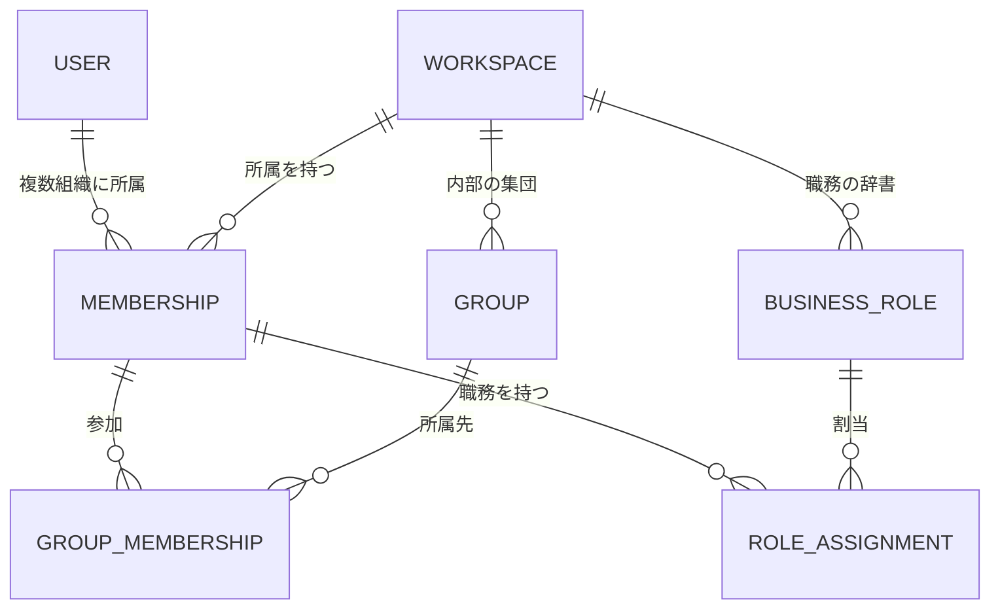

# 候補A: アプリDBで組織所属と権限を管理する

対象: main `b07173e`。独立候補A・未採用・未実装。今回の成果物は設計だけで、他候補は参照していない。
読者は親の比較担当と、採用後にAPI・DB・画面を設計する担当。コード、DB、サービス、共通文書、OKFは変更しない。

## 利用例

1. 花子は「A社」「B社」に所属する。A社では一般メンバーかつ業務Role「開発者」、B社ではAdminかつ業務Role「CTO」である。
2. A社の「開発部」と「新製品プロジェクト」に同時に参加する。B社のGroupにはA社の所属を使って参加できない。
3. A社Adminが花子をGroupへ追加しても、花子の既存チャットは本人だけに見える。CTOという業務Roleだけではメンバーを管理できない。
4. 花子がA社を離れるとA社の利用資格とGroup所属が無効になる。B社の所属、内部User ID、既存の個人チャットは変わらない。
5. 将来、A社の社内資料を取り込む際はA社を保存境界とし、公開先Groupを明示する。花子がA社の業務Roleを変えても、資料の閲覧権は勝手に増えない。

## 中心となる判断

Keycloakは本人確認を担い、app PostgreSQLがWorkspace、所属、Group、業務Role、管理権限の正本を持つ。
Hono共通APIは検証済み内部User UUIDから現在の所属を調べる。IdPの表示名・メール・group claimを、そのまま組織所属や権限に置き換えない。
Workspaceは会社等の最上位の組織境界、Groupはその内部の集団とする。AXのWorkspace、Kubernetes namespace、Keycloak realmとは独立したIDである。

## 概念と関係の骨組み

| 概念・表の仮名 | 主な値と関係 | 何を表すか |
| --- | --- | --- |
| 既存 `users` / `identities` | User UUID、`(issuer, subject) → user_id` | 会社横断の本人。User IDを会社ごとに複製しない |
| `org_workspaces` | UUID、名称、`active / archived`、revision | 組織の境界。外部IdPのtenant IDは主キーにしない |
| `org_memberships` | `(workspace_id, user_id)`、`active / suspended / left`、`access_level: admin / member`、revision | UserがそのWorkspaceに所属する事実と操作区分 |
| `org_groups` | UUID、workspace_id、名称、`active / archived` | 部署、プロジェクト等。初期候補では階層なし |
| `org_group_memberships` | `(workspace_id, group_id, user_id)` | そのWorkspaceの所属がGroupにも参加する関係 |
| `org_business_roles` | UUID、workspace_id、名称、`active / archived` | Workspaceが管理する業務Roleの辞書 |
| `org_membership_business_roles` | `(workspace_id, user_id, business_role_id)` | 所属に対する業務Roleの割当。0個以上の複数割当を提案 |
| `org_audit_events` | actor User、workspace、対象、操作、変更前後、時刻、request ID | 所属・権限の変更履歴。現在状態の正本にはしない |

Group所属は `org_groups(workspace_id, id)` と `org_memberships(workspace_id, user_id)` の両方を参照する。
業務Role割当もRoleのWorkspaceと所属のWorkspaceを一致させる。複合外部キーと一意制約で、別会社のIDを混ぜた関係を保存できなくする。
業務Roleは人の職務・肩書を説明する値であり、操作権限の付与には使わない。同名Roleでも別Workspaceでは別IDである。

## 不変条件と操作権限

- 有効なWorkspace所属だけがそのWorkspaceの機能を利用できる。停止User、停止所属、archive済みWorkspaceでは拒否する。
- Adminは同じWorkspaceの所属・Group・業務Role・Admin区分を管理できる。一般メンバーは自分の所属を参照できる。名簿の公開範囲は未決とする。
- Admin区分はWorkspaceごとに判定し、別Workspaceや基盤全体の管理権限を含めない。既存privateデータの閲覧・移管権限も含めない。
- 有効なWorkspaceから最後の有効Adminを除去・降格・停止できない。管理操作はWorkspace行のロックとrevision照合で直列化する。
- User全体の無効化・identity統合等、Workspaceをまたぐ管理操作も最後のAdmin条件を確認する。通常Adminへこの基盤管理操作は公開しない。
- `suspended` は資格の一時停止で、所属関係は保つが利用を拒否する。`left` への変更ではGroup所属と業務Role割当を同じtransactionで除き、履歴だけ残す。
- 再加入時に過去のAdmin・Group・業務Roleを自動復活させない。新しい明示的な割当が必要。UserとWorkspaceのIDは再利用しない。
- 所属の追加やWorkspaceの選択は、リソースの公開範囲を変更しない。既存の全owner照合経路を維持する。
- 将来のWorkspaceリソースにはworkspace_idを必須とし、必要ならGroupへの明示的な閲覧・操作許可を別途定義する。Group参加だけを全リソースへの許可にしない。
- 所属変更は次の認可判定から反映する。完了済み処理の取消や送信済み外部操作の停止まで保証するものではない。

## APIと実装境界

利用側の骨組みは `GET /v1/me/workspaces`、`GET /v1/workspaces/:wid/me`、`PUT /v1/workspaces/:wid/members/:uid`、`PUT /v1/workspaces/:wid/groups/:gid/members/:uid` とする。
PUTは明示した望ましい状態とexpected revisionを受け、同一状態への再送で重複所属を増やさない。競合は409、未所属の境界は404、所属内の操作権限不足は403とする。
業務Roleの割当とAdmin区分の変更は別の操作・入力型にする。上記member操作で管理できるフィールドは認可済みの明示列だけとする。

| 境界 | 責務 |
| --- | --- |
| Keycloak / 将来のEntra・Cognito接続 | 認証と外部identity。既存の内部User対応を保持し、メール一致で統合しない |
| Web/BFF | Workspace選択、フォーム、CSRF、表示。選択値は操作対象の指定であって権限の証拠ではない |
| Hono共通API | JWTからactorを確定し、Workspace ID等を型へ変換。全入口で同じ所属サービスを利用する |
| app PGの所属用関数 | actor・対象Workspace・現在所属・必要権限の確認と変更・監査記録を同一transactionで行う。runtime roleには限定関数だけ許可する |
| Go controller / AX | 実行と停止の管理を継続。組織所属の正本にせず、所属操作から全体費用guardや再開始禁止を解除しない |

管理画面で確認した権限を更新時まで信用せず、変更のtransactionで再判定する。DB障害やidentity不明では拒否し、token内の古い所属へfallbackしない。
将来の社内連携は外部tenant/groupのIDと内部Workspace/Groupの対応表を持つ取込境界へ分ける。同期権限・競合・退職処理を決めるまでは自動同期しない。
将来のRAGは検索前にWorkspaceと閲覧許可を絞り、検索結果・引用にも同じ境界を適用する。プロンプトに会社名を書くことを認可の代わりにしない。

## 既存からの移行と戻し方

1. 既存User/identityとownerを保持し、新しい所属表を追加する。最初のログインやメールドメインからWorkspace・Adminを自動生成しない。
2. 承認済みの作成経路でWorkspaceと初期Adminを一つのtransactionで作る。既存User UUIDを参照し、二重作成はrequest IDで防ぐ。
3. 所属・Group・業務Roleの管理と表示を導入する。既存チャット・run・成果物はowner限定のまま残し、所属を持たない既存利用者も従来経路を維持する。
4. 将来、個人データをWorkspaceへ移す必要が出た場合は、対象・移管後の所有者・公開先・本人同意を別途設計する。今回の所属導入でbackfillしない。
5. 初期導入を戻す場合は所属機能を閉じ、追加表と監査を保持する。共有リソース導入後に旧owner-only版へ戻す手順は、別の移行設計が必要になる。

認証用DBとapp DBの分離は維持する。追加表はapp DBにあり、PostgreSQLの配置をKubernetes内へ固定しない。
同時実行1件、費用上限、未知usage時の停止、所有者なしデータの保持・非公開は従来どおりで、Workspace数によって緩和しない。

## 利点、受け入れる負担、未決事項

利点は、所属変更・権限判定・対象データを同じDBのtransactionで扱えること、IdP変更で組織IDを付け替えずに済むこと、業務Roleと権限が混同されにくいことである。
負担は、所属管理画面・監査・初期Admin復旧をアプリ側で持つこと、認可時のDB参照が増えること、将来の社内ディレクトリ同期を別途設計することである。
Keycloak group/role claimを正本にする構造は、アプリ資源との原子的な変更と複数IdPへの独立性を優先する本候補では採らない。製品能力の不足を主張するものではない。

実装前に決めること: Workspaceの作成者・初期Adminの復旧手順、招待と参加承認、Workspace内の名簿公開範囲、業務Roleの単数/複数、退会と停止を操作できる主体。
後続で決めること: Groupの階層、外部所属同期、Workspaceをまたぐ共有、業務Roleの検索・推薦用途、スキル/RAG等のリソース別許可、退職後の会社データの保持・移管。
Groupは平坦、業務Roleは複数可、一般メンバーの名簿参照なしを本候補の暫定値とする。未決事項をユーザー承認済みと扱わない。

## 設計確認と根拠

確認項目は、A社AdminからB社管理の拒否、複合キーでの別Workspace関係の拒否、同時に最後のAdminを失う更新の拒否、脱退・再加入で権限が復活しないこと、所属変更後も既存privateチャットが本人限定であること。
さらに、同状態の再送、古いrevision、異なるIdPで同一内部Userを使う場合、DB停止時の拒否、User停止と管理操作の競合を実装時の検証ゲートにする。今回は設計上の照合のみで、実装・DB試験は行っていない。

- 現状: `web/server/auth-schema.sql:1`、`web/server/auth-store.ts:58` は内部Userと外部identityの対応。`web/data/schema.sql:346` のowner認可と `:359` の原子的受付を維持する。
- OKF bundle: `/Users/const/sori883/agent-workspace/.space/babel`。rule/principle全description、`web/data/schema.sql` のpath search、Workspace検索を実施。
- 本文確認: `decisions/systems/ax/auth-foundation` の内部UUID・ownerなし非公開・IdP切替、`decisions/systems/ax/portable-api-postgres` のAPI/DB/controller境界を再利用した。
- 適用原則: `model-the-domain` / `foundational-thinking` は所属関係を中心にする判断、`boundary-discipline` / `type-system-discipline` はAPI境界と複合参照、`make-operations-idempotent` / `separate-before-serializing-shared-state` は同状態再送とWorkspace単位排他、`redesign-from-first-principles` はowner条件への所属の継ぎ足しを避ける判断に適用した。
- 親の依頼で実装・commit・PR・OKF編集は対象外。比較・採否と共通記録は親へ渡す。
