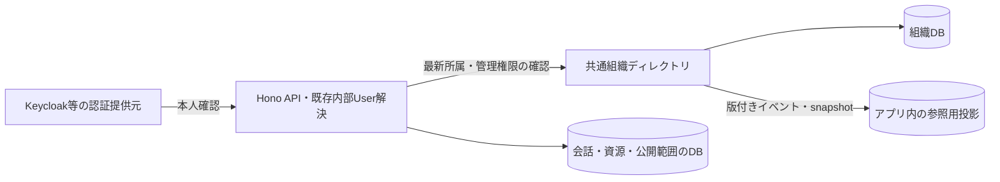

# 候補B：共通組織ディレクトリを所属の正本にする

対象はmain `b07173e4321fbc54c7eedd2f30009b7141914bf7`。独立候補の設計のみ。親から引き継いだ現状を再利用し、他候補は参照していない。特定の認証製品に組織管理機能があるとは仮定しない。

## 利用例から決める境界

山田さんはA社Workspaceでは業務Roleが「CTO・開発者」、操作区分がAdmin、開発部と新製品Groupに所属する。B社Workspaceでは「アドバイザー」、一般メンバーとして監査Groupに所属する。Workspaceを切り替えても、A社の所属・Admin権限・文書がB社へ持ち越されない。

A社AdminはA社の所属・Group・業務Roleを編集できる。Adminであることから他人のprivateチャットを閲覧できるようにはしない。山田さんの既存個人チャットも、A社へ所属しただけではA社・各Groupへ公開しない。

ディレクトリは組織の所属関係と組織管理の権限を所有する。アプリは会話・スキル・文書・連携設定等の内容と、それぞれの操作ルールを所有する。将来、同じ会社・部署情報を複数アプリが使う場合に、この分離が意味を持つ。

## 概念・関係

| 概念 | 正本と関係 |
| --- | --- |
| User | 既存の内部`users.id` UUIDを維持。認証境界がissuer/subjectから解決し、ディレクトリはこのUUIDを参照する。メールをIDにしない |
| Workspace | ディレクトリ所有の最上位組織境界。会社等を表す独立UUID。AX WorkspaceやKubernetes namespaceと同一視しない |
| Membership | ディレクトリ所有。User×Workspaceで一意。状態、操作区分、版を持つ。Userは複数Workspaceへ所属できる |
| Group | 必ず一つのWorkspaceに属するUUID。部署・プロジェクト・任意集団を同じ概念で扱い、初期は親子階層を作らない |
| GroupMembership | 同じWorkspaceのMembershipとGroupを結ぶ多対多。別Workspaceへの横断所属は禁止 |
| BusinessRole | Workspace内の業務上の役割定義。「開発者」「CTO」等。Membershipへの割当は0件以上を推奨し、Group所属とは独立させる |
| WorkspaceAccess | Membershipの`admin`または`member`。業務Roleと別の型・項目にし、CTO等の名称から自動昇格させない |
| ResourceAccess | アプリ所有。資源のWorkspace、owner、公開範囲と操作ルール。初期はowner限定を維持し、共有ACLの実装は後続 |

ディレクトリの概念を、Keycloakのrealm・group・client roleの名前に合わせて変形しない。IdPごとの差は連携境界で変換する。Groupへの参加自体も、将来の全文書・全スキルの閲覧許可にはしない。

## 責務と正本



独立サービスにはWorkspace作成、招待・所属変更、Group管理、BusinessRole割当、Admin変更、監査履歴、認可照会、変更配信が必要。これらを既存Keycloakの機能として扱わず、実装または選定・検証する責務とする。専用の論理DB・接続権限を持ち、アプリが組織表を直接更新しない。PostgreSQLの物理配置は自由で、同じサーバーへの同居も可能。

組織の状態とWorkspaceAccessの正本はディレクトリ、資源ごとの公開範囲と操作ポリシーの正本はアプリ。実際の許可は「有効なUser・有効な所属・必要な組織権限・資源のWorkspace一致・資源のACL」の積で判断する。アプリの投影やログイントークン内の所属情報を、権限の正本にしない。

認証セッション、Keycloakパスワード・パスキー、モデル費用・実行枠はディレクトリへ移さない。既存の費用guard・同時実行1件・二重開始禁止もWorkspaceの導入だけでは分割・緩和しない。

## 最小の型とサービス契約

```ts
type WorkspaceAccess = "admin" | "member";
type Membership = {
  workspaceId: WorkspaceId; userId: InternalUserId;
  status: "invited" | "active" | "suspended" | "removed";
  access: WorkspaceAccess; businessRoleIds: BusinessRoleId[]; revision: number;
};
type MembershipDecision =
  | { allowed: false; reason: "inactive" | "not_member" | "insufficient_access" }
  | { allowed: true; decisionId: string; revision: number;
      membership: Membership; groupIds: GroupId[] };
listMyWorkspaces(actor: VerifiedUser): Promise<WorkspaceSummary[]>;
checkMembership(actor: VerifiedUser, workspace: WorkspaceId,
  purpose: "use_workspace" | "manage_membership"): Promise<MembershipDecision>;
changeMembership(actor: VerifiedUser, command: {
  workspaceId: WorkspaceId; targetUserId: InternalUserId;
  expectedRevision: number; idempotencyKey: string; change: MembershipChange;
}): Promise<Membership>;
```

型は設計骨組みで、通信認証や検証済みUserの受渡し方式は実装前に具体化する。ブラウザ指定のUser ID・Admin・Workspaceヘッダーをそのまま信頼しない。アプリが認証した主体とサービスの権限をディレクトリ境界で検証する。

ディレクトリは変更transaction内で実行者の現在権限と期待版を確認し、同じキー・同じ変更は同じ結果にする。通常操作では最後の有効Adminを消さず、Workspaceの初期Admin指定・管理者喪失時の回復を別の監査可能な手順にする。招待済み状態だけでは利用権を与えない。

## 同期・失効・通信断

投影は一覧の表示や検索索引用で、組織編集はディレクトリだけに送る。Workspace単位の増加する版、削除通知、snapshotと再開位置を定義し、重複を無害化、逆順を拒否、欠番時はsnapshotで再構築する。削除済み所属の古いイベントで権限を復活させない。

Workspace内の読取・更新は都度、正本へ現在の所属を確認する。失効反映をイベント配信だけに任せず、確認できなければそのWorkspaceの操作を拒否する。投影した一覧も、現在アクセスできるWorkspaceで絞ってから表示する。既存のWorkspaceに属さないprivate領域は従来の本人限定判定を維持する。

ただしディレクトリ照会とアプリDB更新は単一transactionではない。本案の初期契約は「正本が許可判断した時点で受付を認可する」とし、判断直後の脱退と競合した既に進行中の要求までは即時取消しを保証しない。判断ID・版を受付の監査情報へ残し、別の要求・再送・結果取得には新しい確認が必要。ログアウト・脱退で過去に取得された本文を回収できるとはしない。

非同期実行は開始直前にも所属を確認し、失効・照会不能なら未開始のまま保留する案とする。開始済み処理の回収・遮断・停止は利用者権限失効後も運用主体が行い、後片付けを妨げない。厳密な「脱退完了後は開始も0件」が必要なら、失効完了を各利用先の停止確認まで待つ方式や共通の認可transactionが追加で必要で、単純な投影案の保証には含めない。

この通信依存を避け、署名済み所属や短期キャッシュだけで許可する構造も考えられるが、失効の遅延を許容する合意がないため本案では採らない。

## 複数IdPと将来の利用

既存のissuer/subject→内部UUID対応を保ち、Workspaceをissuer・メールドメイン・IdPのtenantと一対一にしない。一つのWorkspaceへ複数IdPの利用者を受け入れ、一人が複数Workspaceへ所属できる。外部のgroup/roleは入力元の属性であり、アプリのAdmin権限へ無条件に変換しない。

Entra/Cognitoを追加するときも、本人確認を伴う明示的な対応付けで内部Userを維持する。同じメールだけでアカウントを統合しない。将来複数アプリでディレクトリを共有するなら、各アプリが同じ内部Userを確実に指す共通ID解決が成立条件になる。別々のUser体系を単なるUUID文字列一致で混ぜない。

社内連携は外部の組織・group IDと内部UUIDの対応、属性ごとの更新元を持つ。手動編集と自動同期が同じ属性を競合更新しない契約が必要。スキルやRAG文書はアプリ側でWorkspace・明示的なGroup公開先・owner等を持たせ、検索・取得・生成への投入前に現在の認可を適用する。業務Roleは推薦や整理に使えても、それだけで権限を与えない。

## 既存データへの導入

1. 現在の内部User UUIDを維持し、同意・管理手順でWorkspaceとMembershipを登録する。メールや既存チャットから会社を推測して自動登録しない。
2. 既存チャットは`personal_private`としてowner限定のまま保つ。Workspace未指定を「全Workspace公開」と解釈しない。新しいWorkspace内private資源は所属とownerの両方を必要とする。
3. 既存データをWorkspaceへ関連付ける場合は対象と所属先を明示して変更し、公開範囲はprivateのまま維持する。Groupへ公開する操作は別の共有設計・承認として扱う。
4. 同期・照会・監査を導入し、二つのWorkspace・複数Group・降格・脱退・再招待・サービス停止・イベント逆順の試験を通してからWorkspace境界を必須化する。

脱退・Workspace停止で資源を連鎖削除しない。元のownerとWorkspaceは保存し、閲覧可否は現在の所属で判定する。退職者のprivate資源を他者へ引き継ぐ権限・保存期間は別途決める。導入を戻す際も新たなWorkspace資源を旧本人限定領域へ黙って混ぜず、受付停止と明示的な変換を必要とする。

## 利点・負担・成立条件

| 評価点 | この候補の判断 |
| --- | --- |
| 組織の共通利用 | 複数アプリ・連携先で所属を揃えやすく、認証製品の変更と業務概念を切り離せる |
| 正本 | 組織の更新先が一つ。アプリ別資源の権限まで汎用サービスへ押し込まない |
| 初期の負担 | 新サービス・組織DB・監査・同期・管理UI・共通User参照が必要。現アプリ一つだけなら運用負担が大きい |
| 可用性と性能 | 正本への都度照会がWorkspace操作の遅延・停止要因になる。投影だけでは失効保証を代替できない |
| 整合性 | 組織と資源のDBを跨ぐ失効・受付競合が残る。許可判断時点と実行中の扱いを契約にする必要がある |
| 選ぶ条件 | 組織情報を複数システムで共用する具体的な予定と、独立した運用主体・失効要件への合意がある場合 |

未決は、BusinessRoleの複数割当を採るか、Workspaceの作成権・最初のAdmin、招待・退職・Admin喪失時の運用、厳密な失効時点、既存privateデータの所属先、外部同期の更新元。資源共有・RAG・スキル実行権限の詳細は今回確定しない。

根拠は親から引き継いだmainの認証・PG・owner限定構成、および`docs/auth-foundation.md`、`web/api/runtime.ts`、`web/data/schema.sql`に対応する既存知識。適用原則はboundary-discipline、model-the-domain、foundational-thinking、make-operations-idempotent等。今回は候補の要件照合までで、通信・同期・失効の実装検証は未実施。コード・DB・認証設定・OKF・外部状態は変更していない。
