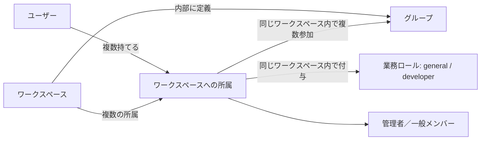

# ワークスペース・グループ・ロールの設計案

2026-10-06。読者はプロダクトの構想を決める利用者と、後続の実装担当。現在のコードは `b07173e`。これは将来構成の提案であり、稼働中の仕様ではない。

## 1. 今回確認できたこと

ワークスペースを会社などの情報境界とし、「ユーザーがそのワークスペースに所属している」という関係を中心に置く。グループと業務ロールはその所属へ結び付ける。利用者の追加回答により、業務ロールと操作権限を分け、ワークスペースごとに管理者／一般メンバーを持つことを確認した。

ユーザーの複数ワークスペース・複数グループ所属、ワークスペース別の業務ロール、管理者権限との分離は確認済み。追加の指定により、初期の業務ロールは一般と開発者の2種類に絞る。英語識別子は `general` / `developer`、管理権限は `admin` / `member` とする。ワークスペースは誰でも作成でき、1ユーザーの作成上限は3個とすることも確認した。具体的なモデル、管理者の詳細権限、保存と共有の方針は提案である。

## 2. 概念と関係

| 概念 | 意味 | 属する範囲 |
| --- | --- | --- |
| ユーザー | ログインする本人。既存の内部利用者IDを継続する | アプリ全体 |
| ワークスペース | 会社・組織などの最上位の利用単位と情報境界 | アプリ内に複数存在 |
| ワークスペースへの所属 | 「誰がどこに所属するか」。在籍状態と管理権限を保持 | ユーザーとワークスペースの組 |
| グループ | 部署・プロジェクト・任意の集団 | 1つのワークスペース |
| 業務ロール | 初期は一般（`general`）と開発者（`developer`） | 付与はワークスペースへの所属ごと |
| 管理権限 | 管理者／一般メンバー。招待や設定変更などの可否 | ワークスペースへの所属 |
| リソースの利用権限 | 特定の資料を読む、スキルを実行するなどの許可 | 対象リソースと操作ごと。将来拡張 |

中心は「所属」であり、グループの下にユーザーを固定する木構造にはしない。部門横断プロジェクトへの参加や、複数社の兼務をそのまま表せる。ワークスペースの親子関係・グループの入れ子は初期案に含めない。グループ種別を付けても、その種別だけで権限を変えない。

例えば同じ田中さんを次のように表せる。役職の自由登録は初期範囲に含めない。

| 所属先 | 参加グループ | 業務ロール | 管理権限 |
| --- | --- | --- | --- |
| A社 | 管理部、新システム導入プロジェクト | 一般（`general`） | 管理者（`admin`） |
| B社 | 開発部、プロダクトX | 開発者（`developer`） | 一般メンバー（`member`） |

開発者だから管理者になる、管理者だから開発者向けの全ツールを実行できる、といった暗黙の結び付けは置かない。「一般」という業務ロールと「一般メンバー」という管理権限も別の項目である。ワークスペース名やグループ名の表示には日本語を使ってもよく、保存モデル・API識別子は英語とする。

## 3. まず保つ境界

1. 1ユーザー×1ワークスペースに有効な所属は1つ。グループと業務ロールは、その所属と同じワークスペースに限る。
2. 管理者権限はそのワークスペースだけに有効。全体運営者や認証サーバーの管理者とも別の概念とする。
3. ワークスペースの所属解除・停止は、その中のグループ・ロール・利用権限すべてに優先する。別会社の所属には影響しない。再参加時に過去の権限を自動復活させない案とする。
4. 初期業務ロールの識別子は `general` / `developer` の2つを使い、付与先は各ワークスペースへの所属とする。A社で開発者でもB社で開発者になるわけではない。カスタム役職の定義は後続とし、表示名から権限を推定しない。
5. グループ未所属のワークスペースメンバーも許す。初期の2種類では所属ごとにどちらか1つを付け、既定値を `general` とする案を推奨する。これは前稿の複数付与案を初期範囲に合わせて簡略化した提案で、複数役職の将来拡張は保留する。
6. 所属・ロール・権限の変更は誰がどのワークスペースで何を変えたか記録する。最後の有効な管理者を通常操作で消せないようにする。凍結・削除・緊急復旧の扱いは別途定める。

管理者は招待、所属の管理、グループの定義・参加管理、2種類の業務ロールの割当、ワークスペース設定を管理する案。一般メンバーによる自己昇格や、自分への管理権限付与は認めない。招待中は有効な所属と区別し、招待先メールだけで別アカウントの統合・権限付与をしない。登録ユーザー一覧や所属名簿の公開範囲は個別に決める。

## 4. 管理できることと、読める情報

ワークスペースは情報の所属先であり、全員に公開する指定ではない。作成者、管理する組織、共有先を区別する。新しい会話・実行記録・成果物にはワークスペースを固定し、初期の閲覧範囲は本人限定とする案を推奨する。実行記録や成果物の閲覧範囲は元の会話より広げない。

将来、リソースごとに「本人」「指定グループ」「ワークスペース全体」などの共有を導入する。ただし対象操作は別々にする。スキルを閲覧できることと、編集・公開・実行できることは同じではない。同じワークスペース内の複数グループから同じ操作の許可がある場合は、どれか有効な許可があれば使える案とする。ワークスペース停止や外部サービス側の拒否はこれに優先する。初期に複雑な個別拒否や権限継承は導入しない。

管理者であるだけで本人限定の会話を読める仕様にはしない案を推奨する。一方、管理者がグループへの加入を変更でき、そのグループに資料閲覧が許可されていれば、自分を加入させて資料を読める。この経路も権限変更として扱う。機密グループについて管理者による自己付与も防ぐ必要がある場合は、加入承認者や資料の共有管理者を分ける設計が必要。管理者からの秘匿を保証するとはまだ決めていない。

退会・退職で組織の会話や実行履歴を個人所有へ変えたり削除したりしない。本人のアクセスは止め、保持・引き継ぎ・削除は組織のデータ方針に従う案。管理者への引き継ぎや監査目的の閲覧を認めるかは未決で、保存されていることから閲覧許可を推定しない。

## 5. 現在の認証・共通APIへの接続

現在は `web/server/auth-schema.sql` の `users` と `identities` が本人を表し、`web/api/runtime.ts` が認証済みIDと有効なユーザーを確認する。`web/data/schema.sql` と `repository.ts` は `owner_user_id` によって本人の記録を分けている。ワークスペース・グループ・業務ロールは未実装。

推奨する責務配置は、ログインをKeycloakなどの認証基盤に残し、ワークスペースへの所属と利用許可を共通APIで判断する形。所属情報は既存のapp PostgreSQLに保存できる。会社ごとにDBを作ることや、新しいDBサービスを導入することをこの概念の前提にしない。PostgreSQLの本番配置先は引き続き未選定。

業務用ワークスペースをKeycloak realm、外部IdPのテナント、AX Workspace、Kubernetes namespaceに直結させない。外部の部署・グループを取り込む場合は、明示的な対応付けと、項目ごとの更新元・失効方法を定める。アプリと外部ディレクトリの双方で同じ所属を自由に書き換える仕様にはしない。

### 初回ログインとワークスペースへの参加（作成権限・上限を確認、詳細は提案）

アカウント作成とワークスペースへの参加を別の操作にする。ログイン済みでも有効な所属が0件の状態を認め、参加または作成の案内を表示する。ログインできたことだけで会社の資料や新しいチャットを使える状態にはしない。現在の本人限定の旧チャットをこの画面から引き続き利用可能にするかは、既存データの移行時に決める。

| 方式 | 初回の体験 | 今回の評価 |
| --- | --- | --- |
| 個人用を自動作成 | 登録した全員に1人用のworkspaceを作る | すぐ使えるが、会社に招待される人にも不要な領域が増える。個人用と会社用のデータ移動も必要になる |
| 招待された人だけ参加 | 会社側がworkspaceを用意し、メンバーを招待する | 社内専用には向く。自分で使い始めたい人向けの入口と、最初の管理者を用意する運用が別途必要 |
| 招待への参加＋明示的な新規作成 | 招待があれば参加し、なければ作成または招待待ちを選ぶ | 推奨。不要な自動作成を避けながら個人・会社の両方から始められる |

3方式とも既存のUser・Workspace・Membershipで表現でき、組織情報の正本やサービス分割は変えない。今回は既存構造の入口を具体化するための同一担当による比較であり、独立候補探索をやり直すものではない。方式の採用はまだ確定していない。

推奨案の利用の流れは次のとおり。

1. 有効な招待から来た人は、登録またはログイン後に招待先を確認して参加する。通常は `member` ＋ `general` から始める。開発者への変更と管理者への昇格はそれぞれ別の管理操作とする。
2. 招待も所属もない人は「ワークスペースを作成」か「会社の管理者から招待を受ける」を選ぶ。有効な認証済みユーザーなら誰でも、作成上限3個の範囲で明示的に作成でき、その新しいworkspaceだけの最初の `admin` になる。業務ロールは別に `general` を既定とする。
3. 既に所属があれば、そのworkspaceへ入る。複数あれば選択・切り替えができる。明示的な招待から来た場合は既存の所属があっても招待の確認へ進む。
4. 全workspaceから脱退した人も、所属0件の案内へ戻る。過去の会社への再参加や過去の管理権限を自動復活させない。

1人用も通常のworkspaceを1人で使う形でよい。後から仲間を招待でき、特別な「個人用workspace型」は初期には設けない。将来会社で使う際に既存の個人データを共有するかは、招待とは別の操作で判断する。

利用者の追加指定により、作成は有効な認証済みユーザー全員に許し、1ユーザーが作成できるworkspaceの上限を3個とする。既存workspaceの `admin` は作成の必要条件にしない。これは作成数の上限であり、招待で参加するworkspaceはこの3個に含めない。例えば3個を作成済みの人が、別会社の招待へ参加することは妨げない。

数え方は、変更しない作成者ID `created_by_user_id` に基づき、削除されていないworkspaceを数える案を推奨する。所属数や現在のadmin数で数えず、管理者交代や脱退で作成枠を自動的に空けない。アーカイブも保持中として数える。削除完了で枠を戻すか、削除の確定時点をどう定めるかは削除機能の設計時に確定する。この数え方の詳細まで利用者が指定したものではない。

作成上限の確認、workspaceと初回adminの作成は同じ原子的な操作として扱い、同時に作成しても3個を超えないようにする。同じ作成要求の再送は元の結果を返し、追加の枠を消費しない。上限到達後の再送も新規作成と区別する。4個目の新規作成は拒否し、画面には上限3個に達したことを表示する。初期3個は設定値として管理し、実装中に勝手に引き上げない。

会社側は招待先と参加先を用意し、本人がパスワード・パスキー等を設定する案とする。管理者が他人のパスワードを作って渡すことは初期の仕組みに含めない。既存ユーザーへの招待でも新しいUserを作らず、その人の所属を追加する。将来Entra等で本人を会社側が用意していても、アプリ内の所属は明示的な対応付けで作る。

招待を受け取ることと参加完了は分ける。招待先workspace・宛先・有効期限・取消・使用済み状態を持ち、宛先の本人確認を完了してから受諾する。URLを知っているだけ、メール文字列が一致するだけで参加を許可しない。失効した招待は拒否して再招待を案内し、別アカウントでは切り替えを案内する。招待の消費と所属追加は一緒に確定し、再送では同じ所属に収束させる。招待元の権限が失われていた場合も、受諾時の再確認または明示的な再承認が必要。正確な本人確認・再承認方法は招待の詳細設計で決める。

同じ会社名・メールドメインを持つユーザーを自動で同じworkspaceへまとめない。未所属ユーザーには他社の一覧や名簿を公開しない。現在の自己登録・招待メール送信は未実装であり、この流れが既に利用できるという意味ではない。

参考として [Slackの公式参加案内](https://slack.com/help/articles/212675257-Join-a-Slack-workspace)も招待の受諾と新規workspace作成を分けている。Slack固有のアカウントモデルをこのアプリへそのまま移すものではない。確認日: 2026-10-06。

画面でワークスペースを選び、各操作が対象のワークスペースを明示する。APIは本人の現在の所属と対象リソースのワークスペースを照合したうえで、対象操作の権限を確認する。表示を隠すことや、ブラウザが送ったIDだけでは認可しない。この確認を各リクエストへ適用する方針は [OWASPの認可ガイド](https://cheatsheetseries.owasp.org/cheatsheets/Authorization_Cheat_Sheet.html)も参照した。

別タブでワークスペースを切り替えても、開いている会話や送信済みのジョブの所属先は変わらない。ジョブには検証済みの対象ワークスペースと実行主体を固定し、遅延実行の開始時に現在の所属・権限を再確認する。認可情報を含むキャッシュも失効の対象にする。実行中の操作や既に渡した情報の回収まで保証するものではなく、停止可能な範囲は実行機能の設計時に定める。境界の確認には [OWASPのマルチテナントガイド](https://cheatsheetseries.owasp.org/cheatsheets/Multi_Tenant_Security_Cheat_Sheet.html)を参照した。

利用者の権限が失効しても、実行管理による通信遮断・停止・状態や費用の記録は、専用の運用権限で継続できるようにする。利用者本人の再実行や結果閲覧を許可するものではない。

### 保存モデルの骨組み（未実装）

| レコード | 主な内容 |
| --- | --- |
| `users` / `identities` | 既存の内部利用者とログインIDの対応を継続 |
| `workspaces` | ID、名前、状態、作成者の内部User ID（`created_by_user_id`）。所属・管理権限とは別に保持 |
| `workspace_memberships` | ID、workspace ID、user ID、在籍状態、`access_level: admin / member`、初期案では `business_role: general / developer` |
| `groups` | ID、workspace ID、名前、任意の種別 |
| `group_memberships` | workspace ID、group ID、membership ID |

グループは所属IDを参照し、業務ロールは所属の属性として持つ初期案。同じワークスペースの組だけを参照できる制約をDBにも持たせる。前稿にあったロール定義・複数付与の表は、カスタム役職が必要になったときの候補に移す。招待、監査、共有設定は別の寿命を持つ記録として詳細設計する。SQL・URL・型の最終契約は今回確定しない。

### 既存データの移行条件

既存の `owner_user_id` を消してworkspace IDへ置き換えるだけでは、本人限定の条件を失う。両方の意味を保持し、既存データをどのワークスペースに帰属させるかを明示的に決めてから移行する。最初の所属先やメールドメインから自動推定しない。所有者が確定しない旧データは公開対象にしない。移行前後で本人限定・件数・実行との対応を照合する。

新規書き込みは所属先が決まってから開始し、移行中に未分類レコードが増えない手順とする。戻す際もワークスペースの制約を無視する旧APIをそのまま公開しない。既存のサービス全体の費用・重複実行防止・不明時の停止を維持する。所属削除や管理者の同時変更は、DBの制約・トランザクションと再確認で不整合を防ぐ。具体的な移行・復旧手順は実装計画の前に確定する。

## 6. 将来の機能でどう使うか

| 機能 | この土台の使い方 | 追加で必要な設計 |
| --- | --- | --- |
| スキル管理 | workspaceで管理し、groupへ共有し、業務roleをおすすめや検索に利用 | 利用・編集・公開・実行を区別。role名だけで自動許可しない |
| 社内システム連携 | 接続設定をworkspaceに所属させ、使える人・groupを指定 | 接続を管理する権限、利用する権限、秘密情報を見る権限を分ける。外部側の許可も満たす |
| RAG | workspaceと許可された資料範囲で検索する | 元資料と検索用断片のアクセス制御を維持。変更・削除・生成物の共有と失効を設計 |
| エージェント・定期実行 | workspaceと実行主体を固定する | 人の代理かサービス用の主体かを明示し、処理開始時と外部操作時に許可を確認 |

RAGはモデルに資料を渡す前に検索範囲を制限する。元資料の許可が変われば、検索対象やキャッシュも見直す。過去の回答や成果物に資料内容が残るため、元資料の権限だけ変更して完了にはできない。この点は [OWASPのRAGガイド](https://cheatsheetseries.owasp.org/cheatsheets/RAG_Security_Cheat_Sheet.html)も参照した。生成物の再共有と失効の具体策はRAG着手前の必須検討事項とする。

外部連携では「アプリ内で使える」かつ「外部システム側でも許される」範囲に限定する。共有の接続資格情報が広い権限を持っていても、全メンバーに同じ権限を渡さない。エージェントが管理用資格情報を持つことを理由に、呼び出した人の許可範囲を広げない。

## 7. 候補の比較

以下は初期ロールを2種類に絞る前に行った責務配置の比較。追加指定に合わせ、第2・3・5節の初期ロールを簡略化した。正本と所属の境界は同じで、この比較の結論は維持する。候補原稿は当時の案として保存する。

[候補A](design-candidates/round-1/a.md)は既存の共通APIとapp PostgreSQLが組織情報の正本を持つ。[候補B](design-candidates/round-1/b.md)は独立した組織ディレクトリを正本とし、アプリが所属を照会する。両案は別担当が他候補を読まずに作成した。

| 共通の評価基準 | A: 共通API＋app DB | B: 独立した組織ディレクトリ |
| --- | --- | --- |
| 複数会社・集団・会社別ロール | 所属を中心とする関係モデルで表現 | 同じ概念をディレクトリの契約として表現 |
| 情報分離と失効 | 所属とデータを同じDBで照合可能 | 正本への照会が必要。照会とデータ更新の間の競合も扱う |
| 認証方式からの独立 | 既存の内部User IDを継続 | 共通User IDをサービス間で一貫して解決する必要がある |
| 現構成への追加負担 | 表・所属管理・認可を既存APIへ追加 | 別サービスの運用、通信認証、照会・投影・同期が追加 |
| 将来の正本管理 | 外部同期時に更新元を明示 | 複数アプリで共用しやすいが、各アプリの資源権限は別途必要 |
| 利用者から見た複雑さ | 一つのアプリで所属管理が完結 | 管理画面は統合可能だが、反映待ちや障害時の扱いが増える |

現段階ではAを推奨する。共通の組織概念は必要だが、複数の独立アプリで同じディレクトリを使う具体的な要件はまだない。現在の共通APIに所属管理の責務を置き、認証と組織管理の境界を明確にすれば、将来の分離を妨げずに始められる。ユーザーによる構成の採用確定ではない。

Aの所属モデル・同じworkspaceに限定した参照・原子的な管理更新を土台とする。Bからは、組織情報とリソースの許可の正本を区別する点、失効が過去の処理や取得済みデータを取り消すものではない点、失効後も実行の後片付けを妨げない点を統合した。独立ディレクトリと投影・同期の実装は初期案には取り込まない。複数アプリでの共有が具体化した段階で再検討する。

候補作成に参加していない読み取り専用の比較担当も、親の選好を伝える前に同じ基準でAを推奨した。複数アプリ共用が具体化していない現状と、二つのサービス間で失効を扱う負担を理由に挙げた。親の比較結果と一致し、候補の不足や未作成はない。

## 8. 次に決める点と初期範囲

| 未決事項 | 推奨案 | 決める時点 |
| --- | --- | --- |
| 同一workspaceでの業務role数 | 初期2種類はどちらか1つ、既定general。複数付与は後続 | 所属・ロールの詳細設計前 |
| 管理者の情報閲覧と共有 | 本人の会話は本人限定。グループ共有は明示的。組織管理と機密資料管理の境界は別途決める | チャットのworkspace移行・共有機能の前 |
| 作成数の計数・削除時の枠返却 | 作成権限は全ユーザー、上限3個は確定。作成者を固定して保持中を数える案。削除による枠返却の時点は未決 | workspace作成・削除の詳細設計前 |
| 既存の個人データの帰属と退会後の保持 | 帰属を明示し、退会で自動共有・削除しない | データ移行前 |

最初に実装を検討する単位は、ワークスペースへの所属と切り替え、管理者／一般メンバー、グループ、初期2種類の業務ロールの付与、それらの境界確認。初回参加の方針を決め、現チャットへのworkspace適用と移行を同じ設計で整合させる。カスタム役職、複数役職、入れ子グループ、独自の操作権限セット、IdPとの組織同期、スキル管理、RAG、定期実行は後続とする。今回の構想整理は、それらへの着手承認ではない。

## 9. 実装時に確認する代表ケース

以下は設計の机上確認項目であり、動作テスト済みではない。

| ケース | 期待する結果 |
| --- | --- |
| A社管理者、B社一般メンバーの同一人物 | A社だけで招待・設定変更できる |
| 開発部と横断プロジェクトへ同時参加 | 両方の所属を持つ。片方の脱退で他方の有効な許可まで消さない |
| developerだがmember | 管理者への昇格や設定変更はできない |
| A社の管理者がB社の所属・グループを変更 | 拒否する |
| 2タブでA社とB社を操作 | 会話・新規作成・取得・成果物が各タブのworkspaceに留まる |
| JWTが有効なままA社から脱退 | A社の新規操作を拒否。B社の有効な所属は維持する |
| 脱退後に待機ジョブが開始 | 開始前の再確認で拒否。以前の権限の写しだけで続行しない |
| 管理者が他人の本人限定チャットを指定 | 管理者という理由だけでは閲覧を許可しない |
| 既存の本人限定データを移行 | workspace参加者へ自動共有されない |
| 資料の権限を取り消す | 新規RAG検索へ混入させない。派生物・キャッシュは別途定める失効方針を適用 |
| 2人の管理者が同時に管理権限を外す | 最後の有効な管理者を失う更新を防ぐ |
| 所属0件でログイン | 参加・作成の案内へ進み、会社への所属を推定しない |
| 既存ユーザーが別会社の招待を受諾 | 同じUserへ別workspaceの所属を追加する |
| 招待が期限切れ・取消済み・宛先が別人 | 所属を作らず、再招待またはアカウント切り替えを案内 |
| 招待受諾・workspace作成を再送 | 所属・workspace・初回adminを重複作成しない |
| 3個を作成済みで4個目を新規作成 | 上限3個を案内して拒否する |
| 3個を作成済みで他社の招待を受諾 | 作成数の上限では拒否せず、招待の条件で判定する |
| 2個を作成済みで異なる作成要求を同時に送信 | 新規作成は1個だけ成立し、合計3個に留まる |
| 上限到達後に成功済みの作成要求を再送 | 同じworkspaceを返し、4個目を作らない |

## 10. 根拠と確認範囲

根拠は今回の利用者の要件と追加回答、上記版の `web/server/auth-schema.sql`、`web/api/runtime.ts`、`web/data/schema.sql`、`web/data/repository.ts`、既存の認証・共通APIの設計記録。外部資料は2026-10-06に確認した。特定製品の組織管理機能やRLSの採用、負荷特性は今回検証していない。

候補比較に加えて統合案を独立担当が読み、失効後の実行管理による安全な後片付けを妨げないことの補足が1件あった。第5節へ反映し、同担当が修正を再確認した。残る必須指摘はない。代表ケースは設計の机上照合までで、実装後の検証に代わるものではない。

続く初期ロール2種類への変更と初回参加の追加検討も、独立担当が読み取り専用で確認した。指定と提案の区別、初回管理者・招待・失効の境界について重大な矛盾や抜けは指摘されていない。

ソースコード、DB、稼働環境は変更していない。利用者が確認した要件は既存のOKF構想記録へ保存し、詳細な提案は本設計に留めた。PR・コミットは作成していない。
