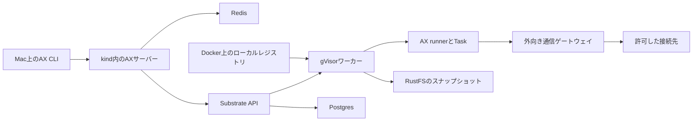

# ローカルのAX実行基盤

2026-10-05、ARM64のkind上でAX・Substrateを動かし、AXのTask内のエージェントがGeminiを使って試験ファイルを作成し、正常終了するところまで確認した。最初のマイルストーンは達成。試験後の外部通信は閉じている。削除・再作成、停止・再開の保存、基本的な監視とHTTP/HTTPS制御も確認済み。

## まず状態を見る

以下はリポジトリのルートで実行する。Docker Desktopが起動し、[導入手順](rebuild.md)でローカル環境を準備していることが前提。

```bash
bash ax-local/ax get tasks -a ax-demo
bash ax-local/ax describe task ax-smoke -a ax-demo
bash ax-local/ax ssh ax-smoke -a ax-demo -- cat /workspace/ax-smoke-result.txt
```

最後の出力は `AX_SMOKE_OK`。`ax-local/ax` は専用kubeconfigを使ってビルド済みCLIを呼ぶ。グローバルのKubernetes接続先は変更しない。



AXサーバーは `ax-system`、Substrateは主に `ate-system`、実行ワーカーは `ax-demo` に置く。ワーカーは1GiB・1 CPU上限で2台。Task本体と起動用スナップショットの準備が1台を取り合わないための構成。

## Taskを操作する

```bash
bash ax-local/ax apply -f ax-local/tasks/smoke.yaml
bash ax-local/ax resume task ax-smoke -a ax-demo
bash ax-local/with-env.sh ax-local/bin/kubectl-ate logs actors ax-smoke -a ax-demo -c guest
```

`apply`直後はSuspendedになる。`resume`で動かし、`describe`のReadyとログの `task command completed successfully`、実ファイルの内容を確認する。**Running/Readyは子コマンドの成功を意味しない。** この版のrunnerはコマンド終了後もサーバーを維持する。

```bash
bash ax-local/ax suspend task ax-smoke -a ax-demo
bash ax-local/ax resume task ax-smoke -a ax-demo
```

`/workspace` は停止・再開で保持される。不要になった試験Taskは次で削除できる。削除はそのTaskの保存データも対象になる。

```bash
bash ax-local/ax delete task ax-smoke -a ax-demo
```

## 外向き通信

Actorごとに許可ポリシーを設定する。既定のポリシー未設定状態は拒否。HTTPSのホスト名制御にはSubstrateの実験的な `--experimental-use-sdsmint` を使用している。検査用の公開CAをローカル用runnerイメージに追加しており、Macの信頼ストアは変更していない。

```bash
bash ax-local/with-env.sh bash ax-local/scripts/set-egress.sh ax-smoke ax-local/egress/smoke-hosts.json
bash ax-local/ax ssh ax-smoke -a ax-demo -- curl -sS -o /dev/null -w '%{http_code}\n' https://example.com/
bash ax-local/ax ssh ax-smoke -a ax-demo -- curl -sS -o /dev/null -w '%{http_code}\n' https://example.org/
```

期待値は順に200と403。403がpolicy拒否であることは `atenet-egress` のログでも確認する。許可先を空に戻す場合：

```bash
bash ax-local/with-env.sh bash ax-local/scripts/set-egress.sh ax-smoke ax-local/egress/deny-all.json
```

この確認はAXのgVisor ActorからのHTTP/HTTPS経路について行った。クラスタ内の全Podや任意のUDP通信など、環境全体の通信隔離を保証するものではない。

## モデル試験と費用ルール

モデル試験は課金を伴う。利用するプロジェクトの上限と残高を事前に確認し、目的・期待する成果物・呼び出し制限を決めて1件ずつ実行する。失敗・成果物なし・使用量不明なら追加送信を止め、原因をモデルAPIなしで調べる。追加購入、自動チャージ、上限引上げ、高額モデルへの自動切替は行わない。

`tasks/model-smoke.yaml` は公式runnerと同梱Antigravity 0.1.20で `runner/model-smoke.py` を実行する。モデルは `gemini-3.1-flash-lite`、モデル呼び出し合計最大3回、ツール2回、入力6000・出力512・合計6512トークン、API再試行0回、出力形式の再処理1回、create_file/finishだけ、subagentなし、90秒timeout。SDKの予算は課金額の厳密な保証とは区別する。

試験ファイルはActor内の `/workspace/model-smoke/result.txt`。中身が正確に `AX_AGENT_OK` と改行になっていることを確認する。モデルがツールでファイルを作れることの確認であり、利用者の業務ファイルではない。

2026-10-05、`ax-model-smoke-v2` でファイル作成・終了0・verified marker・正常終了ログを確認した。生成要求は2件、入力2396・出力61・思考0トークン。確認範囲は [検証要約](verification.md) に記載した。

```bash
bash ax-local/ax ssh ax-model-smoke-v2 -a ax-demo -- cat /workspace/model-smoke/result.txt
bash ax-local/ax ssh ax-model-smoke-v2 -a ax-demo -- cat /workspace/model-smoke/exit-status.txt
bash ax-local/ax ssh ax-model-smoke-v2 -a ax-demo -- cat /workspace/model-smoke/usage.json
```

期待値はファイルが `AX_AGENT_OK` と改行、終了コードが0。`usage.json` はその実行全体のSDK使用量と概算で、請求画面の総額ではない。概算にはコードに記録した確認日の単価を使うため、将来の利用前には[公式料金](https://ai.google.dev/gemini-api/docs/pricing#gemini-3.1-flash-lite)と照合する。

前回ファイルが作られなかった原因は試験設定にあった。SDK 0.1.20で出力形式の再試行を0にすると送信時のfunctionCallingConfigがNONEになり、1でAUTOになることを通信なしで再現した。さらにworkspace_onlyだけでは作成の許可がなく、create_fileが拒否された。修正では作成を明示許可し、実ツール引数TargetFileの絶対パスと実体パスを検査して、試験用result.txt以外を明示拒否する。モデルを高額なものへ変えていない。

通信なしの回帰試験は `runner/verify-model-smoke.py`。ネットワークを切ったDocker内のローカルHTTPスタブで、実SDKによるファイル作成、境界外・..・symlinkの拒否、ツール2回・モデル3回の上限停止、不正出力の打切りを確認する。再実行手順は[再ビルド手順](rebuild.md#モデル試験のオフライン確認)に記載した。スタブの使用量は人工値であり実API利用には数えない。

有料処理の前に `/workspace/model-smoke/attempted` を排他的に作成する。同じ保存領域では二度目を拒否し、成功後はverifiedでも再実行を避ける。現在の修正版Taskは成功記録を保持し、startはなく、egressはdeny-all。旧 `ax-model-smoke` は失敗記録を残してSuspended。新しい試験をする場合は目的・修正の根拠・費用制限を先に確認し、同条件の失敗を自動再送しない。

開始合図を待つのは、Substrateがgolden snapshotを作る際にも同じrunnerを動かすため。通常Actorだけに合図を出す。Taskのspecは登録後変更できないため、別のイメージへ更新するときは旧記録を保存したTaskと区別して作成する。今回の修正版は新しい名前を使い、旧attemptedを解除していない。

`ax-local/.state/model-api-key` はローカルの受け渡し先で、Google AXの規定パスではない。Git対象外、権限600。キーはstdin経由で `ax-demo/gemini-api-secret` の `GEMINI_API_KEY` へ登録済み。値を会話・ログ・Git・イメージへ含めない。接続先はGemini Developer API。

利用停止付きspend capにも集計遅延があり得るため、画面上限やSDKのトークン予算だけで金額の厳密な上限を保証するものではない。利用上限と前払い残高は別。[spend cap](https://ai.google.dev/gemini-api/docs/billing#project-spend-caps)、[前払い](https://ai.google.dev/gemini-api/docs/billing#prepay)を参照。

## 監視を見る

Actorのログは前述の `kubectl-ate logs` で取得する。公式kind構成のPrometheusとJaegerへ、実行時のメトリクスとトレースが届くことも確認した。UIを使う場合、次を別々のターミナルで実行する。

```bash
bash ax-local/with-env.sh kubectl -n otel-system port-forward --address=127.0.0.1 svc/prometheus 9090:9090
bash ax-local/with-env.sh kubectl -n otel-system port-forward --address=127.0.0.1 svc/jaeger 16686:16686
```

ブラウザーで `http://127.0.0.1:9090` または `http://127.0.0.1:16686` を開く。終了はCtrl+C。アラート、長期保管、過去のActorログの集中保管は未構築。

## ファイルと版

| 保存先 | 役割 |
| --- | --- |
| `kind.yaml` / `kubeconfig` | 既存クラスタの設定と専用接続情報。kubeconfigはGit対象外 |
| `mise.toml` / `versions.json` | Go・koの指定と、AX・Substrate・イメージの固定版 |
| `deploy/` | AXのローカル設定、Secret取得権限、WorkerPool |
| `runner/` | 公式runnerをARM64で動かすDockerfileと、公開CAを加える派生イメージ |
| `tasks/` / `egress/` | 実行例と通信許可先 |
| `.sources/` | 固定した公式ソース。Git対象外 |
| `bin/` | ソースから生成したAX・Substrate CLI。Git対象外 |
| `.state/` | ビルド・検証ログ、一時Docker設定、公開CA。Git対象外 |

汎用ツールはmiseで管理し、`.tools/` は使わない。`bin/` はこの版のソースから生成した実行成果物。Docker Desktopのcredential helperが公開イメージ取得時に停止したため、`with-env.sh` は専用の匿名Docker設定を使う。

導入時のコマンドと固定版は [再ビルド手順](rebuild.md)、結果と残件は [検証要約](verification.md) を参照。

## この段階の制約

単一利用者向けのローカル検証環境。AXのSecret取得は指定した1件のgetに制限したが、解決後のキーはActorTemplateのenvとしてSubstrate側にも保存される。この版にはSubstrateのatespace単位RBACがまだないため、共有サービスとしての利用者間隔離は別途必要。

PostgresとRustFSはkind内のPVC、レジストリはDocker volumeを使う。AXのRedisは公式サンプル同様に永続volumeがなく、Redis Podを作り直すとAXのTask等の登録情報が失われる。kind削除後の復旧、バックアップ、本番向けの耐久性は未確認。

クラスタの検査用CAを再作成した場合は、公開CAを取り直して派生runnerを再ビルドし、新しいイメージでTaskを作り直す。既存CAを無条件に使い続けない。
