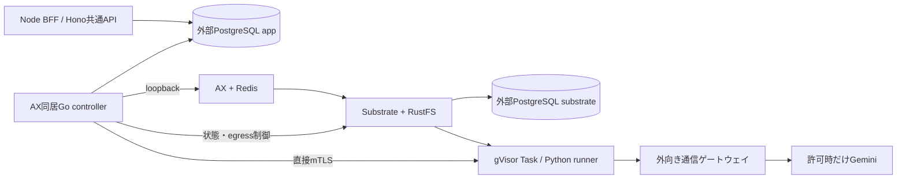

# ローカルのAX実行基盤

ARM64のkind上でAX・Substrate・gVisor Taskを動かすローカル環境です。通常の会話と作業は[Webワークスペース](../web/README.md)から認証付き共通APIへ送り、PostgreSQLへ保存します。AXの操作は同居する[Go execution controller](../execution/README.md)が担当し、Task内のPython runnerがoffline処理またはAntigravity/Geminiを実行します。

旧ファイル台帳からの移行後は`ax-local/task`、Python bridge、通常の直接AX/egressコマンドを拒否します。以前のCLI手順は[旧CLIと台帳](task-cli.md)を参照してください。managed印を外して旧経路を再開しないでください。

新構成の実AX経路・受付再開は[構成変更の検証記録](../.space/tasks/ax-portable-api/verification.md)で管理します。2026-10-05の[初期基盤の確認結果](verification.md)や旧モデル試験の成功は、新しいcontroller経路の合格証拠とは区別します。

## 配置と保存先



AXとcontrollerは`ax-system`、Substrateは主に`ate-system`、実行workerは`ax-demo`へ配置します。通常操作にAX CLI・port-forward・Python常駐サービスは不要です。controllerからAXは同一Podのloopback、workerへはPod identityを検証する直接mTLS接続です。通信時にActorを暗黙再開するatenet-routerを通常経路に使いません。

PostgreSQLはKubernetes外のDockerコンテナです。`substrate`、`keycloak`、`app`でDBを分け、共通APIとcontrollerにも限定ロールを割り当てます。接続先・CA・資格情報は設定から渡し、外部のPostgreSQLへ置き換えられます。[DBの接続・バックアップ手順](postgres/README.md)を参照してください。

| 保存先 | 内容 |
| --- | --- |
| PostgreSQL `app` | 内部利用者・セッション、会話、受付、実行権、結果、成果物bytes、旧原本bytes |
| PostgreSQL `keycloak` | ログイン・パスワード・パスキー等の認証情報 |
| PostgreSQL `substrate` | Actor・worker等の実行基盤状態 |
| RustFS | Taskのスナップショット |
| AX Redis | AX内部のTask等の登録・状態。アプリから直接参照・更新しない |
| `.state/runs` | 移行前の台帳。移行後は新規書込先にしない |
| `.state/migration-backup-*` | 移行前台帳のバックアップ |

## 準備と状態確認

新規の基盤構築は[再ビルド手順](rebuild.md)、認証とアプリの準備は[Web初回準備](../web/README.md#初回準備)、書き込み元の切替・controller配置は[実行管理の手順](../execution/README.md#初回準備と旧台帳からの移行)に従います。再ビルド資料にある旧CLIの実行例はmanaged移行前の基盤検証用です。移行済み環境では実行入口を共通APIに統一します。

Docker Desktopを起動し、専用kubeconfigを使って状態を確認します。以下はリポジトリルートでの読み取りです。

```sh
bash ax-local/with-env.sh kubectl -n ax-system get pods
bash ax-local/with-env.sh kubectl -n ax-demo get workerpools
bash ax-local/with-env.sh ax-local/bin/kubectl-ate get actors -a ax-demo
```

PodのReadyやAXのTask phaseだけでは、個別処理の成功・モデル使用量・実停止を保証しません。成果物・usage・egress deny・Substrate Actor停止とworker未割当を合わせて判定します。run IDごとの診断は[controllerのinspect](../execution/README.md#モデルを呼ばない検証)を使います。

## 通信とモデル費用

offline処理はモデルAPIを呼びません。通常の経路確認にはWebの「動作テスト」を使います。これはTask内で本文を保存する確認であり、モデルの会話品質の試験ではありません。

モデルを使うときだけActorの許可先を`generativelanguage.googleapis.com`へ限定し、結果回収後にdenyを読み戻します。HTTPS制御には固定Substrateの実験的な`--experimental-use-sdsmint`を使い、公開CAをローカルrunnerイメージへ追加しています。Macの信頼ストアは変更しません。確認対象はActorのHTTP/HTTPS経路であり、環境全体の全通信を隔離するものではありません。

有料処理は目的と成果物を決めて1件ずつ実施します。上限2,000円、試用概算累計0.01 USDでの停止、SDKの小さな呼出予算を維持します。成果物なし・有料失敗・使用量不明なら追加送信を止め、モデルなしで原因を調べます。追加購入、自動チャージ、高額モデルへの切替、上限の引上げは行いません。詳細は[費用と接続先](task-cli.md#費用と接続先)を参照してください。

モデル鍵はGit対象外のローカル受渡しファイルとKubernetes Secretで扱い、本文・ログ・イメージへ含めません。この版では解決されたキーがSubstrateのActorTemplate envにも保存されます。Substrateのatespace単位RBACがないため、共有サービスとしての基盤利用者間隔離は別途必要です。

## 監視とバックアップ

Actorログは`kubectl-ate logs actors <run_id> -a ax-demo -c guest`で確認します。秘密・入力本文が含まれ得るため、生ログをPRや会話へ貼らないでください。PrometheusとJaegerのUIは別ターミナルで開きます。

```sh
bash ax-local/with-env.sh kubectl -n otel-system port-forward --address=127.0.0.1 svc/prometheus 9090:9090
bash ax-local/with-env.sh kubectl -n otel-system port-forward --address=127.0.0.1 svc/jaeger 16686:16686
```

ブラウザで`http://127.0.0.1:9090`または`http://127.0.0.1:16686`を開き、Ctrl+Cで終了します。監視用port-forwardはcontrollerの実行経路ではありません。アラート・長期保管・過去Actorログの集中保管は未構築です。

PostgreSQLはDocker volume、RustFSはkindのPVC、レジストリはDocker volumeを使います。AX Redisは永続volumeがなく、Pod再作成でAXの登録情報が失われます。app DBの会話が残ることと、AXの実行基盤を再構築できることは別です。Redis/RustFSを含む全体復旧、kind削除後の復旧、本番向けの耐久性は未確認です。

DB・暗号化鍵・接続資格情報・旧原本を保全し、[DBのバックアップ](postgres/README.md#移行後のバックアップと復元確認)と[認証のバックアップ](keycloak/README.md#バックアップと復元試験)を参照してください。証明書や秘密ファイルを削除してinitし直すことを復旧手順にしません。

## ファイルと版

| 保存先 | 役割 |
| --- | --- |
| `kind.yaml` / `kubeconfig` | 専用クラスタ設定と接続情報。kubeconfigはGit対象外 |
| `mise.toml` / `versions.json` | ツールとAX・Substrate・runner・worker・controllerの固定版 |
| `deploy/` | 基盤の設定とWorkerPool |
| `postgres/` / `keycloak/` | DB・認証の構築と保全 |
| `runner/` / `task_runtime/` | Task用イメージとTask内Pythonプロトコル・モデルアダプター |
| `worker-controller.Dockerfile` | controllerのidentityに限定したworker |
| `../execution/` | Go controller・native接続・診断 |
| `../web/data/` | アプリ保存とDB関数 |
| `.sources/` / `bin/` / `.state/` | 固定上流ソース、生成物、秘密・ログ・旧原本。Git対象外 |

基盤の更新は既存の外部DB設定・資格情報を保持し、受付を閉じてから行います。worker/runnerのCAを変えた場合は対応するイメージを再ビルドし、未解決実行を調べてから切り替えます。
