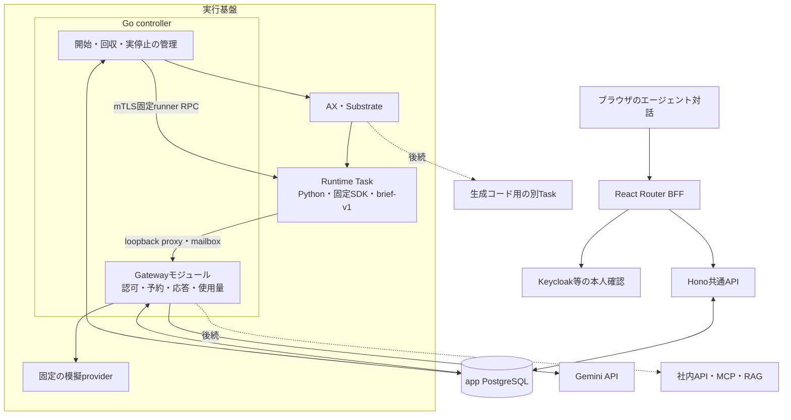

# 対話型エージェントと社内連携の設計

2026-10-08更新。初期設計の基準はmain `a682948be9daddc37555067fd98475eb3938b427`、上流AX固定版は `ac2332829f22360ff97b0ba34d94dd0dd782f17e`。初期実装に加え、標準エージェントとスキル自動利用を反映した。**Agent RuntimeをAX Task内で、作業が進む区間だけ起動するA案**を採用する。会話、本人認可、送信済み操作、費用の正本はTask外のapp PostgreSQLに置く。

初期の無課金プレビューに、実モデルの接続を追加した。画面から実モデルと模擬応答を選び、実モデルは外部送信・料金への同意を伴って開始する。初期経路は質問一つ、停止後の回答一回、固定スキルと固定toolによる小さい本文成果物を扱う。初期の模擬経路は[検証記録](../.space/tasks/ax-agent-runtime/verification.md)で確認済み。実モデルもWeb・実AXで質問→回答→本文生成の2区間が成功し、使用量と実停止を照合した。[実モデルの検証記録](../.space/tasks/ax-agent-model/verification.md)。初期試験後には有料Gatewayを閉じたが、その後の利用者方針により、通常利用ではAI接続を有効に保つ。試験終了だけを理由に接続を閉じず、費用上限・未知usage・停止不明による追加実行の保留は維持する。

現在の主入口は `/workbench` の標準エージェントである。v2では隔離PythonによるCSV/Excel作業、スキル登録、自動利用と「/」による指定を扱う。現行の保存・読み込み・上限は[13節](#13-標準エージェントとスキル自動利用v2schema-v9)を参照する。1〜12節は初期の `/agent` 経路とその設計経緯であり、初期の回数・時間上限をv2へ適用しない。既存の通常チャットと履歴は維持する。サブエージェントは利用者の要望により対象外とし、動的な環境準備、GitHubのclone/push/PR、社内API/MCP/RAG、定期実行UIは後続である。

## 1. 初期実装の構成

ブラウザのエージェント対話画面 `/agent` から、本人と選択Workspaceに属する依頼を受け付ける。Runtimeは固定SDKで型付き提案を一つ作り、外側のGatewayが許可した固定toolで本文を書く。質問なら、本文・使用量・通信遮断・実停止の確認後に回答待ちへ移る。本人の回答は一度だけ受け付け、次の新Taskへ渡す。



GatewayはGo内のモジュールであり、追加の公開HTTPサービスではない。既存Substrateの外向き通信ゲートウェイとも別である。TaskのSDK要求をmailboxから回収し、DBの認可と送信前予約を通す。Taskへモデル鍵、Webのtoken、DB資格情報を渡さず、Taskのegressはdenyのままにする。[Go仲介](../execution/controller/interactive.go)、[mailbox](../ax-local/task_runtime/mailbox.py)

Hono共通APIはTypeScriptの短い受付・参照処理を保ち、Python子プロセスや長時間のagent loopを持たない。PythonはTask内のRuntimeで使う。PostgreSQLの配置をKubernetes内に固定しない。Taskはworker上のActorとして管理される実行単位であり、TaskとPodは同義ではない。

全体の同時実行枠は旧経路と共通で1件である。回答待ちではTaskを実停止して枠を解放する。登録人数に比例する常駐Runtimeや、利用者共用の常駐Runtime Podは置かない。後続の親Runtime→code Task→親Runtimeも、各区間の保存・実停止を確認して切り替える設計とする。

## 2. 初期経路で実装した範囲と上限

| 項目 | 初期の対話経路 | 維持する境界・後続事項 |
| --- | --- | --- |
| 会話 | 依頼→質問一つ→回答一回→本文成果物。直接成果物・未対応の説明も可能 | 私有会話を維持。通常チャットは別経路 |
| Runtime | Python、Antigravity SDK 0.1.20、plain JSON提案 | SDK内部DBの移植なし。任意コード・subagentなし |
| SDK設定 | `tools=[]`、builtin tools空、subagents無効、retryなし、response_schemaなし | SDK自身に外部操作を実行させない |
| 固定処理 | image内の`brief-v1`と信頼済み`write_output` | スキル登録・公開UI、任意script実行は後続 |
| 実行 | 最大2区間、区間ごとに新Task・新SDKプロセス | 同じTaskのresumeは未採用 |
| 送信・費用 | Task外のGatewayが予約・応答・usageを保存。実Geminiと無料previewを受付時に固定 | count後にも生成直前認可、実usageと費用は外部台帳で確定 |
| 保存 | root、有限run、操作、質問・回答、成果物をapp PostgreSQLに保存 | Task filesystemやAX Redisを会話の正本にしない |
| 認証 | 検証済みtokenの期限とfingerprint、現在の本人・所属を検査 | 接続先への委任は後続 |

root全体の上限はモデル要求3回、固定tool 2回、入力6000／出力512トークン、実作業90秒とする。各区間はSDKモデル要求1回、固定tool 1回までであり、初期の最大2区間で3回すべてを使う仕様ではない。実作業時間は区間をまたいで合算し、回答待ちの期限24時間と分ける。残時間を次の区間へ渡し、SDKの再作成や回答で上限をリセットしない。

instructionはUTF-8最大2048bytes、inputs全体は既存の4096bytes上限を維持する。モデル提案は厳密な `{kind: question|output|unsupported, text: string}` で、本文は空白のみ不可・最大2048bytes。回答区間での再質問は拒否する。`reply.txt`は本文そのものとし、制御用JSONを会話へ表示しない。[初期実装契約](../.space/tasks/ax-agent-runtime/implementation.md)、[提案の型](../ax-local/task_runtime/interactive_protocol.py)

旧経路の90秒はadapter timeoutとして残る。既存の2,000円上限、0.01 USDの試用停止条件、未知usage・未停止runによる全体holdも緩めない。プレビューの模擬usage・費用0を、実モデルの料金検証とは扱わない。

### 標準runnerと鍵を渡さないための変更

上流の**ax-task-runnerがPID1**として起動・監督し、その下でPython commandを実行する。標準runner全体を置き換えた「カスタムrunner」ではない。[イメージ構成](../ax-local/runner/Dockerfile)、[Task作成](../execution/native/adapter.go)

- 現在のTask作成はAX Workspaceのbindingを渡さない。アプリの組織Workspaceとは別概念であり、AXのGit・スキル・環境準備を利用済みとはしない。
- 固定版の`setupSkills`は指定ディレクトリを作る。WorkspaceのMCP設定型はあるが、標準起動経路で接続まで実体化する処理は未確認。[固定版のWorkspace準備](https://github.com/google/ax/blob/ac2332829f22360ff97b0ba34d94dd0dd782f17e/internal/workspace/setup.go#L110)、[setupSkills](https://github.com/google/ax/blob/ac2332829f22360ff97b0ba34d94dd0dd782f17e/internal/workspace/setup.go#L262)
- goal bootstrapは鍵不足・失敗でも後続commandを起動し得る。環境のモデル鍵と広いtool許可を使い、アプリの費用管理へ未統合のため、そのまま採用しない。[失敗時の処理](https://github.com/google/ax/blob/ac2332829f22360ff97b0ba34d94dd0dd782f17e/internal/workspace/setup.go#L273)、[bootstrap設定](https://github.com/google/ax/blob/ac2332829f22360ff97b0ba34d94dd0dd782f17e/cmd/ax-task-runner/antigravity_bootstrap.py#L74)
- 上流AXはatespace SecretまたはAXサーバー環境からモデル鍵をActorTemplateへ注入する。要求のenvから鍵を省くだけでは防げない。[固定版の注入処理](https://github.com/google/ax/blob/ac2332829f22360ff97b0ba34d94dd0dd782f17e/internal/controller/reconciler.go#L143)

このため新atespace `ax-runtime` では、モデル鍵注入とdefault templateへのfallbackを禁止する固定patchを実装した。旧`ax-demo`と履歴を維持し、新区間には新Taskを使い、旧snapshotを復元しない。配置したpatch、実際のActorTemplate、Task内の秘密不在を確認するまで稼働合格とはしない。[AX patchと適用条件](../ax-local/patches/README.md)

初期は既存の信頼済みWorkerPool（Kubernetesのax-demo）を共有する。論理atespace ax-runtimeとworkerのnamespaceは別であり、固定Substrateはatespaceから配置先を制約しない。TaskごとのActor/gVisor、正確なActor宛先、ax-demo workerの証明書を確認する。pool別の隔離は保証しない。専用poolと全templateのselectorを移行する案は、任意コードを開放する段階などで再検討する。

## 3. 構造の比較と採用理由

[候補A](../.space/tasks/ax-agent-runtime/design-candidates/a.md)はTask内にloopを置き、[候補B](../.space/tasks/ax-agent-runtime/design-candidates/b.md)はAX外の常駐Runtimeに置く。当初は切替を減らすBを推奨したが、AXをエージェント本体の実行基盤とする利用者の意図と独立した外部レビューからAを再選定した。

| 判断軸 | A：AX内Runtime | B：AX外の常駐Runtime |
| --- | --- | --- |
| 実行基盤 | 既存のTask内エージェントを拡張 | 別の常駐実行系を追加 |
| 保存・復旧 | 外部保存と未確定操作の照合が必要 | 同じく保存・照合・再起動後の復元が必要 |
| 平常時の切替 | 人待ちや別Task処理で停止・復元 | 親Runtimeを保持し、切替を減らせる |
| 秘密・任意コード | 外部Gatewayと別code Taskが必要 | AX外へ置くだけでは解決しない |
| 判断 | 初期実装に採用 | 切替遅延などの実測を受けた再検討案 |

Runtimeの配置とTaskの再利用方法は分けて考える。初期は小さい確認済み状態を**新Taskへ渡す方式**を採用した。同じTaskのsuspend/resumeは、作業ファイルが増えた段階で比較する。どちらも外部保存と送信済み記録を必要とし、プロセスの生メモリ保存を前提にしない。

Pythonの固定SDKを継続利用し、共通APIはTypeScriptを維持する。配置の変更だけでRuntimeの言語を全面変更しない。Aが常に安価・高速とは判断せず、質問・停止・回答・返答の実経路と切替時間で評価する。

## 4. 責務と信頼境界

- **共通API・app DB**：認証済み本人、所属、会話ownerを確認し、受付・回答・停止と履歴を保存する。モデルやTaskの完了までHTTPを保持しない。
- **Runtime Task**：確認済み会話と固定スキルから型付き提案を作る。許可された固定toolだけを実行し、生成コード・未信頼scriptをexec/importしない。
- **Gatewayモジュール**：runとclaim世代から本人・rootを解決し、送信前に権限・停止・残予算をDBで原子的に確認する。応答・usageを確定してからguestへ返す。
- **Go controller**：一度だけ取得した開始権でTaskを動かし、成果物回収・通信遮断・Substrate Actorの実停止を確認する。AXのTask phaseだけで停止を確定しない。
- **AX / Substrate**：Task・Actorの配置、ライフサイクル、volume・snapshotを担う。アプリの会話・費用・本人権限の正本にはしない。

mailboxはrun ID、sequence、kind、bodyを持ち、元JSON bytesのSHA256に応答を結び付ける。要求・応答は各64KiB以下で、重複JSONキーを拒否する。SDKからprovider・宛先・headerを自由指定できず、loopback proxyが外側の確定応答をSDK形式へ変換する。

ACK喪失でモデルを再送しない。DBに確定済みの同じ応答だけを照合・再投入できる。toolの`accepted`は書込み前の許可であり、成果物完成の証拠ではない。Taskの自己申告だけで成功にせず、本文と提案、manifest/hash、保存済みusage、停止証拠を照合する。

将来のcode TaskはRuntimeとは別にし、明示入力だけを渡す。モデル鍵、OAuth token、DB資格情報、Kubernetes操作権、Runtimeの操作権限を持たせない。gVisorやHTTP/HTTPS制御だけで任意コードの隔離が完成したとは判断せず、公開前に実Actorで通信・制御RPC・ファイル・snapshotの境界を検証する。[実行基盤の制約](../ax-local/README.md)

## 5. 本人・所属・失効

WebのCookieやaccess tokenをprompt・Task環境へ渡さない。APIが検証した内部user IDとWorkspaceを正本とし、rootへ検証済みtokenの`exp`とSHA256 fingerprintを保存する。raw tokenはDBへ保存しない。開始と回答時だけでなく、新しいモデル・tool送信前にも本人・所属・grant期限・取消を確認する。

start、answer、revoke-allは同じ本人のロックで直列化する。ログアウトでは、その本人の未完rootを停止対象にし、現在のtoken fingerprintによる新規受付を永続拒否する。これによりログアウト前にBFF認証を通過した要求が遅れて到着しても、同じtokenで新rootや回答を受け付けない。再ログインで得た別tokenは新規依頼に使える。この契約は、外部IdPの全tokenを一括失効させる仕組みではない。

Workspace所属の削除、利用者のactive→disabled変更では、未完rootの停止を永続化する。再加入・再有効化・再ログインで止まったrootは復活しない。回答待ちの期限内に、停止されていないrootへ本人が回答する場合は、新たに検証したtokenでgrantを更新できる。元の依頼範囲・使用済み予算・操作履歴は保持する。[DBの認可と取消](../web/data/schema-v4.sql)

ブラウザを閉じるだけでは実行を止めない。明示停止・ログアウト・失効後も、既送信の照合、通信遮断、実停止、使用量の回収は限定されたcontroller権限で続ける。既送信の内容を取り消したことにはしない。Workspace owner/adminにも、他人の私有会話・成果物への権限を追加しない。

### 後続の社内委任

社内システムが本人と代行者を認証し、対象データへの最終的な業務認可を行う。Gatewayはその受け口へ合意した形式で本人性を渡す接続クライアントである。Workspace管理権やgeneral/developerという業務ロールだけで、社内資料や人事情報の権限を発生させない。

```text
実効権限 = 現在有効な本人・所属
         ∩ 接続先で本人に許された操作・対象
         ∩ Workspaceの接続方針
         ∩ 今回の限定grant
         ∩ 子へ渡した範囲（子機能導入後）
```

接続先tenantと、本人が連携認証した `(issuer, subject)` を対応付ける。メール一致やモデルの指定で連携しない。対応するOAuth委任・token exchange/OBO等を使い、宛先とscopeを限定する。共有service accountしかなく接続先が本人を検証できない場合は、本人権限による業務操作として接続しない。[RFC 8693](https://www.rfc-editor.org/rfc/rfc8693.html)のtoken交換だけでは失効連動が保証されないため、接続先tokenの取消・期限・現在権限も別に確認する。

## 6. スキルと後続の実行機能

初期はimageに固定した[brief-v1](../ax-local/task_runtime/skills/brief-v1/SKILL.md)一種類を使い、digestとRuntime imageの版を固定する。モデルはJSON提案を返し、Python adapterがGateway許可後に固定`write_output`を動かす。SDKのtool-callや任意scriptを実行する仕様ではない。[interactive adapter](../ax-local/task_runtime/adapters/interactive.py)

将来のスキルは`SKILL.md`とreferences/scripts/assetsを持つ版付きbundleとし、本人・Group・Workspaceの利用範囲、下書き・公開、実行中の版を分ける。標準提供、画面登録、対話による作成を拡張候補とする。スキル登録だけでscriptを信頼済みtoolへ昇格させず、外部接続権限も増やさない。[Agent Skills仕様](https://agentskills.io/specification)を形式の参考にするが、allowed-toolsをサーバー認可の代わりにしない。

**サブエージェント**は未実装である。最初の候補は深さ1・子1件・直列とし、目的、必要な文脈、許可tool、予算を限定して渡す。同じ依頼者・Workspaceを持ち、rootの費用・回数・時間・停止を共有する。同じRuntime内の逐次処理は権限隔離と呼ばず、別Taskが必要なら親を保存・停止して切り替える。

**生成コード**も未実装である。導入時は固定Pythonと審査したライブラリから始める。別の使い捨てTaskでCPU・memory・process数・時間・出力サイズを制限し、任意ネットワークを許可しない。秘密、他利用者のvolume、ホストのDocker socketを渡さない。回収側で通常ファイル、許可パス、symlink、サイズ、hashを検査し、生成HTML/scriptをチャットと同じoriginで実行しない。

### 要求に合わせた環境準備

後続の入口は「このデータを集計して」「不具合を直して」という依頼とする。利用者に言語やimageの選択を常に求めず、Runtimeが目的・入力・制約から道具を判断する。不足情報は質問し、未対応なら理由と代案を返す。初期プレビューは環境構築やコード実行を行わない。

| 内部方式 | 利点 | 判断・負担 |
| --- | --- | --- |
| T1：版固定の準備済みimage | 検証した環境を通信なしで開始しやすい | 初期Runtimeに採用。生成コード環境の公開には別の隔離検証が必要 |
| T2：固定ベースへ管理された必要時導入 | 依頼に必要な道具を揃えられる | 取得・検証・準備・実行の分離とキャッシュ管理を要する後続案 |

T2の版管理候補はmiseであり、AX上の適合は未実証・採用未決である。Python/TypeScript/Go/Rust等は道具の例で、全言語対応を保証しない。複数言語は一つの環境manifestへ具体版・OS/CPU・base digest・配布物hash・lockfileを記録する。GPUやOS依存など提供できない条件は明示する。[mise Dev Tools](https://mise.jdx.dev/dev-tools/)、[Rust](https://mise.jdx.dev/lang/rust.html)

repoの設定はデータとして解析し、hook/pluginをRuntimeや資格情報のある取得処理で実行しない。許可した配布元から固定物を取得し、秘密のない準備Taskで導入する。依存のinstall/build scriptは不信コードとして扱い、準備成功後に書込み領域を分けて実行する。private資格情報をTaskへ渡さず、私有依存・生成物を共有キャッシュへ昇格させない。[mise Security](https://mise.jdx.dev/security.html)

準備失敗では実行へ進まず、別版へ黙って切り替えない。時間・容量・回数をrootで管理する。動的導入が現在の実作業90秒に収まる保証はなく、拡張時に測定して必要な上限を判断する。区間を増やして既存上限を回避しない。

### 作業ファイルとGitHub

後続のソース編集は「読取→修正→テスト→差分を返す」を隔離Taskで行う。作業ファイルは組織Workspaceと別概念で、本人・rootに属する版として保存する。DBへowner・revision・manifest・元commitを置き、本体は容量に応じて非公開ストレージへ保存する。現在の単一64KiB成果物でrepository全体を扱えるとはしない。

GitHubは取得、push、PR作成を別の操作にする。資格情報を持つGatewayが登録済みrepository/refから指定commitを取得し、コードTaskは編集・テストと差分を返す。送信側が確認した差分を使い、repoのhook/Git設定を資格情報のある処理で実行しない。ACK不明なら照合し、PR作成とmergeを分ける。認証方式、容量、submodule/LFS、branch方針は接続時に定める。

## 7. 後続の社内API・MCP・RAG

接続は `tool_id + version + 型付き引数` で登録し、必要scope、対象、更新確認、timeout、冪等性・結果照会の能力を持たせる。モデルへのtool提示と実行時の認可を分け、任意URL転送proxyにはしない。

| 接続 | 必要な境界 |
| --- | --- |
| 社内API | 接続先が本人・代行者を認証し、対象と項目単位で許可。Gatewayはversionと結果IDを保存 |
| HTTP MCP | Gatewayがclientとなり、登録済みserver/resourceの宛先に合うtokenを利用 |
| stdio MCP | 管理されたconnector環境を別途用意。API/Runtimeで任意プロセスを起動しない |
| RAG | tenant・ACLで候補を絞り、本文・題名・引用を返す前にも現在権限を照合 |

[MCP認可仕様 2025-11-25](https://modelcontextprotocol.io/specification/2025-11-25/basic/authorization)に従い、宛先違いのtoken passthroughをしない。認可serverの探索、redirect、DNSも検証対象とし、metadata等への意図しない接続を防ぐ。sampling等の追加モデル要求は必要性を確認して導入し、同じ予算管理を通す。[MCP Security Best Practices](https://modelcontextprotocol.io/docs/2025-11-25/tutorials/security/security_best_practices)

RAGは元文書・tenant・ACL版・文書version・削除情報を保持する。権限変更をcache・引用・派生要約へ反映し、現在の権限を確認できないsourceを返さない。既に本人が閲覧した情報を回収できるとはしない。検索製品、保存期間、失効後の表示は接続契約と合わせて決める。

本人の閲覧権と外部モデルへの送信許可を分け、Workspace/sourceの持出し方針に合うモデルだけを使う。スキル・取得文書・MCP応答内の指示を、権限拡大や秘密送信の根拠にしない。追加認証はブラウザ経路で行い、会話欄へパスワードやtokenを入力させない。

## 8. 保存・API・継続の実装

schema v4で次を追加し、既存`ax_runs`を有限の区間として再利用した。v1〜v3の台帳、旧会話、owner、Workspace、hash、usage、旧移行原本を保持する。[schema v4](../web/data/schema-v4.sql)、[repository](../web/data/agents.ts)

| 記録 | 正本とする内容 |
| --- | --- |
| `ax_agent_roots` | 本人・Workspace・会話、状態・revision、grant期限/fingerprint、累積予算、停止要求・待機期限 |
| `ax_agent_segments` | rootと有限runの対応、依頼／回答の区間 |
| `ax_agent_operations` | model/toolの要求hash、送信権、応答、usage、未確定状態 |
| `ax_agent_requests` | 本人の開始・回答の冪等keyと結果 |
| `ax_agent_revocations` | ログアウト時のtoken fingerprintによる再受付拒否 |
| 既存run・会話・artifact | 区間の結果・停止証拠、確認済み質問と返答、本文bytes |

小さい本文・成果物はPGに保存する。複数・バイナリ・大容量へ拡張するときは本体を非公開object storageへ分け、PGのowner・出典・hashと取得時認可を維持する。Task filesystemを永続会話や権限の正本にしない。

```text
GET  /v1/agent-roots
POST /v1/agent-roots                 {key, conversation_id, text}
GET  /v1/agent-roots/:id
POST /v1/agent-roots/:id/answer      {key, question_id, expected_revision, text}
POST /v1/agent-roots/:id/stop        {}
POST /v1/agent-roots/revoke-all      {}
```

revoke-all以外は選択Workspaceを必要とし、ownerとgrant情報は認証contextから確定する。root IDはDBが生成し、question IDはroot IDとする。同キー同本文は既存結果、異本文・古いrevision・別キーの二重回答は競合とする。rootに属する会話を旧chat submitから続ける迂回も拒否する。[公開型](../web/shared/agent-contracts.ts)

画面はrootと既存の本人限定履歴をpollして復元する。断線や再読込を実行再送の指示にせず、旧チャット画面からagent rootの専用画面へ案内する。イベントstream、承認API、任意checkpointへの`continue`は初期APIに含めない。

### 質問→停止→回答→新区間

1. 初回Taskへ現在の依頼と空の確定履歴を渡す。SDKのplain JSON提案を検証し、Gatewayが固定toolを許可した後に`reply.txt`を作る。
2. Gatewayの全操作が確定し、提案本文と成果物・usageが一致することを確認する。egress denyの読戻しと、Substrate Actorの`SUSPENDED`かつworker未割当を確認する。
3. この区間の有限runを解決してからrootを`waiting_input`にする。未解決runを残したまま全体枠を解放しない。停止未確認を回答待ちと表示しない。
4. 本人・現在所属・待機期限24時間・質問ID・revisionを再確認し、回答保存と次のrun受付を同じtransactionで確定する。同じ回答でTaskを二重作成しない。
5. 新Taskには、確認済みの最初の依頼と質問、今回の回答、固定skill、残予算を渡す。新しいSDKプロセスで構成し、旧SDKの内部DBや生メモリは移植しない。起動だけではモデル要求を送らず、controllerの開始許可を待つ。
6. 回答区間は再質問せず、本文成果物か未対応の説明を返す。同じ回収・usage・実停止確認で終端にする。

| rootの状態 | 意味と制限 |
| --- | --- |
| `running` | 受付済みの区間を一度だけ開始し、送信前予約を通して進める |
| `waiting_input` | 区間の結果・使用量・実停止が確定。期限内かつ未取消の場合だけ回答可能 |
| `stopping` / `stopped` | 新送信を止め、回収と停止を続ける。停止要求と実停止を区別 |
| `succeeded` / `failed` | 成果物・既知usage・cleanupを照合した終端 |
| `blocked_unknown` | 送信、usage、成果物照合、実停止等が未確定。期限や再ログインで解除しない |

停止や期限切れでguestの結果が得られない場合でも、Gateway台帳に未確定操作がなく、通信遮断と実停止を確認できれば、台帳の既知usageで失敗・停止を確定できる。操作0件ならusage 0である。元のguest結果は観測として保持し、この経路で成功や回答待ちを作らない。未settled予約が一つでもあれば全体holdを維持する。

旧runの`recover`は回収・遮断・停止だけを行い、開始を再送しない。新経路もlease期限だけで副作用の送信権を再発行せず、旧worker・ACK不明・未確定操作を自動takeoverしない。

### 以前のSDK保存試作との違い

初期調査ではSQLite内のprotobuf等を使い、tool-call ID・結果・会話を別プロセスへ復元した。ただしplain JSONだけでは復元できず、SDKのLIFETIME上限からRESUMEした際に追加送信後に上限終了する例もあった。この試作は、現在の上限内で成立する製品経路とは判断しなかった。

その後、実SDK＋模擬providerで、tools空・response_schemaなし・retryなしのplain JSON返答を、2プロセスで各1要求として正常終了できることを確認した。これを初期実装に採用し、確認済み会話と型付き提案から入力を再構成する。したがって「SDK内部checkpointの移植が未成立だから初期継続も未実装」という状態ではない。一方、この試作の成功を実AXの停止・隔離・Web統合の証拠には代えない。

## 9. 後続の外部更新・監査・復旧

外部更新は対象・差分を本人へ示す確認を追加し、operation ID、引数hash、対象version、期限、本人へ結び付ける。承認者が元々持たない権限を付与せず、承認後に引数や対象が変われば新しい確認を要する。

Gatewayは送信前intentと予算を確定し、相手の冪等キー・結果照会があれば契約どおり使う。「更新は届いたが応答が消えた」場合は不明として保留し、HTTP retryで再送しない。照会できない相手には手動照合が残り、補償変更も別の認可付き操作にする。

監査には依頼者・代行者・Workspace・skill/tool版・認可・対象・引数hash・送信結果・usageを結び付ける。本文や秘密を通常ログへ広げず、監査閲覧権と会話ownerを分ける。組織所有権の譲渡や業務ロール変更でも、本人のチャット・成果物のownerは移さない。

## 10. 実装と検証の段階

初期の製品単位は、**依頼→質問一つ→安全な待機→回答→登録済みスキル一つと信頼済み固定tool→本人の小さい成果物**である。未対応なら理由と代案を返す。実モデルと模擬応答を画面で区別し、同じrootの途中で切り替えない。

| 段階 | 現在の位置 | 終了判断に必要な証拠 |
| --- | --- | --- |
| 実SDK＋模擬provider | plain JSONによる2プロセス継続を初期方式として採用 | 固定SDKで各区間1要求・正常終了。SQLite移植とは区別 |
| Python・PG/API・Go・BFF | 初期経路を実装し、局所試験と独立レビューを実施 | 版と条件を付けた回帰結果、失効・未知・二重送信・予算・本人境界 |
| 実AX Taskの往復 | 模擬・実モデルとも2区間の往復と実停止を確認済み | 鍵なし、開始前0要求、質問→実停止→新Task回答、usage/成果物照合、全体枠1、切替時間 |
| 実Web統合 | 検証記録に結果を集約 | 本人限定、回答待ち、二重送信、再接続、小成果物、旧経路の保持 |

局所試験やイメージbuildを、実Actorでの成功と同一視しない。実行条件・失敗・修正後の再検証は[初期の検証記録](../.space/tasks/ax-agent-runtime/verification.md)と[実モデルの検証記録](../.space/tasks/ax-agent-model/verification.md)へ集約し、本書で進行中の結果を先取りしない。

| 後続の単位 | 開始条件 |
| --- | --- |
| 生成コード | 固定の無課金code Task往復、鍵注入防止、通信/RPC・ファイル隔離、資源制限を実Actorで確認 |
| 子エージェント | 親子の権限縮小、合算予算、停止連動、文脈・作業領域の分離 |
| 環境準備 | 配布物の取得・検証と実行の分離、版固定、準備失敗時の停止。mise等は試作後に選定 |
| GitHub・社内接続 | 本人委任、対象範囲、ACL・失効、持出し方針、更新ACK不明の照合 |
| 登録・定期実行・スキル管理UI | 定義の版、無人実行主体、委任期限、承認待ち、重複起動の後続設計 |

将来の「デプロイ」は、指示・スキル版・接続先・権限・起動条件を持つ定義の登録・有効化として扱える。登録数ではなく稼働区間数を管理し、対話用の期限付きgrantを無期限化しない。管理UIや定期起動は今回実装していない。

新旧経路は共通guardを通し、未知usageや未停止Taskのholdを維持する。移行時は旧ownerなしデータを非公開のまま保全し、データ・未確定操作を捨てて旧方式へ自動fallbackしない。実装・検証・説明は利用経路が通る一つの変更単位へまとめる。

## 11. 残る確認と拡張時の判断

実装の契約と、稼働確認の条件は分ける。今回の結果は上記の検証記録に残し、今後の拡張でも次の境界を維持・再検証する。

- 実Taskの鍵・DB資格情報不在、開始許可前の0要求、egress denyとActor実停止・worker未割当。
- 質問から新Taskへ移る時間、rootの実作業90秒と人待ち24時間、停止済み待機での全体枠解放。
- HTTP切断・二重回答・ACK喪失で追加送信せず、未settled・usage不明・停止不明はholdすること。
- ログアウト後の同token遅延受付、所属削除→再加入、disabled→activeで旧rootが復活しないこと。
- 他人・別Workspaceの参照拒否、私有成果物、旧チャット・履歴・費用guardの回帰。

任意コード、subagent、RAG、外部更新の境界はまだ実装済みではない。これらの導入時には、全通信・制御RPC・ファイル隔離、親子権限と予算、ACL失効と派生物、接続先の認証・結果照会を別途検証する。同じTaskのresume、モデルの選択肢拡大、動的準備に必要な時間・容量、管理UIも後続判断とする。上限拡大や有料送信の許可を、模擬providerの検証から導かない。

判断の履歴は[タスク記録](../.space/tasks/ax-agent-runtime/task.md)、初期契約は[implementation.md](../.space/tasks/ax-agent-runtime/implementation.md)、結果は[verification.md](../.space/tasks/ax-agent-runtime/verification.md)を参照する。


## 12. 実モデル送信と費用の確定

実モデルは `gemini-3.1-flash-lite`、標準テキスト料金、固定profile版を使う。送信先・モデル・出力形式・思考設定をTaskから自由指定させない。鍵はGo Gatewayだけが読むファイルに置き、AX Taskのenvやpromptには渡さない。`model_gateway.enabled`の既定はfalseで、配備時に明示して有効化する。

PGで権限と予算を確認して予約し、Gatewayが最終送信内容をcountTokensで一度計数する。生成直前に所属・停止・期限をもう一度確認し、同じ操作に一回だけ生成権を発行する。確認応答が不明なら再生成しない。SDKの要求と、Gatewayが固定設定へ正規化した送信内容は、それぞれ別のhashで記録する。

生成の出力は思考込みで一区間最大256、root合計512トークン。入力は事前計数へ128トークンの余裕を加え、root残量内なら送信する。countと実usageの完全一致を保証できないため、入力6000は事前判定と実測超過時の停止で扱う。超過や形式不正でも、既知のusage・概算費用を保存する。成果物としての成功と、費用の確定を同じ判定にしない。

0.01 USDの試用停止条件には、従来の有料チャット、新しい有料対話、未精算予約を合算する。これは公開単価による概算の停止ガードであり、請求額の絶対保証ではない。countTokens固有の無料という明示は確認できていないため、生成のusageによる概算と全請求を同一視しない。利用者が設定した2,000円の上限・前払いを引き上げない。現在の通常運用ではAI接続を維持し、試験後の一律閉鎖は行わない。v2の費用枠は次節のとおり別に固定する。

schema v5がmode・profile・送信/精算記録を追加する。旧rootはpreviewとして扱い、v1〜v4のSQL、既存のrequest・実行manifest・hashを変更しない。API/Web/controllerはv5対応版をそろえて更新する。詳細は[送信と精算の契約](../.space/tasks/ax-agent-model/contract.md)を参照。


## 13. 標準エージェントとスキル自動利用（v2・schema v9）

現在の通常依頼は標準エージェントに統一する。利用者は依頼本文を送り、Runtimeが利用できるスキルの名前と説明から必要なものを選ぶ。使用するスキルを指定したい場合は行頭の「/」で候補を選ぶか、公開版の利用リンクから依頼画面を開く。エージェントの作成・編集・選択UIは終了し、旧定義と実行履歴は保存する。旧エージェント詳細は閲覧専用で、新しい実行に `agent_version_id` を指定すると拒否する。受付済みの同一キー・同一内容の再送と、既存rootの処理は互換性を保つ。

### 必要な内容を段階的に読む

1. 共通APIが本人と現在のWorkspace所属を確認し、利用できる登録スキルの最新公開版を一覧に固定する。初回のモデル入力には版ID・名前・説明を入れ、未選択スキルの指示本文や補助ファイル本文は入れない。組み込みの `general-v1` は常に基礎指示として使う。
2. Runtimeは `read_skills` で必要な公開版を提案する。GoとDBが対象・現在の権限・残予算を確認し、現在の区間の精算と実停止を経て読み込みを記録する。次の新しいRuntime Taskには、選んだ版の指示本文と補助ファイルの目録を渡す。
3. 補助資料が必要なら `read_skill_file` で登録済みのパスを提案する。許可したファイルだけを同様に記録し、次のRuntime Taskへ本文を渡す。未読の補助ファイルは目録だけのままにする。`scripts/` の本文を読んでも実行権限は増えない。
4. 必要に応じて質問・回答、隔離Python Task、結果の説明へ進む。Python Taskにはスキルの一覧や本文を渡さず、許可したコードと入出力だけを渡す。

「/」や利用リンクで明示した登録版は、主本文を初回から渡す。古い公開版の指定も維持し、その後の新版や下書きへ差し替えない。内容確認のリンクも同じ公開版を閲覧専用で表示する。組み込み `tabular-v1` は明示指定またはRuntimeの読み込み要求で使い、ファイルの添付だけでは自動適用しない。GETで実行を始めず、実際の送信前に版の利用権限を確認する。

この方式は、AX Task内のSDKを一区間1回呼ぶ既存構造を保つ。スキルを読むために新しい区間へ移るため、読み込みにもモデル・道具の回数とTask起動時間を使う。Task内で任意回数のモデル呼び出しを行うloop、外部Runtime、製品サブエージェントは追加しない。[実装契約](../.space/tasks/ax-agent-workbench/automatic-skills-contract.md)、[SQL](../web/data/schema-v9.sql)、[Runtime](../ax-local/task_runtime/adapters/workbench.py)

### 正本と固定する版

| 内容 | 保存・固定方法 |
| --- | --- |
| 標準の指示と組み込みスキル | 開発時にGit管理する `ax-local/task_runtime/` のファイルと `builtin_catalog.json`。固定Runtimeイメージから読み、本文SHA256を確認する。実行時のGit接続は不要 |
| 画面で登録した指示・説明・補助ファイル | app PostgreSQLの `ax_definitions` に下書き、`ax_definition_versions` に不変の公開版。利用者はGitを操作しない |
| 実行の候補一覧 | `ax_agent_roots.skill_catalog` に受付時の公開版ID・名前・説明を固定する。明示指定した登録版は自動候補から除き、その指定版を読む |
| 読み込みの履歴 | `ax_workbench_skill_loads` へroot・版または組み込みID・パス・読み込み元runを追記する。書き換えや削除は行わない |
| 実際に渡した内容 | `ax_agent_segments.descriptor` の `skill_context` に読み込み済み本文を投影し、descriptor全体のSHA256で固定する |
| 会話・入出力・実行記録 | app PostgreSQLの既存root・segment・checkpoint・file領域。TaskのファイルやAX Redisを正本にしない |

本人用・共有用のスキルはともにWorkspaceに属する。共有スキルは全メンバーが登録でき、作成者と現在のadminが編集できる。本人用は本人だけが利用・編集する。共有はスキルの定義に限り、会話・入力・結果は本人限定のまま。スキル本文を認可や秘密情報へのアクセス許可として扱わない。

### 上限と制限

自動候補は名前・版IDの順に最大32件、JSONのUTF-8表現で8 KiBまでとする。省略数をモデルと画面へ渡す。省略されたスキルも「/」の一覧をページ送りすれば指定できる。明示指定は組み込みと登録版を合わせて8件まで。動的に読み込む登録版と追加の `tabular-v1` もroot内で計8件までとし、常時使う `general-v1` はその動的読み込み枠に含めない。

読み込んだ内容を含むdescriptorは40 KiB以内で、超過時は `skill_context_too_large` として次区間の生成前に止める。Gatewayの入力6000トークンの事前計数も維持する。1rootはモデル6回・道具8回・Python3回・区間9回・実作業300秒・モデル費用概算0.01 USDまで。読み込みや回答で使用済み予算をリセットしない。v2の累計概算0.05 USD停止ガード、既存の2,000円上限、未知usageや未停止runの保留を維持する。

候補一覧と読み込み済み版は保護操作のたびに現在の権限を確認する。初期実装では未使用の候補も再確認するため、その候補が利用終了になっただけでも進行中の依頼が止まる場合がある。未知の版ID・未読スキルの補助ファイル・同じ内容の重複読み込みは拒否する。モデルが適切なスキルを選ぶことや、指示を常に守ることは保証しない。

隔離PythonはCSVとopenpyxlによるExcel処理を対象とする。追加パッケージの導入・任意ネットワーク・GitHub・社内API/MCP/RAGはこの許可に含めない。定期実行は未実装で、無人実行の主体・版や入力の選択・費用枠は別に確定する。

### 検証と運用

現在の配備はschema v9・対応Web/API・Go controller・固定Runtimeイメージをそろえる。AI接続を使う通常運用では `deploy-execution.ts --deploy --enable-model` を使い、試験終了だけを理由に無効化しない。鍵はGatewayだけに置き、送信時の同意、本人・所属・停止・残予算の確認を続ける。

`web/scripts/verify-automatic-skills-local.ts --run --real-model` は、専用Workspaceに本人用スキルと補助CSVを登録して、明示選択なしの1依頼を送る限定検証である。候補一覧だけの初回入力、主本文、補助資料の順で読み込んだこと、隔離Pythonによる結果ファイル、usageと各Taskの実停止を確認する。実行にはwebディレクトリで `node --import tsx` を使う。失敗・質問待ち・受付不明でも自動回答・再送はしない。実環境の成否は実行時の証拠に記録し、コマンドの用意や局所試験の成功から推定しない。
