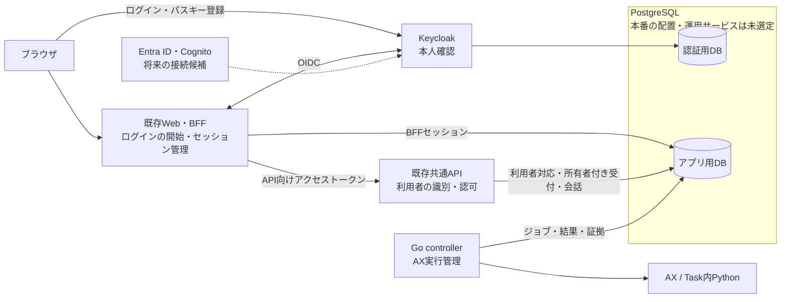

# チャットの認証基盤

2026-10-06の要件に合わせたローカル認証基盤。Keycloak 26.8.0によるメールアドレス・パスワードとパスキー、BFFのログイン・ログアウト、APIと保存済み会話の所有者照合を実装した。PostgreSQLはKubernetesの外のローカルDockerで動かし、認証用・アプリ用・実行基盤用にDBと接続ユーザーを分ける。[DBの構成と運用手順](../ax-local/postgres/README.md)を参照。既存の[Web構成](web-architecture.md)に、共通認証と利用者の管理を加える。

会話・実行保存はその後、Pythonのreceipt台帳からapp PostgreSQLへ移した。共通APIが所有者付き受付をDBへ保存し、Go controllerがAXを操作する。認証の内部UUID・issuer/subject対応は維持する。現在の起動・保存先は[Web README](../web/README.md)、旧原本の移行と復旧の境界は[実行管理](../execution/README.md)を参照。以下の図と所有者説明はこの構成を反映する。

## 今回の範囲

最初に揃える機能は、ログイン・ログアウト、未ログイン時のチャット利用拒否、自分の会話だけを閲覧・継続できること。ログイン方式はメールアドレス＋パスワードとパスキーとする。将来のMicrosoft Entra ID・Amazon Cognitoとの接続を考慮するが、外部テナントの設定は今回の初期導入に含めない。

利用者はWebからのエージェント操作や定期実行の製品拡張を保留し、当面は会話できる状態を土台にする方針を示した。既存のチャット・実行機能は保持し、認証を迂回できないよう既存の実行一覧・詳細・成果物・復旧にも同じ所有者確認を適用する。

## 構成と追加するDB

初期の認証サービスはKeycloakを使う。メールアドレス＋パスワード、パスキーの登録・検証はKeycloakが担当する。Keycloakはパスキーと外部の認証サービスとの連携に対応している。[Keycloakの管理ガイド](https://www.keycloak.org/docs/latest/server_admin/index.html)

既存のHono共通バックエンドに利用者の識別・会話の認可を加える。別の独自認証APIを作ってパスワードやパスキーを検証する構成にはしない。

図は導入後の論理構成であり、DBの配置先や台数を指定するものではない。採用するDBはPostgreSQLとし、本番の配置先・運用サービスは別に選定する。認証用とアプリ用の2用途に分けるが、この分離も配置先とは独立した方針である。ローカルはKubernetes外のDockerに1インスタンスを置き、実行基盤の `substrate`、認証用 `keycloak`、アプリ用 `app` の3DBと別々の接続ユーザーを使う。この開発構成を本番の配置・台数の前提にはしない。[PostgreSQLのDB分離とアクセス管理](https://www.postgresql.org/docs/16/manage-ag-overview.html)

| 保存先 | 保存するもの | 読み書きの責務 |
| --- | --- | --- |
| 認証用DB | アカウント、パスワードのハッシュ、パスキーの登録情報、認証設定 | Keycloakが管理。アプリはテーブルを直接参照しない |
| アプリ用DB | 内部利用者ID、外部ID対応、BFFセッション、所有者付き会話・受付・結果・成果物bytes | BFFが認証セッション、共通APIが認可と受付、Go controllerが実行を担当。DB関数が原子的受付と全体ガードを判定する |
| 旧receipt・入力・成果物ファイル | 移行前の原本とバックアップ。DBのax_importsにも原bytesを保全 | 移行後の新規書込みを拒否する。通常APIの保存先にはしない |

Keycloakはユーザーや認証設定の永続保存にDBを使い、PostgreSQLを公式にサポートする。内蔵の開発用DBもあるが、この設計では初期からPostgreSQLへ保存する。[KeycloakのDB設定](https://www.keycloak.org/server/db)

アプリ用DBは利用者とログイン状態の管理に使い、認証の追加に会話本文のDB移行が必須という意味ではない。パスキーの秘密鍵や生体情報はアプリのDBへ保存しない。サーバーは公開鍵などの登録情報で本人確認を行う。[WebAuthnの仕様](https://www.w3.org/TR/webauthn-2/)

本番DBの配置先は、次の候補を残して未選定とする。アプリがEKSや別のKubernetes上で動く場合も、DBを同じクラスタへ置くことを要件にしない。

| 配置の候補 | 選定する内容 |
| --- | --- |
| AWSのマネージドDB（Amazon RDS for PostgreSQLなど） | 利用するサービス、アプリからの接続経路、運用条件 |
| AWS以外を含むPostgreSQLホスティングサービス | 提供元、接続経路、対応機能と運用条件 |
| Kubernetes内などでの自己管理 | 稼働場所、永続保存、DBの運用方法 |

選定では、対応するPostgreSQLのバージョン・接続機能、ネットワーク、費用、可用性、バックアップ・復元、更新作業の担当を比較する。候補として挙げたサービスとの接続は未検証。Keycloak・BFF・共通APIは外部設定でDBの接続先・資格情報・TLSを受け取り、クラスタ内のサービス名や永続ボリュームをアプリの前提にしない。提供元固有の認証・接続条件は、選定後の接続設定と配置手順で扱う。

運用上は、Keycloakの更新に加えてDBの保存・復旧・接続情報の管理が増える。DB自体の更新やバックアップを誰が担うかは、選ぶ運用サービスによって分担する。1インスタンスにまとめる場合は障害・保守の影響を共有する。永続保存はどの配置でも必要で、Kubernetes内を選ぶ場合にはPodの一時領域を保存先にしない。

## 利用者とログイン状態

利用者を表す内部IDは、メールアドレスや認証サービスの名前から独立させる。アプリ用DBに以下を持つ。スキーマは `web/server/auth-schema.sql`、初期作成は `npm --prefix web run auth:migrate`。マイグレーションはトランザクションと排他で一度だけ適用する。

- `users(id, status, display_name)`：再利用しない内部利用者UUID、有効・無効、表示名。
- `identities(issuer, subject, user_id)`：検証済みの発行元とsubjectの組を内部IDへ対応させる。組に一意制約を置く。
- `sessions`：256ビットのランダムIDのSHA-256、利用者・絶対期限、AES-256-GCMで暗号化したトークン。ログアウト時は行を削除する。
- `login_flows`：stateのSHA-256とブラウザCookieのIDのSHA-256、暗号化したPKCE verifier・nonce・戻り先。5分で失効し、callbackで一度だけ消費する。

APIは既存の内部Bearerに加え、`X-AX-Access-Token` の発行元・RS256署名・`typ=Bearer`・`aud=ax-api`・`azp=ax-web`・発行時刻・期限・subjectを検証してから、DB上の有効な利用者対応を引く。起動確認用 `/v1/status` だけは内部Bearerのみで応答する。ブラウザのフォーム・URL・任意のヘッダーに書かれた利用者IDを信用しない。`issuer + subject` を識別の元とし、メールアドレスの一致だけで既存利用者へ統合しない。[OIDCの識別子の安定性](https://openid.net/specs/openid-connect-core-1_0.html#ClaimStability)

ログインはBFFをOIDCクライアントとし、認可コード＋PKCE S256、state・nonce・redirect URIの完全一致を確認する。認証Cookieとlogin flow CookieはHttpOnly・SameSite=Lax、フォーム用の署名済みCSRF CookieはSameSite=Strictとする。ログイン成功時に新しい認証セッションを発行し、以前のセッションを失効させる。ローカルHTTPで動作するためSecure属性は付けない。本番のHTTPS・公開origin設定は別工程である。

認証セッションはログインから30分以内、かつaccess tokenの期限以内とする。自動refreshは実装せず、期限後は再ログインする。暗号化鍵は `.state/auth/encryption.key` と `app.json` に保持し、Web/API再起動時に作り直さない。Cookieに生のトークンを入れず、暗号化のAADに保存レコードIDを含め、暗号文の別レコードへの移植を拒否する。

ログアウトはBFFセッションを先に失効させ、Cookieを破棄したうえでKeycloakの終了確認画面へ接続する。URLにはclient IDと登録済みの戻り先だけを含め、ID tokenを載せない。Keycloakへ到達できなくても同じCookieではアプリを利用できない。発行済みAPIトークンの失効・有効期間と、将来の外部IdP側のログアウトは別に扱い、全サービスから即時にログアウトできるとはしない。

## 会話と既存データの扱い

新しい受付では、共通APIで確定した内部利用者IDを`owner_user_id`としてapp DBの同一transactionに保存する。会話の各往復は同じ所有者を要求する。DBの制約と関数で会話・実行・受付キーの整合を確認し、実行受付と一緒に所有者を確定する。Keycloak DBや旧ファイルへ会話の所有権を二重登録しない。

会話とrunの一覧・詳細・送信・成果物・復旧・同一キーの再送をすべて所有者で制限する。一覧は件数を絞る前に所有者を適用する。再送キーは利用者単位で扱い、他人の既存受付を返さない。利用者対応が無効・不明、DBが利用不能、保存済み会話・実行の所有者が矛盾する場合は操作を拒否する。DBの停止を匿名利用へ切り替える理由にしない。

ownerのない既存データは削除せず、認証導入後の通常のWeb利用者には表示・操作を許可しない。最初にログインした人へ自動で割り当てない。必要な履歴は対象と所有者を確認した管理手順で引き継ぐ。移行対象と方法を決める前に既存ファイルを書き換えない。

移行後は旧CLI・bridgeの通常操作を拒否し、新規受付は認証付き共通APIへ統一する。管理者操作は取り込み・検査・復旧証明・失敗の確認記録に限定し、新しいownerなし実行の受付は追加しない。ownerなしの既存実行も、全体の費用集計・未解決実行の停止条件から除外しない。費用上限と同時実行1件の制約は全体で維持する。利用者別の並列実行や料金管理は今回追加しない。

復旧では、認証用DB・アプリ用DBのID対応と会話・実行の所有者を照合する。旧原本のownerも移行時に保持する。利用者IDを作り直して既存記録へ自動的に割り当てない。復元後に対応が欠ける会話はアクセスを止め、バックアップからの整合回復か明示的な移行で解消する。

## 将来の接続と比較した構造

初期はアプリがKeycloakのOIDCを使い、将来のEntra IDやCognitoはまずKeycloak側への外部IdP接続を検討する。これは接続可能な標準方式に基づく方針であり、対象テナントとの相互運用を検証済みとはしない。

| 候補 | 構造 | 利点 | 受け入れる負担 |
| --- | --- | --- | --- |
| A | Keycloakを共通認証窓口にし、上流IdPをKeycloakへ接続。会話ownerはKeycloakの発行元＋subject | Web/APIの認証接続先を揃え、認証方式の追加を集約できる | Keycloakの保守、Keycloak自体を置き換える際のowner移行 |
| B | アプリが各OIDC提供元へ直接接続し、内部利用者IDへ対応付ける | IdPの入れ替えと会話所有権を切り離せる | 各提供元の検証・ログアウト・アカウント関連付けをアプリが扱う |

初期の接続構造はAを土台とし、Bの内部利用者IDと外部ID対応を取り込む。複数のIdPへ直接接続する処理は初期実装に入れない。会話のownerにKeycloakのsubjectを直接使わないことで、将来Keycloak自体を置き換えるときにも、本人確認済みのID対応の移行で会話との紐付けを維持できる。ただし、置き換えが設定変更だけで完了するという意味ではない。

外部アカウントの関連付けは既存アカウントの本人確認を伴う手順とする。パスキーは登録先のRP IDに結び付くため、本番の認証ドメインを安定させる。認証サービスを置き換えれば登録済みパスキーが自動で移るとはせず、再登録の要否を移行時に検討する。[KeycloakのWebAuthn設定](https://www.keycloak.org/docs/latest/server_admin/index.html#_webauthn)

## 認証導入時の順序と確認条件

1. 開発・検証用にKeycloakとPostgreSQLをローカルで動かす。DBの接続先は設定で渡し、ローカル配置を本番の選定結果とは扱わない。用途別のDB・権限・永続保存を設定し、メールアドレス＋パスワードでのログイン、再起動後の保持、バックアップの復元を確認する。
2. パスキーの登録・ログイン・追加/削除と、端末を失った場合の復旧を確認する。ローカルでは`localhost`等の適合するorigin/RP IDを固定し、本番はHTTPSを前提にする。自動試験と実機での確認を区別する。
3. BFFのログイン・セッション・ログアウト、APIのトークン検証と内部利用者IDへの対応、receiptの所有者保存・照合を接続する。2人のテスト利用者で全経路の相互アクセス拒否を確認する。
4. 期限切れ、不正なコールバック・トークン、DB/IdP停止、再送、Web/API再起動、ownerなしの旧データを確認する。履歴・実行・費用の保存を維持し、ログアウト後のCookie再利用を拒否する。

アカウントの発行は初期ローカルでは管理者が作るテスト利用者で確認する。利用者自身による登録、メール確認・パスワード再設定の送信には、登録方針とメール送信手段を決める必要がある。本番のドメイン・復旧方法・利用者招待の方針は公開前に確定する。これらの未決事項は、ローカル基盤の構築を妨げない。

ローカルの起動・アカウント操作は[Web README](../web/README.md)、Keycloakの固定版・秘密ファイル・復元試験は[Keycloak README](../ax-local/keycloak/README.md)、検証の対象と結果は[実装検証記録](../.space/tasks/ax-auth/verification.md)を参照する。[当初見積もり](web-mvp-estimate.md)の認証工数には今回のパスキー・DB運用・移行条件の具体化が入っていないため、そのまま新しい範囲の工数として使わない。

## 障害・復元と公開前の残件

app DBへ接続できない場合、ログイン・認証済みページ・APIは利用を拒否する。IdP停止中は新規ログインできない。取得済みの公開鍵を持つAPIは、署名と期限が有効な既存tokenをDBの有効な利用者対応と照合して扱える。IdPを停止しただけで、全ての発行済みtokenが即失効する方式ではない。BFFのlogoutはIdPの応答と別にapp sessionを失効させる。

DBの復元は既存DBを上書きする前に別DBで試す。Keycloak DB、会話を含むapp DB、暗号化鍵とclient secret、保全した旧原本を一組としてバックアップし、issuer/subjectから内部IDへの対応が一致することを確認する。紛失したIDや鍵を再生成して既存会話へ付け替えない。ログイン済みセッションの復元が不要なら、運用判断でsessions/login_flowsを失効させて全員を再ログインさせる。

この実装の公開入口はloopbackに限定する。公開前にはWeb/IdPのHTTPSとorigin、安定したパスキーRP ID、招待・本人確認・パスワード復旧メール、DBと秘密のバックアップ運用、外部IdP側の失効・連携を確定して追加検証する。Entra ID/Cognitoとの相互運用と実機の生体認証は今回の自動検証に含めない。
