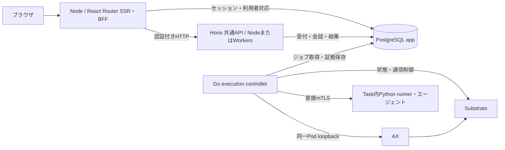

# AX ワークスペース

ログインし、会社やプロジェクトのワークスペースを選んでAX内のエージェントに依頼するWebアプリです。標準エージェントは相談・文章作成・計算に対応し、必要な場合はCSV・Excelを処理します。依頼・実行受付・入力・結果はPostgreSQLに保存し、完成した返答を表示します。文字単位のストリーミングは行いません。

AIへの依頼はAntigravity/Geminiを使い、料金が発生します。モデルを呼ばない確認は「新しい依頼」の「画面の操作を試す（無料）」を使ってください。[費用制御](../ax-local/task-cli.md#費用と接続先)は全利用者・移行済み記録を通して適用します。

ワークスペース追加後の移行・動作確認は[検証記録](../.space/tasks/ax-workspace-access/verification.md)、共通APIへの構成変更は[以前の検証記録](../.space/tasks/ax-portable-api/verification.md)を参照してください。以下の利用手順は、実行基盤の検証と受付再開が完了している環境向けです。

## 構成



APIはPython子プロセス、AX CLI、共有ローカル台帳を使いません。DBが所有権・同じ受付キーの再送・会話順序・全体の同時実行1件・費用制御を判定します。HTTP応答とは独立したGo controllerが、DBへ一度だけの送信権を保存してからAXを操作します。PythonはTask内の処理に残り、ローカルの構築・移行用ツールにも使います。

PostgreSQLはアプリやKubernetesと別の場所へ配置できます。現ローカル構成はDocker上のPostgreSQLです。BFFはNodeで動作し、Workersへの配置対象は共通APIです。Workersの入口とworkerd試験は実装されていますが、クラウド配備・本番公開の確認は含みません。

## 初回準備

Node.js 24.15.0以上の24系、npm、Docker Desktopが必要です。ローカル基盤の準備にはPython 3と[固定版のAX・Substrate環境](../ax-local/README.md)を使います。Go controllerのビルド要件は[実行管理の手順](../execution/README.md)を参照してください。

次はリポジトリルートで実行します。既存環境では秘密ファイルやDBを作り直さず、未実施の段階だけ進めます。

```sh
npm --prefix web ci
python3 ax-local/postgres/manage.py init
python3 ax-local/postgres/manage.py up
python3 ax-local/postgres/manage.py provision
python3 ax-local/keycloak/manage.py init
python3 ax-local/keycloak/manage.py up
python3 ax-local/keycloak/manage.py provision
npm --prefix web run auth:migrate
npm --prefix web run data:migrate
```

スキーマ作成には管理用接続を使います。`data:migrate`は版とSQLハッシュを検査し、異なる既存スキーマを上書きしません。初回の新規受付は閉じた状態です。再実行は受付を開閉しません。

続けて[実行管理の初回準備と移行](../execution/README.md#初回準備と旧台帳からの移行)を行い、限定DBロール、固定イメージ、controller、通信境界を準備します。既存の`.state/runs`がある場合は同じ手順で一度だけ取り込みます。Web起動だけではcontrollerの配置や受付再開は行いません。

## 起動して使う

```sh
npm --prefix web run dev
```

`AX workspace ready: http://127.0.0.1:3100` が表示されたら、表示どおりのURLを開きます。`localhost`へ読み替えないでください。この表示はWeb/APIの起動確認であり、AXの実行成功や新規受付の許可を意味しません。

1. 「ログインへ進む」から認証画面を開きます。初期利用者は`alice@example.test`と`bob@example.test`です。パスワードの保存先・パスキー設定は[Keycloakの手順](../ax-local/keycloak/README.md)を参照してください。
2. 初回はワークスペースを作成するか、管理者から受け取った招待リンクから参加します。所属がある場合は一覧から利用先を選びます。
3. 一覧の「エージェントを開く」から依頼画面へ進みます。本文だけで依頼でき、必要な場合に「ファイルを添付（任意）」「変更・スキルを選ぶ」を開きます。
4. 「AIに依頼する」を選び、外部送信と料金を確認して送信します。モデルを使わず操作を試す場合は「画面の操作を試す（無料）」を選びます。無料の操作テストは固定応答で、AIの回答やファイル処理は行いません。
5. エージェントが確認事項を質問したら、回答して依頼を続けます。「依頼の履歴」から結果を開き直せます。完了後の「新しい依頼」には、前のやり取りは自動で引き継がれません。

継続会話の旧チャットは「履歴・設定など」→「これまでのチャット」、旧エージェント対話は同じ欄の「以前のエージェント対話」から開けます。既存URLと履歴は保持しています。

「履歴・設定など」→「アカウント」からパスキーの登録・管理とログアウトを行います。ログインは最大30分です。送信済みの内容は保存しますが、入力途中の下書きは再読込後の保持を保証しません。Enterは改行、Ctrl / ⌘ + Enterは送信です。

Ctrl+CはローカルWeb/APIを終了します。**DBに受け付け済みの処理とcontrollerは独立して動作します。** ブラウザやWebの終了を取消しとして使わないでください。API・共通処理・設定の変更時は起動コマンドを再実行し、controllerの更新は[停止・復旧手順](../execution/README.md#停止と復旧)に従います。

本番ビルドのローカル確認にも、開発用依存を含む`npm ci`が必要です。

```sh
npm --prefix web run build
npm --prefix web start
```

## 以前のエージェント対話

「履歴・設定など」→「以前のエージェント対話」では、依頼に応じた質問と短いテキスト成果物を受け取れます。実モデルを選ぶ場合は、会話の外部送信と利用料金を確認してから開始します。無料で操作だけを確かめる場合は「模擬応答で操作を試す」を選びます。開始後に種類は変更できません。

実モデルはGemini 3.1 Flash-Liteを使います。必要なら一度だけ質問し、処理を止めて回答を待ちます。回答すると新しいAX Taskで続きを作ります。生成コードの実行、サブエージェント、外部サービス操作はまだ対応していません。モデルの返答と確定した料金の目安を表示し、状態や使用量が不明なときは追加実行を保留します。

管理側でschema v8と対応controllerを配置する必要があります。`deploy-execution.ts --deploy`は実モデル送信を閉じた状態で配置します。費用条件を確認して短い試験を行うときだけ`--enable-model`を追加し、終了後は付けずに再配置します。どちらも受付を閉じ、未解決実行がなく、DBの固定イメージ・Python許可・モデル許可が配備設定と一致することを先に確認します。モデル鍵はGatewayだけに渡し、Taskには渡しません。

## 標準エージェント・スキルとファイル作業

以下はv8の追加機能です。ローカル環境へ配備し、登録・本人限定のファイル取得・実モデルによるCSV集計を確認しました。Excel処理と8MiB搬送は固定したモデル提案による実AX試験で確認しています。実モデル接続は限定試験の後に閉じるため、通常は登録・ファイル管理と模擬応答を利用できます。確認範囲と定期実行の残件は[作業記録](../.space/tasks/ax-agent-workbench/task.md)に残しています。

「新しい依頼」では相談や文章作成など、添付なしの依頼を標準エージェントに送れます。ファイルが必要な場合は「ファイルを添付（任意）」を開きます。新しいCSV・Excelは別タブの「作業ファイル」で保存し、依頼画面に戻って「追加したファイルを読み込む」から選択します。入力は最大4件、合計8 MiBです。エージェントは必要な確認を質問し、隔離したPython環境で集計して、CSV・Excelの結果ファイルを返します。結果の取得時には保存したサイズとSHA256を照合します。画面を閉じても受付済みの処理と履歴は残ります。

「スキル・エージェント」には組み込みの「相談・文章作成」「CSV・Excelの集計」と適用条件を表示します。相談用はすべての依頼、集計用はCSV・Excelまたは既存の結果ファイルを参照する区間に適用します。組み込みスキルの登録は不要です。

同じ画面で指示を下書きし、公開版を作れます。公開後の「この版で依頼する」を押すと、その公開版を選んだ依頼画面を開きます。この操作だけでは実行せず、送信時に利用権限を再確認します。本人用も共有用も現在のワークスペースに属します。共有用は全メンバーが登録でき、作成者と現在のワークスペース管理者が編集できます。本人用は本人だけが利用・編集できます。実行時は公開版を固定し、編集中の下書きは使いません。共有エージェントから本人用スキルを参照して公開することはできません。

共有するのはスキルやエージェントの設定です。会話・入力ファイル・実行結果は、現在そのワークスペースに所属する所有者本人だけが取得できます。管理者にも他人の実行内容を公開しません。

| 内容 | 正本と読み込み方 |
| --- | --- |
| 製品同梱のプロンプト・スキル | `ax-local/task_runtime/` の製品ファイル。`builtin_catalog.json` が表示と読込の共通原本で、Runtimeはスキル本文のSHA256を検証。開発時にGit管理し、固定イメージへ組み込む。実行時のGit接続は不要 |
| 画面で登録した設定・指示・補助テキスト | app PostgreSQLの `ax_definitions` / `ax_definition_versions`。公開版は不変で、実行時に選んだ版とhashを保存 |
| 作業履歴・途中の結果 | app PostgreSQLの `ax_agent_roots` / `ax_agent_segments` / `ax_workbench_checkpoints` |
| 入出力ファイル | app PostgreSQLの `ax_files` / `ax_file_chunks`。Taskの一時ファイルは実行後に回収・削除 |

登録したスキルは指示と参照テキストを渡す機能です。任意スクリプト・追加パッケージ・外部接続の権限は付与しません。初期のPython環境はCSVとopenpyxlによるExcel処理を対象とし、インターネット接続やパッケージの追加インストールを許可しません。

この試行版は1依頼につきモデル6回、道具8回（Python3回）、実作業300秒、モデル費用概算0.01 USDで停止します。回答待ち時間は実作業時間へ加えません。無料の模擬応答と実モデルを区別し、実モデルでは明示同意が必要です。定期実行は未実装で、作成者の権限・版と入力の選び方・無人実行の費用枠を確定してから追加します。

標準エージェントの添付なし文章作成は `node --import tsx scripts/verify-general-local.ts --run --real-model` で限定確認します。既存の専用Workspaceだけを使い、1依頼だけ送信します。想定はモデル1回・Python0回ですが、強制上限は上記のroot予算です。日付・時刻を含む短い案内文と再読込を確認し、実際の回数・費用・停止はroot IDを使ってサーバー側で照合します。自動試験の失敗でも再送はしません。今回の確認と制約は [汎用化と画面整理の記録](../.space/tasks/ax-agent-workbench/general-agent-ui.md)を参照してください。

ファイル作業の限定した実モデル確認には `node --import tsx scripts/verify-workbench-local.ts --run --real-model` を使います。専用の検証ワークスペースにAlice/Bobの両方が所属していることを送信前に確かめ、CSV合計300の作成・再取得・同じワークスペースの別本人への拒否を調べます。開始は1回だけで、質問待ちや不明結果でも自動回答・再送しません。事前の実行許可と費用枠、終了後のGate閉鎖は管理者が確認してください。

実ローカル経路の確認には `node --import tsx scripts/verify-interactive-local.ts --run` をwebディレクトリから実行します。既定は模擬応答で、`--real-model`を明示した場合だけ同意付きで実モデルを最大2回使います。受付や返答に問題があれば自動再送せず停止します。私有の証拠は`ax-local/.state/verification/`へ保存します。ブラウザ確認に加え、DBのusage・費用台帳とAX Actorの停止を確認してください。

## ワークスペース・メンバー・招待

一人の利用者が現在所有できるワークスペースは最大50個です。過去の作成回数では数えません。招待から参加する数には上限を設けず、個人用ワークスペースも自動作成しません。

各ワークスペースには一人の所有者がいます。所属には管理権限（`admin` / `member`）と業務ロール（`general` / `developer`）を別々に保存します。作成者は所有者・管理者・一般で始まり、招待から参加した人はメンバー・一般で始まります。業務ロールだけで管理操作を許可しません。所有者の退出・削除・一般メンバーへの降格は、所有権を譲渡するまでできません。最後の有効な管理者も退出・削除・降格できません。

所有者は「メンバー・設定」から、参加中のメンバーへ所有権の譲渡を依頼できます。相手が7日以内に承諾すると、その人の所有数に数え、元の所有者の枠が空きます。承諾前の依頼取消や受取人の辞退もできます。受取人がすでに50個を所有している場合は承諾できません。譲渡後、元の所有者は管理者として残り、必要なら退出できます。業務ロールとグループ参加は維持します。ワークスペースの削除機能はありません。

管理者は名前、所属者の権限・業務ロール、招待、グループを管理します。グループはワークスペース内の平坦な集まりで、一人が複数に所属できます。グループ自体には権限を付けません。所属を削除するとグループへの所属も消え、再参加しても以前の権限は復元しません。

招待はメールアドレスを指定して有効期限7日のリンクを発行し、管理者が相手へ渡します。メールの自動送信は行いません。招待先と一致する確認済みメールアドレスを持つログイン済み利用者だけが参加できます。DBにはリンクの秘密のハッシュだけを保存し、リンク全文は発行直後の画面でだけ確認できます。同じ受付キーの再送ではリンクを変えませんが全文は再表示できないため、紛失した場合は招待を取り消して作り直します。

ログインアカウントは認証基盤が管理します。現ローカルKeycloakは管理者が用意した利用者を使い、公開ユーザー登録や確認メールの配送設定は含みません。アプリはメールアドレス一致だけで別の認証アカウントを統合しません。

会話・実行・成果物の参照には「現在のワークスペースの所属」と「記録の所有者本人」の両方が必要です。同じ会社の所有者・管理者も他人の会話を読むことはできず、所有権を譲渡しても記録は共有されません。利用先は各ページのURLで明示し、別タブでワークスペースを変えても入力先を勝手に切り替えません。旧履歴は本人限定のまま残し、「以前の履歴」から参照・安全な復旧だけを行います。旧会話への追記や新規実行はできません。

## 既存環境の更新

新規受付を閉じ、処理中・未解決の実行がないことを確認して、DBをバックアップします。Web/APIを止めてから `auth:migrate`、`data:migrate`、`prepare-execution.ts` の順で適用してください。過去のSQLとチェックサムを保持し、認証v2・実行データv3まで追加します。v2より前の実行・会話はワークスペース未割当のまま残します。旧API用関数の直接実行権は外し、ワークスペースを確認する関数だけをAPIへ許可します。

v3は作成者を最初の所有者にします。作成者がすでに退出・降格・無効化されている行がある場合は、権限を自動で付け直さず、移行全体をロールバックします。その環境では現在の所属と権限を確認してから対応してください。v3適用後は新しい一覧応答を扱えるWeb/APIを同時に起動します。

v1以前から更新する場合は、Workspaceの失効に対応したcontrollerもビルド・配備します。v2からv3への所有権変更ではcontrollerの更新は不要です。Web/APIを再起動して、所属と本人の境界、旧履歴、所有数と譲渡を確認して受付を開きます。DBを書き戻して古い版へ自動復元する手順はありません。問題があれば受付を閉じたままバックアップと現状を保全します。

## 受付・再送・復旧

単発作業はフォームのURLに受付キーを保持します。チャットの送信キーは会話IDと現在の末尾実行に対応します。同じ利用者・同じキー・同じ内容の再送には同じ実行番号を返します。同じキーで内容を変えると拒否します。応答が不明なら、先に一覧を確認してください。別の作業には「新しい実行」を使います。

HTTP切断やWeb/APIの再起動で受付を失わず、外部操作を自動再送しません。controllerが実行権を取得した後に消えたり、開始結果が不明になったりすると、期限切れだけでは他のcontrollerへ引き継ぎません。未解決の記録がある間は全利用者の新規実行を止めます。

画面の「状態を確認して終了する」は、未着手の受付なら「開始せず終了」にできます。外部操作済みの場合は復旧待ちにし、管理者が旧controllerの停止・接続遮断・送信中操作の確定を証明してから復旧ジョブを許可します。ボタンだけでこの管理者確認は完了しません。

復旧ではTask作成・再開・開始合図を送りません。稼働中のTaskから回収できる結果と、通信遮断・実停止を確認します。過去に送信権を作った操作は再送せず、観測だけを行います。未回収のまま停止したTask、未知の使用量、応答不明の後片付けは解決できない場合があります。[管理者の復旧手順](../execution/README.md#停止と復旧)を参照してください。

## 入力と保存

| 項目 | 制限・保存先 |
| --- | --- |
| 単発作業の指示 | UTF-8で2048バイト |
| 作業用テキスト | UTF-8で4096バイト。requestの`inputs["input.txt"]`として渡す |
| 成果物 | 1ファイル、64文字以内の安全な名前、最大64 KiB。サイズ・SHA256・UTF-8を照合 |
| チャット | 最新発言2048バイト、過去の成功ペアをJSONにした文脈4096バイト、最大32回の受付 |
| 会話・実行・入力・結果 | app DBの`ax_conversations`、`ax_runs`等 |
| 成果物の原bytes | app DBの`ax_artifacts`。現段階では外部オブジェクトストレージを使わない |
| 旧原本 | 取り込み時のbytesを`ax_imports`へ保存。元の`.state/runs`と移行バックアップも保持 |

新しい受付は内部利用者UUIDとワークスペースUUIDを同時に保存し、所属中の本人だけが一覧・詳細・成果物を利用できます。所属喪失後も、所有者本人による安全な復旧要求は許可します。最近の一覧は本人の50件まで。ownerのない旧記録は通常画面へ公開せず、全体の費用・未解決判定には含めます。NULを含む本文など、JSONBで保持できない原bytesはbyteaに保存します。

## 接続設定と権限

| 設定 | ローカルの既定値・用途 |
| --- | --- |
| `WEB_PORT` / `API_PORT` | `3100` / `3101`。異なる1024〜65535のポート |
| `AUTH_CONFIG_FILE` | BFF・管理用の`ax-local/.state/auth/app.json`。相対既定値は`web/`から解決 |
| `API_CONFIG_FILE` | API専用の`ax-local/.state/auth/api.json`。`prepare-execution.ts`が生成 |
| `API_SETTINGS` | Nodeではファイル設定の代わりになる完全なJSON。秘密として渡す |
| `API_ORIGIN` | 設定するとWebは外部APIを使い、ローカルAPIを起動しない。外部はHTTPS |
| `INTERNAL_API_TOKEN` | BFF/APIで共有する32文字以上の秘密。外部API使用時は明示設定 |
| `RUNNER_IMAGE` | Nodeのファイル設定経路でrunnerの固定digestを上書き。既定は`versions.json` |
| `API_HOST` | Node APIの待受。既定は`127.0.0.1` |

ポート変更時はKeycloakのcallback/logout URIも完全一致で変更します。外部APIのoriginとBearerはBFF側・API側で一致させます。秘密値をGit・画面・ログに載せないでください。

NodeのAPI設定は`apiOrigin`、`apiToken`、`identity`、`image`、`databaseSchema`（既定`public`）、`database`を持ちます。`identity`は`issuer`、`clientId: "ax-web"`、`audience: "ax-api"`。DBは`host`、`port`、`database`、`user`、`password`、`ca`（PEM本文）です。外部DBはCA必須で証明書を検証します。ローカルファイル設定の`caPath`はNode入口でPEMへ変換します。

Workers入口は`web/api/worker.ts`です。`API_SETTINGS`にはDB接続項目を除いたAPI設定を渡し、接続は`POSTGRES.connectionString`を提供するHyperdrive bindingから注入します。試験は`nodejs_compat`のworkerdで行います。BFFの認証秘密や暗号化鍵をWorkersへ渡す必要はありません。

APIのDBロール`ax_api`は利用者対応の参照と受付・取得・復旧要求の関数だけ、controllerの`ax_execution`はclaim・送信権・証拠・結果確定の関数だけを使います。スキーマ管理・取り込み・管理者復旧の権限を付与しません。ローカルBFF・移行は既存の`ax_app`接続を使います。

APIはHost・内部Bearerを検証し、Origin付き要求を拒否します。`/v1/status`以外はアクセストークンとDBの有効な利用者対応も確認します。所有者IDをブラウザ指定値から決めません。BFFはセッション・Origin・CSRFを検証し、トークンを暗号化してapp DBへ保存します。認証済みCookieは不透明なIDです。

| 内部API | 用途 |
| --- | --- |
| `GET /v1/conversations` | 最近の会話一覧 |
| `GET /v1/conversations/:id` | 会話履歴 |
| `POST /v1/conversations/:id/turns` | 親実行・受付キー付きの発言 |
| `POST /v1/runs` | 単発作業の永続受付 |
| `GET /v1/runs`、`GET /v1/runs/:runId` | 一覧・入力・状態・結果 |
| `GET /v1/runs/:runId/artifact` | 検証済み成果物 |
| `POST /v1/runs/:runId/recover` | 再開始をしない復旧要求 |

## 検証する

次の自動試験はモデルAPIを呼びません。Node/workerd試験は専用DB`app_auth_test`の一意schema、ブラウザ試験は認証・実行のfixtureを使います。通常の`app` DBを試験で初期化しないよう設定を制限しています。

```sh
npm --prefix web run typecheck
npm --prefix web test
npm --prefix web run build
cd web
npx playwright install chromium
npm run test:e2e
```

DB試験は所有者・同時受付・同キー再送・未知usage・費用・会話順序・原bytes・移行・実行権を確認します。runtime試験はNode/workerdの同一DB接続、再起動後の保持、DB切断時に受付を再送しないことを確認します。ブラウザ試験は認証・会話・フォーム・取得・JavaScriptなし・狭い画面・操作性・API停止・ポート競合を対象とします。3210/3211/3212、3230/3231、3240/3241番を空けてください。

実Keycloak・パスキーの記録は[認証検証](../.space/tasks/ax-auth/verification.md)、現在の移行・実AX・停止確認は[構成変更の検証](../.space/tasks/ax-portable-api/verification.md)に分けています。自動試験の成功を実AX経路の合格とは扱いません。

デザインは[デジタル庁デザインスキル](../.agents/skills/apply-digital-agency-design-system/SKILL.md)の保存済み資料に基づきます。公式コンポーネントの採用やアクセシビリティの完全適合を示すものではありません。
