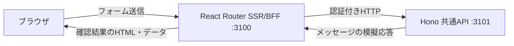

# AX ワークスペース：Webの土台

ローカルのブラウザからメッセージを送り、React RouterのSSR/BFFを経由してHono APIの模擬応答を確認できます。W1の実装です。AX・Docker・モデルAPIへの接続や、タスクの作成は行いません。

## 起動する

Node.js 24.15.0以上の24系とnpmを使います。リポジトリのルートで次を実行してください。

```sh
npm --prefix web ci
npm --prefix web run dev
```

`AX workspace ready: http://127.0.0.1:3100` が表示されたら、[接続確認画面](http://127.0.0.1:3100)を開きます。「送信して接続を確認」を押して、入力したメッセージと確認番号が表示されれば疎通成功です。`localhost` ではなく表示された `127.0.0.1` のURLを使ってください。

Ctrl+CでWebとAPIを終了します。画面の変更は開発サーバーに反映されますが、API・共通処理・起動設定を変更した場合はコマンドを再起動してください。稼働後にAPIだけが停止すると、Webはエラーを表示できる状態で残ります。復旧はコマンド全体の再起動とページの再読み込みで行います。

ビルド後の動作を確認する場合も、開発用依存を含む `npm ci` が必要です。

```sh
npm --prefix web run build
npm --prefix web start
```

## 設定と利用範囲

| 設定 | 既定値 | 条件 |
| --- | --- | --- |
| `WEB_PORT` | `3100` | 1024〜65535 |
| `API_PORT` | `3101` | Webと異なる1024〜65535 |

どちらも `127.0.0.1` にのみ待ち受けます。たとえば `WEB_PORT=3110 API_PORT=3111 npm --prefix web run dev` でポートを変更できます。既存サービスがポートを使用している場合は起動を中止し、そのサービスには干渉しません。

サーバー間の秘密値とCookie署名鍵は起動時に生成されます。設定ファイルへの保存は不要です。ブラウザに渡すのはCSRF値だけで、内部APIのURLやBearerトークンは渡しません。ローカルセッションの期限は30分で、コマンドの再起動でも失効します。

この構成は単一利用者向けのローカル検証用です。同じPC上の敵対的なプロセスを隔離する仕組みではありません。公開・複数利用者向けの認証は後続の作業です。

## 処理の流れ



- `app/`：初期HTMLの生成、画面、フォーム検証、署名Cookie、CSRF検証、API呼び出し。
- `api/`：`GET /v1/status` と `POST /v1/connection-check`。全経路でHostとBearerを検証し、Origin付き要求を拒否します。
- `shared/`：入出力の定義と本文サイズ上限。メッセージは空白を除いて1〜200 UTF-16コード単位、要求・応答本文は16 KiBまでです。絵文字などは1字を複数単位として数える場合があります。
- `scripts/run.ts`：別プロセスでWeb/APIを起動し、準備と終了を管理します。Webの準備確認には起動時の署名鍵で検証できるCookieも使い、既存サービスの200応答を成功と誤認しません。

API通信は本文の受信を含めて3秒で打ち切り、自動再送しません。GET・SSR・起動確認は実行操作を行いません。入力と確認結果は台帳に保存せず、APIログには受付の確認番号だけを記録します。

## 検証する

```sh
npm --prefix web run typecheck
npm --prefix web test
npm --prefix web run build
cd web
npx playwright install chromium
npm run test:e2e
```

境界テストは不正なHost/Origin・CSRF・期限切れCookie、API認証、入力制限、応答異常、本文途中のタイムアウトを確認します。ブラウザテストはSSR、送信、JavaScriptなし、320px幅、キーボード、axeの自動検査、API停止、ポート競合と終了処理を確認します。ブラウザテスト用の3210/3211、3230/3231、3240/3241番ポートを空けておいてください。

デザインはプロジェクト内の[デジタル庁デザインシステム参照スキル](../.agents/skills/apply-digital-agency-design-system/SKILL.md)を使い、可視ラベル、十分な操作領域、フォーカス、エラー表示を確認しています。公式コンポーネントの採用や、アクセシビリティの完全適合を示すものではありません。

次は[W2：既存Python処理とAXの接続](../docs/web-mvp-estimate.md)です。非同期の開始・状態照会・永続記録・費用保護を接続してから、実行用の画面へ進みます。
