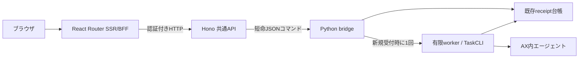

# AX ワークスペース

ローカルのブラウザから指示と少量のテキストを渡し、AX内でエージェントを実行できます。受付後は実行一覧・結果画面で、成果物、使用量、外部通信の遮断と停止の確認を見られます。

既定の「動作テスト」は入力をそのまま成果物に保存し、モデルを呼びません。「モデルを使う」を明示選択し、外部送信と料金の確認にチェックすると、設定済みのAntigravity/Geminiで作業します。モデルの呼び出し上限と[既存の費用制御](../ax-local/task-cli.md#費用と接続先)を維持しています。

## 起動して試す

Node.js 24.15.0以上の24系、npm、Python 3.10以上を使います。実行にはDocker Desktopと[AXのローカル基盤](../ax-local/README.md)、固定版CLI・runnerイメージが必要です。Webの起動や記録の閲覧だけではAXを操作しません。

リポジトリのルートで実行します。

```sh
npm --prefix web ci
npm --prefix web run dev
```

`AX workspace ready: http://127.0.0.1:3100` が表示されたら[ワークスペース](http://127.0.0.1:3100)を開きます。`localhost`ではなく、表示された`127.0.0.1`を使ってください。

1. 「動作テスト」のまま、指示・作業用テキスト・成果物名を入力します。
2. 「実行する」を押すと、受付後に実行番号付きの結果画面へ移動します。
3. 「完了」となり、入力したテキストが成果物に表示されることを確認します。ダウンロードもできます。

テストの作業用テキストが空の場合は指示そのものを保存します。モデルの判断を含まない経路確認です。従来の模擬応答は[接続確認](http://127.0.0.1:3100/connection)に残しています。

Ctrl+CでWebとAPIを終了します。**受け付け済みのエージェント処理は独立して続き、通常は結果回収・通信遮断・停止まで進みます。** 再起動した画面の一覧から結果を確認できます。Webを閉じることを実行の取消しとして使わないでください。

画面の変更は開発サーバーに反映されます。API・共通処理・起動設定の変更はコマンド全体を再起動してください。Pythonコードは実行中のworkerを終えてから更新します。APIだけが停止した場合、Webはエラーを表示できる状態で残ります。

本番ビルドのローカル確認も、開発用依存を含む`npm ci`が必要です。

```sh
npm --prefix web run build
npm --prefix web start
```

## 受付・再送・復旧

フォームのURLに受付キーを保持します。同じフォームを再送すると、同じ内容なら同じ実行番号が返り、実行は増えません。同じキーで内容を変えると拒否します。別の作業には「新しい実行」を使います。応答が不明なときは、先に実行一覧を確認してください。

ブラウザの再読込、HTTPの切断、Web/APIの再起動から実行を自動再送しません。受付を保存した後、処理を開始する前に異常終了した場合は「受付済み・実行未確認」として残ります。実行中のworkerが消え、結果・使用量・停止が未確認なら「復旧が必要」と表示します。未解決の記録がある間はWebと従来CLIの両方で新しい実行を止めます。

結果画面の「状態を確認して終了する」は、保存済み結果の回収、通信遮断、Task停止だけを試みます。モデルの再呼出、開始合図の再送、停止Taskの再開は行いません。外部操作を始めていない受付は「開始せず終了」になり、通信遮断・Task停止を実施した記録にはしません。

使用量が不明なまま、またはTaskを停止した後に結果を回収できない場合は、復旧操作後も未解決です。[CLIの復旧手順](../ax-local/task-cli.md#失敗中断した場合)で保存済み記録を確認します。台帳や開始済みの印を削除して実行し直さないでください。

## 入力・保存・利用範囲

指示はUTF-8で2048バイト、作業用テキストは4096バイトまで。作業用テキストは`input.txt`として渡します。成果物は英数字で始まる64文字以内の名前で1件、最大64 KiBです。成果物の表示・取得時にもサイズ・SHA256・UTF-8を照合します。

入力、進行、結果、成果物は`ax-local/.state/runs/<run_id>/`へ保存します。この領域はGit対象外で、旧CLIの記録も一覧・詳細から参照できます。一覧は最近の50件を表示します。

| 設定 | 既定値 | 条件 |
| --- | --- | --- |
| `WEB_PORT` | `3100` | 1024〜65535 |
| `API_PORT` | `3101` | Webと異なる1024〜65535 |

両方とも`127.0.0.1`にのみ待ち受けます。`WEB_PORT=3110 API_PORT=3111 npm --prefix web run dev`で変更できます。既存サービスがポートを使っている場合は起動を中止し、そのサービスには干渉しません。

サーバー間の秘密値とCookie署名鍵は起動時に生成します。内部APIのBearerトークンはブラウザへ渡しません。ローカルセッションは30分で失効し、Web/APIの再起動でも更新が必要です。フォームの受付キーはセッションと別に保持します。

単一利用者、同時実行1件のローカル検証用です。同じPC上の敵対的なプロセスの隔離や、複数利用者向けの認証・公開配置は範囲外です。

## 処理の流れ



Pythonが受付・実行・費用の記録を所有します。完成したrequest/manifest/receiptをディレクトリごと原子的に公開し、`accepted`の受付を保存してから応答します。workerは既存の全体ロックを取得し、未着手の受付だけを実行します。実行中の外部コマンドへロックFDを継承し、workerの強制終了でコマンドだけ残る場合にも同時操作を避けます。

| 内部API | 用途 |
| --- | --- |
| `POST /v1/runs` | key付きの永続受付 |
| `GET /v1/runs` | 最近の実行一覧 |
| `GET /v1/runs/:runId` | 状態・入力・結果・使用量 |
| `GET /v1/runs/:runId/artifact` | 検証済み成果物 |
| `POST /v1/runs/:runId/recover` | 再開始をしない復旧 |

全APIでHostとBearerを検証し、Origin付き要求を拒否します。BFFの更新操作には署名セッション・Origin・CSRFの一致が必要です。実行APIは要求64 KiB、応答512 KiB、Pythonへの待ち時間5秒、BFFは本文読取まで8秒。実行workerの寿命とは分け、自動再送しません。接続確認用APIは従来の16 KiB・3秒制限を維持します。

## 検証する

```sh
python3 -m unittest discover -s ax-local/tests -p 'test_*.py' -v
npm --prefix web run typecheck
npm --prefix web test
npm --prefix web run build
cd web
npx playwright install chromium
npm run test:e2e
```

Python試験は受付の競合・原子的公開・開始前の中断・強制終了・残存コマンドの排他・使用量不明・復旧・既存CLIを確認します。Node試験はHTTPとPython間の入出力、ローカル認証、上限、タイムアウト、応答型を確認します。

ブラウザ試験はSSR、フォーム、受付キー保持、状態更新、ダウンロード、JavaScriptなし、320px幅、キーボード、axe、API停止、ポート競合を確認します。実行バックエンドはテスト専用fixtureで、CIからAX・モデルを呼びません。3210/3211、3230/3231、3240/3241番ポートを空けてください。実AXの確認結果は[検証記録](../.space/tasks/ax-web-runs/verification.md)に分けています。

デザインはプロジェクトの[デジタル庁デザインスキル](../.agents/skills/apply-digital-agency-design-system/SKILL.md)の保存済み資料に基づき、文字、可視ラベル、ラジオ、チェックボックス、フォーカス、エラー表示を適用しています。公式コンポーネントそのものの採用やアクセシビリティの完全適合を示すものではありません。
