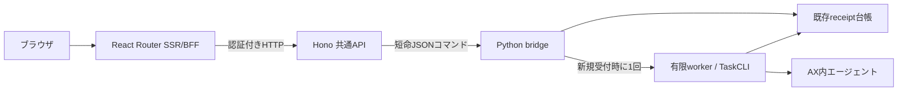

# AX ワークスペース

メールアドレス・パスワードまたはパスキーでログインし、ローカルのブラウザからAX内のエージェントと会話できます。送信済みの発言と返答を保存し、画面を開き直しても続きから話せます。各往復は有限のAX実行として処理し、完成した返答を表示します。文字単位のストリーミングは行いません。

チャットは設定済みのAntigravity/Geminiを使います。最初の送信前に外部送信と料金を確認してください。会話ごとの入力・返答量と[既存の費用制御](../ax-local/task-cli.md#費用と接続先)を維持しています。料金なしの経路確認は[エージェントの実行](http://127.0.0.1:3100/tasks)の「動作テスト」で行えます。

## 起動して試す

Node.js 24.15.0以上の24系、npm、Python 3.10以上を使います。実行にはDocker Desktopと[AXのローカル基盤](../ax-local/README.md)、固定版CLI・runnerイメージが必要です。Webの起動や記録の閲覧だけではAXを操作しません。

先に[ローカルPostgreSQL](../ax-local/postgres/README.md)を起動します。認証サービスの初期設定・アカウント・秘密ファイルの扱いは[Keycloakの手順](../ax-local/keycloak/README.md)を参照してください。以下はリポジトリのルートで実行します。

```sh
npm --prefix web ci
python3 ax-local/keycloak/manage.py init
python3 ax-local/keycloak/manage.py up
python3 ax-local/keycloak/manage.py provision
npm --prefix web run auth:migrate
npm --prefix web run dev
```

`AX workspace ready: http://127.0.0.1:3100` が表示されたら[ワークスペース](http://127.0.0.1:3100)を開きます。`localhost`ではなく、表示された`127.0.0.1`を使ってください。

1. 「ログインへ進む」から認証画面を開きます。初期テスト利用者は `alice@example.test` と `bob@example.test`、パスワードはローカルの `ax-local/.state/auth/alice.password` と `bob.password` です。
2. チャットの「メッセージ」に質問を書き、外部送信と料金の確認にチェックします。
3. 「送信する」を押すと、発言が保存され、エージェントが返答を準備します。Enterは改行、Ctrl / ⌘ + Enterは送信です。
4. 返答が表示されたら続きを送れます。「最近の会話」から以前の会話へ戻れます。

「アカウント」からパスキーを登録し、登録済みのパスキーやパスワードを管理できます。ログアウトも同じ画面から行います。ログインは最大30分で切れ、再確認が必要です。パスキーを使えない場合はパスワードでログインできます。

送信済みの会話を保存します。入力途中の下書きは再読込後の保持を保証しません。会話の履歴には長さの上限があり、超えた場合は新しいチャットを案内します。履歴を黙って省略したり、追加のモデル呼び出しで要約したりしません。

[エージェントの実行](http://127.0.0.1:3100/tasks)は従来の単発作業画面です。「動作テスト」は作業用テキストをそのまま成果物へ保存し、モデルを呼びません。作業用テキストが空の場合は指示を保存します。従来の模擬応答は[接続確認](http://127.0.0.1:3100/connection)に残しています。

Ctrl+CでWebとAPIを終了します。**受け付け済みのエージェント処理は独立して続き、通常は結果回収・通信遮断・停止まで進みます。** 再起動した画面の一覧から結果を確認できます。Webを閉じることを実行の取消しとして使わないでください。

画面の変更は開発サーバーに反映されます。API・共通処理・起動設定の変更はコマンド全体を再起動してください。Pythonコードは実行中のworkerを終えてから更新します。APIだけが停止した場合、Webはエラーを表示できる状態で残ります。

本番ビルドのローカル確認も、開発用依存を含む`npm ci`が必要です。

```sh
npm --prefix web run build
npm --prefix web start
```

## 受付・再送・復旧

単発作業はフォームのURLに受付キーを保持します。チャットは会話IDと現在の末尾実行から送信キーを作り、同じ会話状態なら再読込後も同じキーになります。同じ利用者が同じフォームを再送すると、同じ内容なら同じ実行番号が返り、実行は増えません。同じキーで内容を変えると拒否します。別の作業には「新しい実行」を使います。応答が不明なときは、先に実行一覧を確認してください。

ブラウザの再読込、HTTPの切断、Web/APIの再起動から実行を自動再送しません。受付を保存した後、処理を開始する前に異常終了した場合は「受付済み・実行未確認」として残ります。実行中のworkerが消え、結果・使用量・停止が未確認なら「復旧が必要」と表示します。未解決の記録がある間はWebと従来CLIの両方で新しい実行を止めます。

結果画面の「状態を確認して終了する」は、保存済み結果の回収、通信遮断、Task停止だけを試みます。モデルの再呼出、開始合図の再送、停止Taskの再開は行いません。外部操作を始めていない受付は「開始せず終了」になり、通信遮断・Task停止を実施した記録にはしません。

使用量が不明なまま、またはTaskを停止した後に結果を回収できない場合は、復旧操作後も未解決です。[CLIの復旧手順](../ax-local/task-cli.md#失敗中断した場合)で保存済み記録を確認します。台帳や開始済みの印を削除して実行し直さないでください。

## 入力・保存・利用範囲

指示はUTF-8で2048バイト、作業用テキストは4096バイトまで。単発作業のテキストはrequest.json内の`inputs["input.txt"]`という項目で渡します。独立したinput.txtファイルを自動作成するという意味ではありません。成果物は英数字で始まる64文字以内の名前で1件、最大64 KiBです。成果物の表示・取得時にもサイズ・SHA256・UTF-8を照合します。

チャットは最新発言2048バイト、過去の成功ペアをrole/content付きJSONにした文脈4096バイト、最大32回の受付まで。失敗した発言も画面には残しますが、次のモデル文脈には含めません。失敗時の既存費用・復旧ガードは維持します。

入力、進行、結果、成果物は`ax-local/.state/runs/<run_id>/`へ保存します。会話の順序はreceipt内のconversation、発言はrequest.jsonのinstruction、返答は検証済みのartifacts/reply.txtが正本です。この領域はGit対象外です。新しい受付は内部利用者IDをownerとして同時に保存し、本人の記録だけを一覧・詳細・成果物・復旧へ公開します。一覧は本人の最近50件です。認証導入前や管理CLIから作ったownerなしの記録は保存したまま、通常のWebへ表示しません。全体の費用・未解決判定には引き続き含めます。

| 設定 | 既定値 | 条件 |
| --- | --- | --- |
| `WEB_PORT` | `3100` | 1024〜65535 |
| `API_PORT` | `3101` | Webと異なる1024〜65535 |
| `AUTH_CONFIG_FILE` | `ax-local/.state/auth/app.json` | 秘密を含む認証・外部DB設定の絶対パス |

両方とも`127.0.0.1`にのみ待ち受けます。ポートを変える場合はKeycloakのredirect URIとlogout URIも完全一致で登録してください。既存サービスがポートを使っている場合は起動を中止し、そのサービスには干渉しません。

内部APIの秘密値と匿名CSRF用Cookie署名鍵は起動時に生成します。認証済みCookieは不透明なIDで、アクセストークンは含みません。セッションはapp DB、トークンはローカルの永続鍵で暗号化して保存します。Web/API再起動後も有効期限内の認証セッションを使えますが、開いたままのフォームは再読込が必要です。フォームの受付キーはセッションと別に保持します。

アカウントを分離して使えるローカル検証用です。同時実行は全利用者を通して1件です。同じPC上の敵対的なプロセスの隔離、本番のHTTPS公開・メール送信・自己登録は対象外です。DBの設置先は接続設定で指定し、Kubernetes内へ固定しません。

## 処理の流れ



Pythonが受付・実行・費用の記録を所有します。完成したrequest/manifest/receiptをディレクトリごと原子的に公開し、`accepted`の受付を保存してから応答します。workerは既存の全体ロックを取得し、未着手の受付だけを実行します。実行中の外部コマンドへロックFDを継承し、workerの強制終了でコマンドだけ残る場合にも同時操作を避けます。

| 内部API | 用途 |
| --- | --- |
| `GET /v1/conversations` | 最近の会話一覧 |
| `GET /v1/conversations/:id` | 会話履歴と続行可能状態 |
| `POST /v1/conversations/:id/turns` | 親実行・送信キー付きの新しい発言 |
| `POST /v1/runs` | key付きの永続受付 |
| `GET /v1/runs` | 最近の実行一覧 |
| `GET /v1/runs/:runId` | 状態・入力・結果・使用量 |
| `GET /v1/runs/:runId/artifact` | 検証済み成果物 |
| `POST /v1/runs/:runId/recover` | 再開始をしない復旧 |

全APIでHostと内部Bearerを検証し、Origin付き要求を拒否します。起動確認の `/v1/status` を除き、`X-AX-Access-Token` のJWT署名・発行元・用途・宛先・期限と、DBの有効な利用者対応も確認します。利用者IDはブラウザから受け取らず、検証後にPythonへ渡します。BFFの更新操作には署名セッション・Origin・CSRFの一致が必要です。APIは要求64 KiB、実行応答512 KiB、会話応答1 MiB、Pythonへの待ち時間5秒、BFFは本文読取まで8秒。実行workerの寿命とは分け、自動再送しません。接続確認用APIは従来の16 KiB・3秒制限を維持します。

## 検証する

```sh
python3 -m unittest discover -s ax-local/tests -p 'test_*.py' -v
python3 -m unittest discover -s ax-local/keycloak -p 'test_*.py' -v
npm --prefix web run typecheck
npm --prefix web test
npm --prefix web run build
cd web
npx playwright install chromium
npm run test:e2e
```

Python試験は受付の競合・原子的公開・利用者ごとの所有権・開始前の中断・強制終了・残存コマンドの排他・使用量不明・復旧・既存CLIを確認します。Keycloakの初期化試験は秘密情報の保持と不整合時の停止を確認します。Node試験はHTTPとPython間の入出力、JWT・セッション・認証フロー、上限、タイムアウト、応答型を確認します。

Node・ブラウザ試験には専用のPostgreSQL `app_auth_test` を使います。ローカルでは起動済みPostgreSQLから試験専用設定を準備し、CIでは専用サービスを立てます。試験設定のDB名を制限して、通常の `app` DBを試験で初期化しないようにしています。

ブラウザ試験はログイン、認証フローの再利用拒否、2人の利用者の分離、ログアウトと障害に加え、会話継続・再読込・同内容再送・日本語IME・履歴上限、SSR、フォーム、受付キー保持、状態更新、ダウンロード、JavaScriptなし、320px幅、キーボード、axe、API停止、ポート競合を確認します。認証サーバーと実行バックエンドは試験専用fixtureで、CIからAX・モデルを呼びません。3210/3211/3212、3230/3231、3240/3241番ポートを空けてください。実Keycloak・パスキー・実AX・バックアップ復元の結果は[認証の検証記録](../.space/tasks/ax-auth/verification.md)に分けています。

デザインはプロジェクトの[デジタル庁デザインスキル](../.agents/skills/apply-digital-agency-design-system/SKILL.md)の保存済み資料に基づき、文字、可視ラベル、ラジオ、チェックボックス、フォーカス、エラー表示を適用しています。公式コンポーネントそのものの採用やアクセシビリティの完全適合を示すものではありません。
