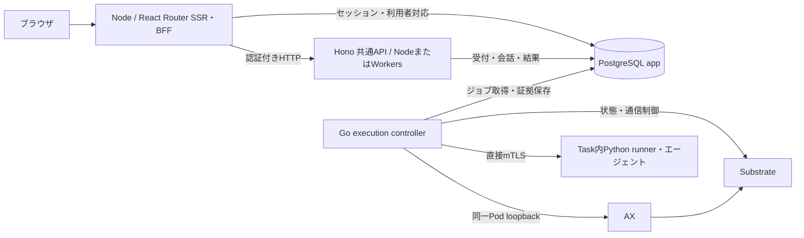

# AX ワークスペース

ログインしてAX内のエージェントと会話するWebアプリです。会話・実行受付・入力・結果・成果物はPostgreSQLに保存します。完成した返答を表示し、画面を開き直しても続きから話せます。文字単位のストリーミングは行いません。

チャットはAntigravity/Geminiを使い、料金が発生します。モデルを呼ばない確認は、[単発作業画面](http://127.0.0.1:3100/tasks)の「動作テスト」を使ってください。[費用制御](../ax-local/task-cli.md#費用と接続先)は全利用者・移行済み記録を通して適用します。

構成変更後の受付再開、実AX経路の合否、最新の稼働状態は[検証記録](../.space/tasks/ax-portable-api/verification.md)を参照してください。以下の利用手順は、実行基盤の検証と受付再開が完了している環境向けです。

## 構成



APIはPython子プロセス、AX CLI、共有ローカル台帳を使いません。DBが所有権・同じ受付キーの再送・会話順序・全体の同時実行1件・費用制御を判定します。HTTP応答とは独立したGo controllerが、DBへ一度だけの送信権を保存してからAXを操作します。PythonはTask内の処理に残り、ローカルの構築・移行用ツールにも使います。

PostgreSQLはアプリやKubernetesと別の場所へ配置できます。現ローカル構成はDocker上のPostgreSQLです。BFFはNodeで動作し、Workersへの配置対象は共通APIです。Workersの入口とworkerd試験は実装されていますが、クラウド配備・本番公開の確認は含みません。

## 初回準備

Node.js 24.15.0以上の24系、npm、Docker Desktopが必要です。ローカル基盤の準備にはPython 3と[固定版のAX・Substrate環境](../ax-local/README.md)を使います。Go controllerのビルド要件は[実行管理の手順](../execution/README.md)を参照してください。

次はリポジトリルートで実行します。既存環境では秘密ファイルやDBを作り直さず、未実施の段階だけ進めます。

```sh
npm --prefix web ci
python3 ax-local/postgres/manage.py init
python3 ax-local/postgres/manage.py up
python3 ax-local/postgres/manage.py provision
python3 ax-local/keycloak/manage.py init
python3 ax-local/keycloak/manage.py up
python3 ax-local/keycloak/manage.py provision
npm --prefix web run auth:migrate
npm --prefix web run data:migrate
```

スキーマ作成には管理用接続を使います。`data:migrate`は版とSQLハッシュを検査し、異なる既存スキーマを上書きしません。初回の新規受付は閉じた状態です。再実行は受付を開閉しません。

続けて[実行管理の初回準備と移行](../execution/README.md#初回準備と旧台帳からの移行)を行い、限定DBロール、固定イメージ、controller、通信境界を準備します。既存の`.state/runs`がある場合は同じ手順で一度だけ取り込みます。Web起動だけではcontrollerの配置や受付再開は行いません。

## 起動して使う

```sh
npm --prefix web run dev
```

`AX workspace ready: http://127.0.0.1:3100` が表示されたら、表示どおりのURLを開きます。`localhost`へ読み替えないでください。この表示はWeb/APIの起動確認であり、AXの実行成功や新規受付の許可を意味しません。

1. 「ログインへ進む」から認証画面を開きます。初期利用者は`alice@example.test`と`bob@example.test`です。パスワードの保存先・パスキー設定は[Keycloakの手順](../ax-local/keycloak/README.md)を参照してください。
2. モデルなしの確認では「エージェントの実行」から「動作テスト」を選びます。作業用テキストをそのまま成果物へ保存し、空の場合は指示を保存します。
3. チャットではメッセージを書き、外部送信と料金を確認して送信します。Enterは改行、Ctrl / ⌘ + Enterは送信です。
4. 返答後に続きを送れます。「最近の会話」から以前の会話へ戻れます。失敗した発言は表示に残り、次のモデル文脈には含めません。

「アカウント」からパスキーの登録・管理とログアウトを行います。ログインは最大30分です。送信済みの内容は保存しますが、入力途中の下書きは再読込後の保持を保証しません。履歴上限では新しい会話へ進み、黙った省略やモデルによる自動要約は行いません。

Ctrl+CはローカルWeb/APIを終了します。**DBに受け付け済みの処理とcontrollerは独立して動作します。** ブラウザやWebの終了を取消しとして使わないでください。API・共通処理・設定の変更時は起動コマンドを再実行し、controllerの更新は[停止・復旧手順](../execution/README.md#停止と復旧)に従います。

本番ビルドのローカル確認にも、開発用依存を含む`npm ci`が必要です。

```sh
npm --prefix web run build
npm --prefix web start
```

## 受付・再送・復旧

単発作業はフォームのURLに受付キーを保持します。チャットの送信キーは会話IDと現在の末尾実行に対応します。同じ利用者・同じキー・同じ内容の再送には同じ実行番号を返します。同じキーで内容を変えると拒否します。応答が不明なら、先に一覧を確認してください。別の作業には「新しい実行」を使います。

HTTP切断やWeb/APIの再起動で受付を失わず、外部操作を自動再送しません。controllerが実行権を取得した後に消えたり、開始結果が不明になったりすると、期限切れだけでは他のcontrollerへ引き継ぎません。未解決の記録がある間は全利用者の新規実行を止めます。

画面の「状態を確認して終了する」は、未着手の受付なら「開始せず終了」にできます。外部操作済みの場合は復旧待ちにし、管理者が旧controllerの停止・接続遮断・送信中操作の確定を証明してから復旧ジョブを許可します。ボタンだけでこの管理者確認は完了しません。

復旧ではTask作成・再開・開始合図を送りません。稼働中のTaskから回収できる結果と、通信遮断・実停止を確認します。過去に送信権を作った操作は再送せず、観測だけを行います。未回収のまま停止したTask、未知の使用量、応答不明の後片付けは解決できない場合があります。[管理者の復旧手順](../execution/README.md#停止と復旧)を参照してください。

## 入力と保存

| 項目 | 制限・保存先 |
| --- | --- |
| 単発作業の指示 | UTF-8で2048バイト |
| 作業用テキスト | UTF-8で4096バイト。requestの`inputs["input.txt"]`として渡す |
| 成果物 | 1ファイル、64文字以内の安全な名前、最大64 KiB。サイズ・SHA256・UTF-8を照合 |
| チャット | 最新発言2048バイト、過去の成功ペアをJSONにした文脈4096バイト、最大32回の受付 |
| 会話・実行・入力・結果 | app DBの`ax_conversations`、`ax_runs`等 |
| 成果物の原bytes | app DBの`ax_artifacts`。現段階では外部オブジェクトストレージを使わない |
| 旧原本 | 取り込み時のbytesを`ax_imports`へ保存。元の`.state/runs`と移行バックアップも保持 |

新しい受付は内部利用者UUIDと同時に保存し、本人だけが一覧・詳細・成果物・復旧を利用できます。最近の一覧は本人の50件まで。ownerのない旧記録は通常画面へ公開せず、全体の費用・未解決判定には含めます。NULを含む本文など、JSONBで保持できない原bytesはbyteaに保存します。

## 接続設定と権限

| 設定 | ローカルの既定値・用途 |
| --- | --- |
| `WEB_PORT` / `API_PORT` | `3100` / `3101`。異なる1024〜65535のポート |
| `AUTH_CONFIG_FILE` | BFF・管理用の`ax-local/.state/auth/app.json`。相対既定値は`web/`から解決 |
| `API_CONFIG_FILE` | API専用の`ax-local/.state/auth/api.json`。`prepare-execution.ts`が生成 |
| `API_SETTINGS` | Nodeではファイル設定の代わりになる完全なJSON。秘密として渡す |
| `API_ORIGIN` | 設定するとWebは外部APIを使い、ローカルAPIを起動しない。外部はHTTPS |
| `INTERNAL_API_TOKEN` | BFF/APIで共有する32文字以上の秘密。外部API使用時は明示設定 |
| `RUNNER_IMAGE` | Nodeのファイル設定経路でrunnerの固定digestを上書き。既定は`versions.json` |
| `API_HOST` | Node APIの待受。既定は`127.0.0.1` |

ポート変更時はKeycloakのcallback/logout URIも完全一致で変更します。外部APIのoriginとBearerはBFF側・API側で一致させます。秘密値をGit・画面・ログに載せないでください。

NodeのAPI設定は`apiOrigin`、`apiToken`、`identity`、`image`、`databaseSchema`（既定`public`）、`database`を持ちます。`identity`は`issuer`、`clientId: "ax-web"`、`audience: "ax-api"`。DBは`host`、`port`、`database`、`user`、`password`、`ca`（PEM本文）です。外部DBはCA必須で証明書を検証します。ローカルファイル設定の`caPath`はNode入口でPEMへ変換します。

Workers入口は`web/api/worker.ts`です。`API_SETTINGS`にはDB接続項目を除いたAPI設定を渡し、接続は`POSTGRES.connectionString`を提供するHyperdrive bindingから注入します。試験は`nodejs_compat`のworkerdで行います。BFFの認証秘密や暗号化鍵をWorkersへ渡す必要はありません。

APIのDBロール`ax_api`は利用者対応の参照と受付・取得・復旧要求の関数だけ、controllerの`ax_execution`はclaim・送信権・証拠・結果確定の関数だけを使います。スキーマ管理・取り込み・管理者復旧の権限を付与しません。ローカルBFF・移行は既存の`ax_app`接続を使います。

APIはHost・内部Bearerを検証し、Origin付き要求を拒否します。`/v1/status`以外はアクセストークンとDBの有効な利用者対応も確認します。所有者IDをブラウザ指定値から決めません。BFFはセッション・Origin・CSRFを検証し、トークンを暗号化してapp DBへ保存します。認証済みCookieは不透明なIDです。

| 内部API | 用途 |
| --- | --- |
| `GET /v1/conversations` | 最近の会話一覧 |
| `GET /v1/conversations/:id` | 会話履歴 |
| `POST /v1/conversations/:id/turns` | 親実行・受付キー付きの発言 |
| `POST /v1/runs` | 単発作業の永続受付 |
| `GET /v1/runs`、`GET /v1/runs/:runId` | 一覧・入力・状態・結果 |
| `GET /v1/runs/:runId/artifact` | 検証済み成果物 |
| `POST /v1/runs/:runId/recover` | 再開始をしない復旧要求 |

## 検証する

次の自動試験はモデルAPIを呼びません。Node/workerd試験は専用DB`app_auth_test`の一意schema、ブラウザ試験は認証・実行のfixtureを使います。通常の`app` DBを試験で初期化しないよう設定を制限しています。

```sh
npm --prefix web run typecheck
npm --prefix web test
npm --prefix web run build
cd web
npx playwright install chromium
npm run test:e2e
```

DB試験は所有者・同時受付・同キー再送・未知usage・費用・会話順序・原bytes・移行・実行権を確認します。runtime試験はNode/workerdの同一DB接続、再起動後の保持、DB切断時に受付を再送しないことを確認します。ブラウザ試験は認証・会話・フォーム・取得・JavaScriptなし・狭い画面・操作性・API停止・ポート競合を対象とします。3210/3211/3212、3230/3231、3240/3241番を空けてください。

実Keycloak・パスキーの記録は[認証検証](../.space/tasks/ax-auth/verification.md)、現在の移行・実AX・停止確認は[構成変更の検証](../.space/tasks/ax-portable-api/verification.md)に分けています。自動試験の成功を実AX経路の合格とは扱いません。

デザインは[デジタル庁デザインスキル](../.agents/skills/apply-digital-agency-design-system/SKILL.md)の保存済み資料に基づきます。公式コンポーネントの採用やアクセシビリティの完全適合を示すものではありません。
